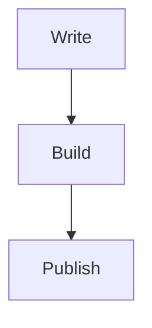

# Dump

Astro blog starter for markdown-first publishing with:

- content collections for posts in `src/content/blog`
- syntax-highlighted code blocks with light and dark themes
- Mermaid diagram rendering from fenced `mermaid` blocks
- responsive layout and a persistent theme toggle
- RSS and sitemap generation

## Commands

| Command | Action |
| :--- | :--- |
| `npm run dev` | Start the local Astro dev server |
| `npm run build` | Build the production site into `dist/` |
| `npm run preview` | Preview the production build locally |

## Writing posts

Create Markdown files in `src/content/blog` with frontmatter like:

```md
---
title: "A new post"
description: "Short summary for listings and metadata."
pubDate: "2026-03-20"
tags:
  - astro
  - notes
---
```

For diagrams, use a fenced block with the `mermaid` language:

````md

````

## Personalization

- Update site metadata in `src/consts.ts`
- Adjust the design in `src/styles/global.css`

## GitHub Pages

This repository is configured as a GitHub Pages project site, so the published URL includes the repository name:

- Site root: `https://theo-matzavinos.github.io/dump/`
- Blog post: `https://theo-matzavinos.github.io/dump/blog/angular-dependency-injection/`

If you open `https://theo-matzavinos.github.io/blog/...` instead, GitHub Pages will return a `404` because that path belongs to a user site root, not this project repository.
