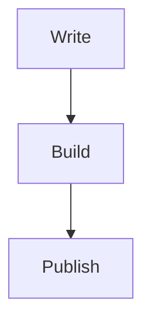

# Dump

Astro blog starter for markdown-first publishing with:

- content collections for posts in `src/content/blog`
- syntax-highlighted code blocks with light and dark themes
- Mermaid diagram rendering from fenced `mermaid` blocks
- responsive layout and a persistent theme toggle
- RSS and sitemap generation

## Commands

Use Node.js 22.12.0 or newer and pnpm 12.8.1 (pinned in `package.json`).

| Command                          | Action                                 |
| :------------------------------- | :------------------------------------- |
| `pnpm install --frozen-lockfile` | Install dependencies from the lockfile |
| `pnpm dev`                       | Start the local Astro dev server       |
| `pnpm build`                     | Build the production site into `dist/` |
| `pnpm preview`                   | Preview the production build locally   |

If Sharp detects a system libvips and tries to build from source, use
`SHARP_IGNORE_GLOBAL_LIBVIPS=1 pnpm install --frozen-lockfile` to use its bundled binary.

## Writing posts

Create Markdown files in `src/content/blog` with frontmatter like:

```md
---
title: "A new post"
description: "Short summary for listings and metadata."
pubDate: "2026-03-20"
tags:
  - astro
  - notes
---
```

For diagrams, use a fenced block with the `mermaid` language:

````md

```mermaid
flowchart TD
    A[Write] --> B[Build]
    B --> C[Publish]
```
````

For runnable article examples, see [the small browser-check workflow](docs/article-checks.md).
It extracts identified fences and validates browser result elements and measured viewports.

## Personalization

- Update site metadata in `src/consts.ts`
- Adjust the design in `src/styles/global.css`
- Configure fonts in `astro.config.mjs`; Astro's Fonts API serves the local files in `src/assets/fonts/` with base-aware URLs, styles, and preloads

## GitHub Pages

This repository is configured as a GitHub Pages project site, so the published URL includes the repository name:

- Site root: `https://theo-matzavinos.github.io/dump/`
- Blog post: `https://theo-matzavinos.github.io/dump/blog/angular-dependency-injection/`

If you open `https://theo-matzavinos.github.io/blog/...` instead, GitHub Pages will return a `404` because that path belongs to a user site root, not this project repository.
