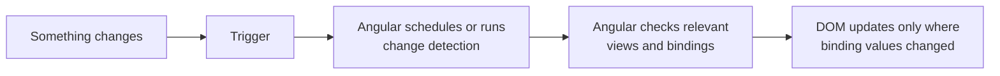
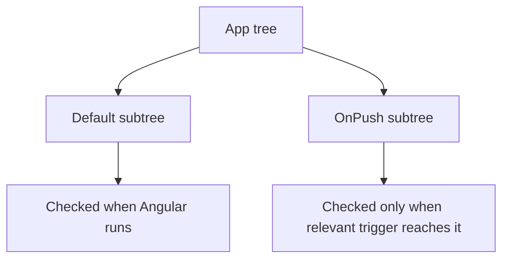
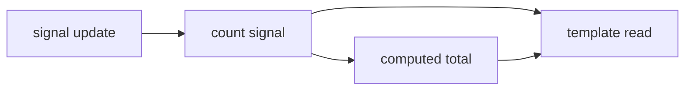

Change detection is one of those Angular topics that people often learn as a bag of rules:

- "`OnPush` is faster"
- "do not mutate inputs"
- "the `async` pipe fixes it"
- "signals change everything"

Those rules are not useless, but on their own they are not a model. Without a model, teams end up cargo-culting optimizations, misreading bugs, and arguing about framework magic instead of understanding what Angular is doing.

This article uses one central idea:

Angular change detection gets much easier once you separate **trigger**, **check**, and **update**.

- A **trigger** is what causes Angular to start a change-detection pass, or to mark work that should be checked.
- A **check** is Angular evaluating bindings in the relevant views.
- An **update** is Angular synchronizing the DOM where a binding result changed.

That distinction is what makes `Default`, `OnPush`, `async` pipe, and signals feel coherent instead of magical.

## 1. The problem change detection solves

All frontend frameworks have the same basic problem.

Your application state changes over time:

- a user clicks a button
- an HTTP request resolves
- a timer fires
- a form control changes

But the DOM does not automatically know that your application state changed. Something has to connect "state changed in JavaScript" to "the UI should now show something different".

That "something" is change detection.

In plain language:

> Change detection is the framework's process for noticing that application state may have changed, checking what the UI depends on, and updating the DOM where needed.

That is the problem every framework needs to solve. The interesting part is how each framework chooses to solve it.

## 2. One short detour: different frameworks, different tradeoffs

At a very high level, UI frameworks tend to lean toward one of these families:

- **Dirty checking**: keep checking values until you notice something changed.
- **Virtual DOM diffing**: re-run render logic and compare the new result with the old one.
- **Fine-grained reactivity**: track exact dependencies and update only the consumers of those dependencies.

Angular has moved across that landscape in its own way.

- The traditional Angular model is heavily associated with zone-driven change detection.
- `OnPush` lets Angular skip more work by being more selective about which subtrees to check.
- Signals move Angular toward more explicit dependency tracking.

That is enough cross-framework context for this article. The rest is about how Angular behaves in practice.

## 3. The core Angular mental model

Here is the model to keep in your head:



That breaks down into four steps:

1. Something in the app changes.
2. Angular gets a **trigger** to do work.
3. Angular decides which views should be **checked**.
4. Angular **updates** the DOM where binding results changed.

That is the anchor for the rest of the article.

Two distinctions matter immediately.

First, **a trigger is not the same thing as a DOM update**. Angular can run a change-detection pass even when almost nothing visibly changes.

Second, **a check is not the same thing as "rerender everything"**. Angular evaluates bindings in views that are part of the current pass, and then updates the DOM only where those evaluated values differ from what the DOM currently reflects.

If you keep those distinctions separate, a lot of Angular behavior becomes much easier to reason about.

## 4. Default change detection

The default Angular model is intentionally convenient.

Angular uses Zone.js to patch common async boundaries in the browser and framework runtime. Conceptually, that means Angular can notice when work like this completes:

- DOM events
- timers such as `setTimeout`
- promise resolution
- many HTTP-related async completions

After one of those boundaries, Angular runs a change-detection cycle.

In the default strategy, Angular checks broadly through the component tree. The useful mental model is not "Angular rerenders the whole app". A better model is:

> Angular walks the relevant tree, evaluates bindings, and updates the DOM only where evaluated values changed.

Here is a simple example:

```ts
import { Component } from '@angular/core';

@Component({
  selector: 'app-counter',
  template: `
    <button (click)="increment()">Clicked {{ count }} times</button>
    <p>Status: {{ count > 5 ? 'busy' : 'idle' }}</p>
  `,
})
export class CounterComponent {
  count = 0;

  increment() {
    this.count += 1;
  }
}
```

When the button is clicked:

- the click event is a trigger surface
- Angular runs change detection
- Angular checks the bindings that read `count`
- the DOM updates where those binding results changed

That feels straightforward because the component uses the default strategy and the state mutation happened during an Angular-handled event.

## 5. The distinction that unstucks people: trigger vs check

This is the hinge point of the whole topic.

When people say "Angular ran change detection", they often mentally collapse three separate ideas into one:

- something triggered a pass
- Angular checked some part of the tree
- the DOM visibly changed

Those are related, but they are not the same thing.

A click can trigger a pass even if no meaningful state changed. A promise resolution can trigger a pass that ends up updating one text node. A timer can trigger a pass that checks a large part of the tree and updates nothing.

That is why performance conversations need more precision.

If a page feels expensive, the problem might be:

- checks are happening too often
- checks are traversing too much of the tree
- bindings are expensive to evaluate
- the DOM is being updated more than necessary

Those are different problems, and they do not all have the same solution.

This is also why "`OnPush` makes Angular fast" is too vague to be useful. `OnPush` does not change what a changed binding means. It changes how selectively Angular chooses what to check.

## 6. `OnPush`: what it actually changes

`ChangeDetectionStrategy.OnPush` is best understood as a more selective checking policy.

It tells Angular:

> Skip this component subtree unless there is a reason to check it.

The main reasons Angular will check an `OnPush` subtree are:

- a new input arrives through template binding
- an event originates from that component or somewhere inside its subtree
- an observable or promise consumed by the `async` pipe emits
- code explicitly uses change-detection APIs such as `markForCheck()`

That leads to a more selective model than default change detection.



This is the key framing:

- `Default` says "when Angular runs a pass, check broadly"
- `OnPush` says "when Angular runs a pass, skip this subtree unless it has a relevant reason to be checked"

That is more accurate than saying "`OnPush` only updates on input reference changes". New inputs matter, but they are not the only trigger surface that matters in real applications.

## 7. Why `OnPush` feels weird at first

Most `OnPush` confusion comes from three things:

- reference semantics
- subtree boundaries
- misunderstanding where the trigger came from

### Mutation vs replacement

This is the classic pitfall.

```ts
import { ChangeDetectionStrategy, Component, Input } from '@angular/core';

@Component({
  selector: 'user-card',
  changeDetection: ChangeDetectionStrategy.OnPush,
  template: `<p>{{ user.name }}</p>`,
})
export class UserCardComponent {
  @Input() user!: { name: string };
}
```

Now imagine the **parent** holds the `user` object and passes it to that child:

```ts
this.user.name = 'Maria';
```

That mutation happens in the parent component, not inside the `OnPush` child. For `OnPush` inputs, Angular effectively cares whether the new input value is equal to the previous one. For objects and arrays, that usually comes down to reference equality: if the parent keeps passing the same object reference, Angular does not see a new input for that child.

The usual fix is to replace, not mutate:

```ts
this.user = {
  ...this.user,
  name: 'Maria',
};
```

Again, that replacement happens in the parent. Now the child receives a new reference, and Angular has a reason to check that `OnPush` boundary.

### Why a local click still updates an `OnPush` component

Another common surprise is this:

```ts
import { ChangeDetectionStrategy, Component } from '@angular/core';

@Component({
  selector: 'app-toggle',
  changeDetection: ChangeDetectionStrategy.OnPush,
  template: `
    <button (click)="toggle()">Toggle</button>
    <p>{{ open ? 'Open' : 'Closed' }}</p>
  `,
})
export class ToggleComponent {
  open = false;

  toggle() {
    this.open = !this.open;
  }
}
```

This still updates correctly.

Why? Because the event originated inside the component's own subtree. `OnPush` does not mean "ignore local state forever". It means Angular needs a relevant reason to check the subtree, and a local event is one of those reasons.

### Why `async` pipe often works when manual subscription glue does not

The `async` pipe matters because it is not only a subscription convenience. It is also a change-detection integration point.

```ts
import { AsyncPipe } from '@angular/common';
import { ChangeDetectionStrategy, Component } from '@angular/core';
import { user$ } from './state';

@Component({
  selector: 'user-name',
  imports: [AsyncPipe],
  changeDetection: ChangeDetectionStrategy.OnPush,
  template: `<p>{{ (user$ | async)?.name }}</p>`,
})
export class UserNameComponent {
  user$ = user$;
}
```

When the observable emits, the `async` pipe marks the component to be checked. That is why this pattern works naturally with `OnPush`.

By contrast, manual subscriptions can go wrong when they update component state in ways that do not properly mark the relevant `OnPush` boundary, or when they spread change-detection concerns across lifecycle hooks and services.

That does not make manual subscriptions forbidden. It means the `async` pipe is often the cleaner trigger surface for template-driven consumption.

### Why "it updated once but not later" usually has a boring explanation

When an `OnPush` component behaves inconsistently, the explanation is usually one of these:

- the first update came from a local event, but later updates relied on mutating the same input reference
- an observable emitted through `async` pipe in one version, but later code moved to a manual subscription path
- the expected trigger happened outside the subtree the developer assumed Angular would check

In other words, the weirdness is usually not random. It is a mismatch between your mental model and Angular's trigger or subtree rules.

## 8. Signals: a more explicit model

Signals introduce a more explicit reactive model for state and derivation.

At a high level:

- `signal()` holds state
- `computed()` derives state from other signals
- `effect()` runs side effects when signal dependencies change

Here is the simplest example:

```ts
import { Component, computed, signal } from '@angular/core';

@Component({
  selector: 'cart-summary',
  template: `
    <p>Items: {{ itemCount() }}</p>
    <p>Total: {{ total() }}</p>
    <button (click)="addItem()">Add item</button>
  `,
})
export class CartSummaryComponent {
  readonly prices = signal([10, 15]);
  readonly itemCount = computed(() => this.prices().length);
  readonly total = computed(() => this.prices().reduce((sum, price) => sum + price, 0));

  addItem() {
    this.prices.update((prices) => [...prices, 20]);
  }
}
```

The important part is not the syntax. The important part is the dependency model.

When code reads a signal, Angular can track that read. When the signal changes, Angular knows which consumers depend on it.

That is why signals feel different from the older "something async happened, so Angular should go check" model.

Angular's signals guide also makes an important point about `effect()`: it is mainly for side effects, not ordinary state propagation. If one value is derived from another value, `computed()` is usually the right tool.

## 9. How signals change the mental model

Signals do not mean you should forget everything about change detection. They do change the mental center of gravity.

With the older zone-driven model, the thought process is often:

> Something async happened, so Angular should run a check.

With signals, the thought process is closer to:

> This exact dependency changed, so the consumers of that dependency need to react.

That gives Angular more explicit information.



That does **not** mean:

- Zone.js is obsolete in every app
- signals remove all need to understand component boundaries
- signals are automatically the right answer for every state problem

It means signals give Angular a more explicit dependency graph to work with. That can improve predictability and reduce unnecessary checking in the right circumstances.

There is also an important practical detail for teams already using `OnPush`: when an `OnPush` template reads a signal, Angular tracks that signal as a dependency of the component. When the signal changes, Angular marks that component so it can be updated on the next change-detection run.

## 10. A compact comparison

| Model | Main idea | Typical trigger style | What developers usually need to watch |
| --- | --- | --- | --- |
| `Default` | Broad tree checking during Angular passes | Zone-driven async boundaries such as events, timers, promises | Too many broad checks in large trees |
| `OnPush` | Selective subtree checking | New inputs, local subtree events, `async` pipe emissions, manual marking | Mutating inputs, misunderstanding subtree boundaries |
| Signals | Explicit dependency tracking | Signal writes and derived recomputation | Using `effect()` for ordinary state flow, mixing models carelessly |

## 11. Be careful with `effect()`

If you are deriving one value from another, reach for `computed()`, not `effect()`. Effects are better for side effects such as logging, local storage synchronization, or integration with APIs outside Angular's reactive template model.

## 12. Conclusion

If you only keep four ideas from this article, keep these:

- Change detection is a **trigger, check, update** problem.
- `Default` and `OnPush` mainly differ in **how broadly Angular checks**.
- Most `OnPush` surprises come from **references, subtree boundaries, and trigger origin**.
- Signals shift Angular toward **more explicit dependency tracking**, which is why they often feel easier to reason about.
