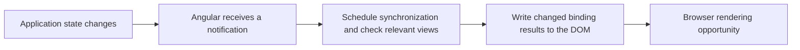

A button changes a field and the UI updates. A timer changes the same field and the UI stays stale. Replacing an input object works, but mutating it does not—until another click makes the new value appear.

These are not unrelated Angular exceptions. They involve separate questions:

1. **Notification:** what tells Angular there is work to do?
2. **Check:** which views and bindings need evaluation?
3. **Update:** which changed binding results need to be written to the DOM?

The browser then decides when to perform rendering work and display the result. Updating application state, updating the DOM, and painting pixels are different milestones.

This article follows that sequence, using current Angular first and then explaining the Zone.js-based model still found in existing applications.

## Contents

1. [Notification, check, update, paint](#notification-check-update-paint)
2. [Current defaults and independent choices](#current-defaults-and-independent-choices)
3. [OnPush versus eager checking](#onpush-versus-eager-checking)
4. [Why a timer can leave the UI stale](#why-a-timer-can-leave-the-ui-stale)
5. [Input replacement versus mutation](#input-replacement-versus-mutation)
6. [Signals track dependencies, not deep mutations](#signals-track-dependencies-not-deep-mutations)
7. [Observables and AsyncPipe](#observables-and-asyncpipe)
8. [Marking versus checking immediately](#marking-versus-checking-immediately)
9. [Where Zone.js fits](#where-zonejs-fits)
10. [A debugging and performance checklist](#a-debugging-and-performance-checklist)

## Notification, check, update, paint

Changing a JavaScript variable does not automatically change the DOM:

```ts
let count = 0;
count += 1;
```

Something must connect that state to a displayed value. Angular does this through view synchronization, usually called **change detection**.


```mermaid
flowchart LR
    S[Application state changes] --> N[Angular receives a notification]
    N --> C[Schedule synchronization and check relevant views]
    C --> U[Write changed binding results to the DOM]
    U --> P[Browser rendering opportunity]
```

The first arrow is not automatic for every state change. A plain assignment inside an arbitrary callback may provide no notification.

The later arrows also need qualifications:

- Angular can receive several notifications before one synchronization pass; do not assume one notification means one separate full-tree check.
- A check can evaluate bindings without changing any DOM value.
- Angular normally compares a binding's new result with its previously recorded result, not with a fresh inspection of the DOM.
- DOM writes do not force the browser to paint immediately.

A component **view** contains the template work Angular can evaluate, including bindings such as `{{ count }}`. Checking a view is not equivalent to discarding and rebuilding its HTML.

For browser scheduling details, see [JavaScript engines and runtimes](/dump/blog/javascript-engines-and-runtimes/). Here, the important distinction is that Angular chooses synchronization work while the browser schedules JavaScript and rendering opportunities.

## Current defaults and independent choices

**Version baseline:** the APIs and behavior below were checked against Angular v22.2.1.

| Version boundary | Change                                                                                                          |
| ---------------- | --------------------------------------------------------------------------------------------------------------- |
| Angular v20      | Zoneless change detection is available through `provideZonelessChangeDetection()`                               |
| Angular v21+     | Zoneless is the default unless the application opts into Zone.js-based change detection                         |
| Angular v22+     | `OnPush` is the default component strategy; `Eager` names broad checking, and `Default` is its deprecated alias |

In older Angular versions, articles often use “default change detection” to mean both Zone.js scheduling and broad component checking. Those are independent concerns, not one switch.

| Concern             | Choices or mechanisms                                               | What it controls                                          |
| ------------------- | ------------------------------------------------------------------- | --------------------------------------------------------- |
| Scheduling          | Angular notifications; Zone.js integration in zone-based apps       | When synchronization is requested                         |
| View checking       | `OnPush` or `Eager` (historically `Default`)                        | Whether a reached component view is eligible for checking |
| Dependency tracking | Signals read by templates, `computed`, and other reactive consumers | Which consumers depend on reactive state                  |

Signals work **with** checking strategies. Zoneless does not mean “signals only,” and `OnPush` does not mean “no Zone.js.”

### Notifications in a zoneless application

Angular's documented notification surfaces include:

- bound template and host listeners;
- changing a signal read by a template;
- `ChangeDetectorRef.markForCheck()`, including calls made by `AsyncPipe`;
- `ComponentRef.setInput()` for dynamically created components;
- attaching a view that has already been marked dirty.

A changed template-bound input also makes its receiving view eligible for checking while the parent view is being evaluated. Replacing an object in an arbitrary callback does not, by itself, arrange for that parent evaluation to happen.

The practical question is **“what notified Angular?”**, not merely **“what async API completed?”**

## OnPush versus eager checking

`OnPush` lets Angular skip component views that have no reason to refresh. Reasons include changed template-bound inputs, an Angular-handled event in the view or its descendants, explicit marking, and changed signal dependencies read by the template.

`Eager` views are checked eagerly when traversal reaches them. It does not mean a zoneless application watches every ordinary assignment or automatically schedules work after every timer.

Two boundaries matter:

- A clean `OnPush` boundary can prevent broad checking of a subtree.
- Checking a parent does not force every nested `OnPush` child to refresh. Each child still has its own eligibility conditions.

Angular can also traverse ancestors to reach a descendant needing refresh without reevaluating every ancestor's bindings. Do not treat “traversed” and “checked” as exact synonyms.

### A local event can update a plain field

```ts
import { ChangeDetectionStrategy, Component } from "@angular/core";

@Component({
  selector: "click-counter",
  changeDetection: ChangeDetectionStrategy.OnPush,
  template: ` <button (click)="increment()">Clicked {{ count }} times</button> `,
})
export class ClickCounter {
  count = 0;

  increment(): void {
    this.count += 1;
  }
}
```

The field is not a signal. This still works because Angular handles the bound listener and has a reason to check the view after the event.

Explicit `OnPush` declarations in these examples make the intended strategy visible and preserve it when the examples are used with pre-v22 Angular.

An event in a descendant can also make `OnPush` ancestors eligible for checking. It does not make every unrelated `OnPush` sibling eligible.

## Why a timer can leave the UI stale

Compare two delayed updates in a zoneless application:

```ts
import { ChangeDetectionStrategy, Component, signal } from "@angular/core";

@Component({
  selector: "delayed-counter",
  changeDetection: ChangeDetectionStrategy.OnPush,
  template: `
    <button (click)="incrementPlainLater()">Increment plain field later</button>
    <button (click)="incrementSignalLater()">Increment signal later</button>
    <p>Plain: {{ plainCount }}</p>
    <p>Signal: {{ signalCount() }}</p>
  `,
})
export class DelayedCounter {
  plainCount = 0;
  readonly signalCount = signal(0);

  incrementPlainLater(): void {
    setTimeout(() => {
      this.plainCount += 1;
    }, 1000);
  }

  incrementSignalLater(): void {
    setTimeout(() => {
      this.signalCount.update((count) => count + 1);
    }, 1000);
  }
}
```

Assuming no other notifications or forced checks:

| Action                            | State after the timer       | Displayed result                    |
| --------------------------------- | --------------------------- | ----------------------------------- |
| Click the plain-field button once | `plainCount` becomes `1`    | The paragraph still shows `0`       |
| Click the signal button once      | `signalCount()` becomes `1` | The signal paragraph updates to `1` |

The initial click notifies Angular **before** the delayed mutation. That does not grant the later timer callback permanent change-detection integration.

The signal write supplies a new notification because the template is a tracked consumer. Another later local event or signal notification can make the plain field's already-changed value visible too. That explains many “it updates only when I click somewhere” reports.

These one-shot timers demonstrate scheduling, not a background-job design. Long-lived timers and subscriptions still need cleanup when their owning feature is destroyed.

## Input replacement versus mutation

Here is a parent and child in one file:

```ts
import { ChangeDetectionStrategy, Component, input } from "@angular/core";

interface User {
  name: string;
}

@Component({
  selector: "user-card",
  changeDetection: ChangeDetectionStrategy.OnPush,
  template: `<p>{{ user().name }}</p>`,
})
export class UserCard {
  readonly user = input.required<User>();
}

@Component({
  selector: "user-page",
  imports: [UserCard],
  changeDetection: ChangeDetectionStrategy.OnPush,
  template: `
    <button (click)="mutate()">Mutate name</button>
    <button (click)="replace()">Replace user</button>
    <user-card [user]="user" />
  `,
})
export class UserPage {
  user: User = { name: "Alice" };

  mutate(): void {
    this.user.name = "Maria";
  }

  replace(): void {
    this.user = { ...this.user, name: "Maria" };
  }
}
```

After **Mutate name**, the parent is checked because it handled the event. But the child still receives the same object reference. That does not constitute a changed input, so the clean `OnPush` child can remain skipped and continue displaying `Alice`.

After **Replace user**, the parent evaluates a new reference for the binding. The child receives a changed input and displays `Maria`.

The important distinction is not “Angular forbids mutation.” It is that a mutation does not provide a new input value at this boundary. If another reason later causes the child to be checked, it can display the mutated object's current contents.

Using a signal-based input does not turn the incoming object into a deeply observed proxy. Likewise, direct TypeScript assignment to a child's ordinary input property is not equivalent to Angular updating a template binding. For dynamically created components, use the framework's `ComponentRef.setInput()` integration rather than assuming a property assignment will notify it.

## Signals track dependencies, not deep mutations

Signals describe reactive state and derived values:

```ts
import { ChangeDetectionStrategy, Component, computed, signal } from "@angular/core";

@Component({
  selector: "cart-summary",
  changeDetection: ChangeDetectionStrategy.OnPush,
  template: `
    <p>Items: {{ itemCount() }}</p>
    <p>Total: {{ total() }}</p>
    <button (click)="addItem()">Add item</button>
  `,
})
export class CartSummary {
  readonly prices = signal([10, 15]);
  readonly itemCount = computed(() => this.prices().length);
  readonly total = computed(() => {
    let total = 0;

    for (const price of this.prices()) {
      total += price;
    }

    return total;
  });

  addItem(): void {
    this.prices.update((prices) => [...prices, 20]);
  }
}
```

The initial values are two items and a total of `25`. Adding an item creates a new array, invalidates the dependent computations, and the next synchronization displays three items and `45`.

### Tracking needs a reactive context

Angular tracks signal reads while evaluating a **reactive consumer**, such as a template, `computed()`, or `effect()`. Reading a signal in arbitrary ordinary code does not automatically subscribe that code to future changes.

Dependencies are dynamic: a computation tracks the signals actually read during its latest evaluation, not every signal mentioned somewhere in the function. Tracking is also synchronous; reads after an `await` are not part of the preceding reactive context.

### Computed values are lazy and cached

A `computed()` derivation runs when its value is needed, not immediately every time a source signal changes. Angular caches the result. A dependency change invalidates that cache; a later read recomputes it.

For state derived from other state, use `computed()` rather than an `effect()` that copies a value into another writable signal. Effects are for side effects such as logging or integration with non-reactive APIs, not the default tool for state propagation.

### A signal write still has equality semantics

Signals use `Object.is()` equality by default. Mutating the value without changing its reference does not notify consumers:

```ts
import { signal } from "@angular/core";

const user = signal({ name: "Alice" });

user().name = "Maria"; // Mutates the object, but sends no signal notification.
user.set(user()); // Same reference: still no notification under default equality.

user.update((current) => ({ ...current, name: "Maria" })); // New reference.
```

Custom equality functions can change whether a write counts as a change. Readonly signal views prevent writes through the signal API, not deep mutation of their returned objects.

Finally, signals do not give each interpolation its own independent DOM-patching engine. Angular tracks consumers and uses those dependencies to decide what view work is needed. Template bindings still participate in change detection.

## Observables and AsyncPipe

An observable emission is not, by itself, a template notification. `AsyncPipe` provides that integration:

```ts
import { AsyncPipe } from "@angular/common";
import { ChangeDetectionStrategy, Component } from "@angular/core";
import { interval } from "rxjs";

@Component({
  selector: "elapsed-counter",
  imports: [AsyncPipe],
  changeDetection: ChangeDetectionStrategy.OnPush,
  template: `<p>Latest tick: {{ ticks$ | async }}</p>`,
})
export class ElapsedCounter {
  readonly ticks$ = interval(1000);
}
```

The template initially has no emitted tick; after one second it displays `0`, then `1`, and so on. On asynchronous emissions, the pipe marks its containing view for checking. It also manages subscription cleanup when the view is destroyed and switches subscriptions if the supplied source changes.

A manual subscription that assigns `this.tick = value` to a plain field does not provide the same notification automatically. Use a template-read signal, or explicitly mark the view after assigning the field. The subscription also needs an owner and cleanup, for example through `takeUntilDestroyed()`.

`AsyncPipe` also supports promises; a promise resolves once rather than emitting a continuing sequence.

A useful alternative for component code that needs reactive observable values is `toSignal()` from `@angular/core/rxjs-interop`. It manages the subscription and exposes a signal. Account for its injection-context and initial-value requirements, and create it once rather than recreating subscriptions during template evaluation.

None of these APIs makes the browser paint immediately on receipt of a value. They connect asynchronous state to Angular's synchronization model.

## Marking versus checking immediately

Two similarly named APIs do different jobs:

| API               | Meaning                                                                                |
| ----------------- | -------------------------------------------------------------------------------------- |
| `markForCheck()`  | Mark a view for a future synchronization pass; it is a zoneless notification surface   |
| `detectChanges()` | Perform a local check of the view and its children according to change-detection rules |

For a normal callback updating a plain field, marking is usually the intended integration:

```ts
import { ChangeDetectionStrategy, ChangeDetectorRef, Component, inject } from "@angular/core";

@Component({
  selector: "marked-counter",
  changeDetection: ChangeDetectionStrategy.OnPush,
  template: `
    <button (click)="incrementLater()">Increment later</button>
    <p>{{ count }}</p>
  `,
})
export class MarkedCounter {
  private readonly changeDetector = inject(ChangeDetectorRef);
  count = 0;

  incrementLater(): void {
    setTimeout(() => {
      this.count += 1;
      this.changeDetector.markForCheck();
    }, 1000);
  }
}
```

The timer now supplies the missing notification. Notice that `ChangeDetectorRef` is injected in the field initializer, not inside the timer callback.

`detectChanges()` is not a stronger version to sprinkle everywhere. It changes timing by doing local work immediately. One deliberate use is combining it with a detached view for explicitly controlled refreshes. Detached views are excluded from normal traversal, even when marked; that is an advanced ownership decision, not the starting fix for stale state.

## Where Zone.js fits

In a Zone.js-based application, patched asynchronous APIs give Angular broad hints that application state **may** have changed. Angular's zone integration can arrange synchronization after relevant activity inside the Angular zone.

This is why older eager/default components often updated after a timer assigned a plain field, even though the application supplied no explicit dependency notification.

That model needs limits:

- Zone.js is not a dependency graph and does not know whether a field actually changed.
- Not every asynchronous API is patched, and work outside the Angular zone does not behave like work inside it.
- Coalescing and scheduling configuration affect how activity maps to passes; “every promise causes a full render” is inaccurate.
- Zone-driven scheduling does not remove clean `OnPush` boundaries. A timer can cause a pass without making its `OnPush` component eligible for refresh.

`NgZone.runOutsideAngular()` can keep high-frequency work from repeatedly invoking zone-based synchronization. Reentering with `NgZone.run()` matters for zone integration, but it does not substitute for correct `OnPush` marking. In zoneless applications, use the documented notification mechanisms; entering a zone is not the missing notification.

Signals, `AsyncPipe`, and explicit marking work in zone-based applications too. Migration is not “rewrite every field as a signal”; it is making the application's update paths supply appropriate notifications.

Reactive forms deserve attention during that migration: programmatic changes such as `setValue()` update form state and emit form observables, but do not automatically schedule zoneless component checking. Connect template-relevant form state to a notification mechanism, rather than assuming every form-model operation is equivalent to a bound user event.

## A debugging and performance checklist

For a stale UI, follow the value through the full chain:

1. **Did the state really change?** Inspect the owning object and distinguish it from another service or component instance.
2. **What notified Angular?** Identify a bound listener, template-read signal write, `AsyncPipe`, input integration, or explicit mark. A timer completing is not sufficient evidence in a zoneless app.
3. **Which view is eligible?** Check `OnPush` boundaries and whether the input reference actually changed.
4. **Did the template establish the dependency?** A signal read in unrelated application code does not make the template a consumer. Deep mutation does not notify by itself.
5. **Is the view still attached and alive?** Detached views and destroyed owners do not participate in ordinary updates.
6. **Did the evaluated binding result change?** A new check does not guarantee a new DOM write.
7. **Are you confusing DOM updates with paint?** Long-running JavaScript can delay visible rendering after state has already changed.

For performance, measure separate costs instead of assuming `OnPush` solves them all:

| Observed cost                   | What to investigate                                                    |
| ------------------------------- | ---------------------------------------------------------------------- |
| Too many synchronization passes | Notification frequency, high-frequency events, zone activity, batching |
| Too much view evaluation        | Checking boundaries and which consumers are marked                     |
| Expensive binding work          | Repeated computations, data size, suitable cached derivations          |
| Expensive DOM/layout work       | Structural changes, large rendered lists, layout-triggering code       |
| Long main-thread execution      | CPU work, chunking, or workers—not just checking strategy              |

Use Angular DevTools and browser performance profiles on the actual interaction. A cheap check that changes nothing is not automatically the bottleneck.

In zoneless tests, exercise the real update path and allow Angular to synchronize, for example with `await fixture.whenStable()`. Calling `fixture.detectChanges()` after every assignment can make a test pass while hiding the missing notification that production needs. Deliberate local checks still have their uses; they should not replace testing the scheduling contract.

## Takeaways

- Notification, view checking, DOM updates, and browser painting are separate steps.
- Zoneless scheduling, `OnPush`, and signals address different concerns and work together.
- A local bound event can refresh a plain field; a later arbitrary callback needs its own integration.
- Replacing an input reference and deeply mutating an existing object are different operations.
- Signals track synchronous reactive reads and use equality to decide whether writes notify consumers.
- `AsyncPipe` integrates emissions with checking; manual subscriptions need intentional notification and cleanup.
- Mark for a future pass when that is what you need; do not force immediate checks by habit.

## Sources and further reading

- [Angular: zoneless defaults and notification requirements](https://angular.dev/guide/zoneless)
- [Angular: skipping component subtrees](https://angular.dev/best-practices/skipping-subtrees)
- [Angular: signals, reactive contexts, and equality](https://angular.dev/guide/signals)
- [Angular: AsyncPipe](https://angular.dev/api/common/AsyncPipe)
- [Angular: ChangeDetectorRef](https://angular.dev/api/core/ChangeDetectorRef)
- [Angular: RxJS interop with signals](https://angular.dev/ecosystem/rxjs-interop)
- [Angular v22.2.1: OnPush default, Eager, and the deprecated Default alias](https://github.com/angular/angular/blob/fb7711f87d293ba1a282f21d0e9c1ef651c1b343/packages/core/src/change_detection/constants.ts)
