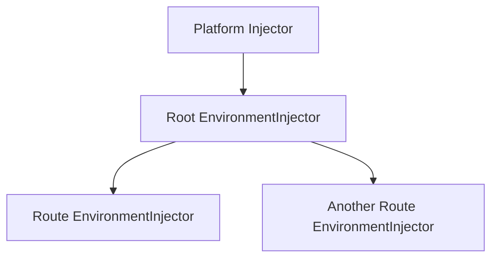
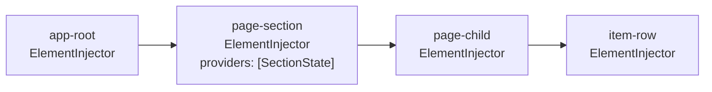
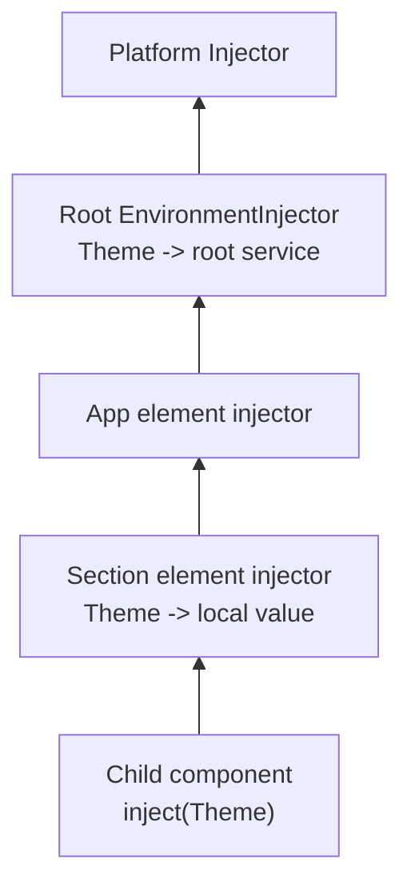
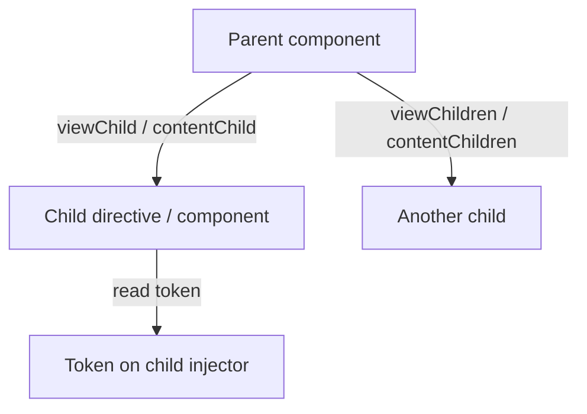

Dependency injection is one of those topics that can look abstract at first, but the underlying problem is simple:

How does one object get access to the things it depends on?

We will start with plain TypeScript, build up the idea of a DI container, and then move into Angular's dependency injection system: injectors, tokens, providers, `@Injectable`, `providedIn`, component and directive injection, and the connection between DI and queries.

## 1. Manual object creation

Let's start with the most direct approach.

```ts
class Logger {
  log(message: string) {
    console.log(message);
  }
}

class UserApi {
  private logger = new Logger();

  loadUser(id: string) {
    this.logger.log(`Loading user ${id}`);
    return { id, name: 'Alice' };
  }
}
```

This works, but `UserApi` is doing two jobs:

- business logic
- creating one of its own dependencies

That leads to tighter coupling than we usually want. `UserApi` is now tied to:

- the concrete `Logger` class
- the decision to instantiate it directly
- the decision to own its lifetime

That becomes painful when testing, replacing, configuring, or sharing dependencies.

## 2. Eagerly instantiated singletons

A common next step is to create one shared instance up front.

```ts
class Logger {
  log(message: string) {
    console.log(message);
  }
}

const logger = new Logger();

class UserApi {
  loadUser(id: string) {
    logger.log(`Loading user ${id}`);
    return { id, name: 'Alice' };
  }
}
```

This avoids repeated instantiation, but it still has problems:

- the dependency source is global
- the consumer still decides where it comes from
- testing becomes awkward
- the lifetime policy is baked into the code

We have reduced duplication, but not really separated concerns.

## 3. Lazily instantiated singletons

Sometimes we want a singleton only if it is actually needed.

```ts
class Logger {
  log(message: string) {
    console.log(message);
  }
}

class LoggerStore {
  private static instance: Logger | null = null;

  static get() {
    if (!this.instance) {
      this.instance = new Logger();
    }

    return this.instance;
  }
}

class UserApi {
  loadUser(id: string) {
    LoggerStore.get().log(`Loading user ${id}`);
    return { id, name: 'Alice' };
  }
}
```

This helps with eager startup cost, but `UserApi` still knows too much. It now depends not just on `Logger`, but on the singleton access mechanism too.

That is the recurring problem: the class that needs the dependency is still involved in deciding how the dependency is obtained.

## 4. Dependency injection

Dependency injection means that a class receives what it needs instead of creating or locating it itself.

```ts
class Logger {
  log(message: string) {
    console.log(message);
  }
}

class UserApi {
  private logger!: Logger;

  setLogger(logger: Logger) {
    this.logger = logger;
  }

  loadUser(id: string) {
    this.logger.log(`Loading user ${id}`);
    return { id, name: 'Alice' };
  }
}

const logger = new Logger();
const api = new UserApi();
api.setLogger(logger);
```

Now `UserApi` only expresses what it needs. It no longer decides:

- how `Logger` is created
- whether it is shared
- whether it is lazy
- whether it is replaced in tests
- whether a different implementation should be used

That separation is the whole point.

## 5. What a DI container is

In a typical DI system, the container is the object responsible for managing dependencies.

A container usually knows:

- which tokens exist
- how each token should be created
- whether to create a new value or reuse an existing one
- how to resolve nested dependencies

If `A` depends on `B`, and `B` depends on `C`, the container can build that graph for you.

Instead of writing this manually:

```ts
const c = new C();
const b = new B(c);
const a = new A(b);
```

you register rules with the container, and then ask it for `A`.

That means the container handles:

- registration
- resolution
- instantiation
- lifetime and scope

This is what Angular's DI system does for framework-managed objects.

## 6. Tokens

A DI system usually works in terms of tokens.

A token is the key you use to ask for a dependency.

Sometimes the token is a class. Sometimes it is not.

Examples of non-class tokens:

- config values
- environment-specific settings
- feature flags
- abstractions with multiple implementations

This distinction matters because "what I need" and "how it is created" are not the same thing.

Angular models this very explicitly.

## 7. Angular DI

Angular has a built-in dependency injection system. It manages dependencies for objects Angular creates, including:

- services
- components
- directives

A simple Angular-managed dependency might look like this:

```ts
import { Injectable } from '@angular/core';

@Injectable({
  providedIn: 'root',
})
export class Logger {
  log(message: string) {
    console.log(message);
  }
}
```

And another Angular-managed class can request it with `inject()`:

```ts
import { Component, inject } from '@angular/core';
import { Logger } from './logger';

@Component({
  selector: 'user-page',
  template: `User page`,
})
export class UserPage {
  private logger = inject(Logger);
}
```

The important point is the same as before:

`UserPage` asks for `Logger`. Angular handles finding or creating it.

## 8. `@Injectable()` and `providedIn`

`@Injectable()` marks a class as something Angular can create through DI.

```ts
@Injectable({
  providedIn: 'root',
})
export class ApiClient {}
```

The `providedIn` option tells Angular where to register that dependency.

The most common value is `'root'`, which means:

- register it in the root environment injector
- make it available throughout the application
- typically create one shared instance for that scope

So `providedIn` is really about registration scope.

If a class has `@Injectable()` but no `providedIn`, Angular can still create it, but it must be registered explicitly somewhere in a `providers` array.

## 9. Injection tokens

Classes work well as tokens when the dependency is naturally represented by a class.

But sometimes the thing we want to inject is not a class at all. In those cases we use `InjectionToken`.

```ts
import { InjectionToken } from '@angular/core';

export const API_URL = new InjectionToken<string>('api.url');
```

Now `API_URL` can be used as a DI token:

```ts
const apiUrl = inject(API_URL);
```

This is useful for things like:

- config values
- runtime flags
- aliases
- abstract capabilities

## 10. Providers

A provider tells Angular what value should be used for a token.

This is one of the core concepts in Angular DI.

### Class provider

```ts
providers: [Logger]
```

This is shorthand for:

```ts
providers: [{ provide: Logger, useClass: Logger }]
```

### `useClass`

```ts
providers: [
  { provide: Logger, useClass: ConsoleLogger },
]
```

When something asks for `Logger`, Angular creates `ConsoleLogger`.

### `useValue`

```ts
providers: [
  { provide: API_URL, useValue: '/api' },
]
```

Angular returns exactly that value.

### `useFactory`

```ts
providers: [
  {
    provide: API_URL,
    useFactory: () => window.location.origin + '/api',
  },
]
```

Angular calls the factory and uses its return value.

Factories can also use DI:

```ts
import { InjectionToken, inject } from '@angular/core';

export const FEATURE_ENABLED = new InjectionToken<boolean>('feature.enabled');

providers: [
  {
    provide: FEATURE_ENABLED,
    useFactory: () => inject(Config).isEnabled('chat'),
  },
]
```

### `useExisting`

```ts
providers: [
  Logger,
  { provide: AuditLogger, useExisting: Logger },
]
```

This creates an alias. Asking for `AuditLogger` returns the same instance as `Logger`.

That is important because `useExisting` shares an existing instance, while `useClass` resolves through a class provider.

## 11. A first Angular example

```ts
import { Component, Injectable, InjectionToken, inject } from '@angular/core';

export const API_URL = new InjectionToken<string>('api.url');

@Injectable({
  providedIn: 'root',
})
export class Logger {
  log(message: string) {
    console.log(message);
  }
}

@Injectable()
export class UserApi {
  private logger = inject(Logger);
  private apiUrl = inject(API_URL);

  loadUser(id: string) {
    this.logger.log(`GET ${this.apiUrl}/users/${id}`);
  }
}

@Component({
  selector: 'user-page',
  template: `User page`,
  providers: [
    UserApi,
    { provide: API_URL, useValue: '/feature-api' },
  ],
})
export class UserPage {
  private api = inject(UserApi);

  ngOnInit() {
    this.api.loadUser('42');
  }
}
```

Here:

- `Logger` comes from the root environment injector
- `UserApi` is scoped to this component
- `API_URL` is also scoped to this component
- Angular creates `UserApi` and resolves its dependencies automatically

## 12. Angular uses hierarchical injectors

Angular does not use one flat global container.

It uses a hierarchy of injectors, and that hierarchy is what makes scoping and local overrides possible.

The two main injector hierarchies to understand are:

- the `EnvironmentInjector` hierarchy
- the `ElementInjector` hierarchy

## 13. Environment injectors

`EnvironmentInjector` is the broader application-level hierarchy.

Important levels include:

- the platform injector
- the root environment injector
- child environment injectors created for smaller scopes such as routes

The root environment injector is where dependencies provided with:

```ts
@Injectable({ providedIn: 'root' })
```

are registered.

That is why those dependencies are usually available application-wide.

Child environment injectors let Angular create smaller scopes with different provider configuration.

## 14. Element injectors

Angular also creates an `ElementInjector` for each DOM element.

Most are empty, but they can hold providers contributed by directives and components on that element.

For example:

```ts
import { Component } from '@angular/core';
import { SectionState } from './section-state';

@Component({
  selector: 'app-section',
  template: `<app-child />`,
  providers: [SectionState],
})
export class Section {}
```

That `SectionState` provider lives on the injector associated with the host element of `Section`.

This is why descendants can inject dependencies provided by ancestor components or directives.

A useful mental model is:

- environment injectors provide broad app or route scope
- element injectors provide local tree scope

## 15. Injector hierarchy diagram

It is easier to read this as two related hierarchies rather than one crowded diagram.

### Environment injector hierarchy



### Element injector hierarchy in a component subtree



The important thing to notice is that Angular has more than one hierarchy in play:

- environment injectors for broader scopes
- element injectors for local template scopes

When a dependency is resolved, Angular moves through those hierarchies according to its resolution rules.

## 16. How Angular resolves a dependency

When Angular resolves a token, a useful mental model is:

1. Search upward through the `ElementInjector` chain.
2. If no match is found there, continue through the `EnvironmentInjector` chain.

The most important practical rule is:

The nearest matching provider wins.

Example:

```ts
import { Component, Injectable, inject } from '@angular/core';

@Injectable({
  providedIn: 'root',
})
export class Theme {
  name = 'global';
}

@Component({
  selector: 'page-section',
  template: `<page-child />`,
  providers: [
    { provide: Theme, useValue: { name: 'local' } },
  ],
})
export class Section {}

@Component({
  selector: 'page-child',
  template: `Child`,
})
export class Child {
  theme = inject(Theme);
}
```

`Child` gets the local `Theme`, not the root one, because the nearest visible provider wins.

## 17. Injection resolution diagram



Angular does not jump straight to the root. It checks the nearest relevant injectors first.

That is what makes local overrides possible.

## 18. Components and directives can be injected

Components and directives are just Angular-created objects, so they can also participate in DI.

That means Angular can inject:

- services
- injection tokens
- directives
- components

For example, a child can inject its parent:

```ts
import { Component, inject } from '@angular/core';

@Component({
  selector: 'parent-panel',
  template: `<child-item />`,
})
export class ParentPanel {
  title = 'Parent';
}

@Component({
  selector: 'child-item',
  template: `Child`,
})
export class ChildItem {
  parent = inject(ParentPanel);
}
```

This works because the parent component instance is available through the injector hierarchy.

That can be very useful, but it also introduces tighter coupling, so it should be used intentionally.

## 19. Resolution modifiers

Angular gives us some control over lookup behavior.

### Optional lookup

```ts
const parent = inject(ParentPanel, { optional: true });
```

If Angular cannot resolve the token, it returns `null` instead of throwing.

### `self`

Only check the current injector.

### `skipSelf`

Skip the current injector and begin at the parent.

### `host`

Stop the search at the host boundary.

These are advanced tools, but they make the injector hierarchy much easier to reason about when you need precise behavior.

## 20. Why DI is useful in Angular

At this point the Angular-specific benefits are clearer.

DI gives us:

- centralized object creation
- shared dependencies without globals
- local overrides
- route- or subtree-level scoping
- better testability
- less manual wiring
- a consistent model for framework-managed relationships

Instead of every feature inventing its own object-sharing strategy, Angular gives us one dependency model that works everywhere.

## 21. Queries and DI are closely related

APIs like `viewChild`, `viewChildren`, `contentChild`, and `contentChildren` are not the same thing as normal injection, but they are closely related conceptually.

A useful mental model is:

- `inject()` looks upward for a token
- queries look downward for matching nodes
- once a node is found, Angular can read a value from it

So queries and DI are different APIs built on related ideas:

- tree traversal
- tokens
- values attached to nodes

## 22. View queries

A view query searches inside a component's own template.

```ts
import { Component, viewChild } from '@angular/core';
import { SearchInput } from './search-input';

@Component({
  selector: 'app-toolbar',
  template: `<input searchInput />`,
})
export class Toolbar {
  searchInput = viewChild(SearchInput);
}
```

This asks Angular to find a matching child in the component's own view.

## 23. Content queries

A content query searches projected content passed into a component.

If a component accepts content through `<ng-content>`, then a content query can inspect that projected content.

The important boundary is:

A component cannot query into another component's private template.

Each component's template is a black box to the outside.

## 24. Queries can read provider tokens

Queries get especially interesting when they use tokens.

```ts
import { Component, InjectionToken, viewChild } from '@angular/core';

export const ITEM_KIND = new InjectionToken<string>('item.kind');

@Component({
  selector: 'app-item',
  template: `Item`,
  providers: [
    { provide: ITEM_KIND, useValue: 'special' },
  ],
})
export class Item {}

@Component({
  selector: 'app-list',
  template: `<app-item />`,
})
export class List {
  itemKind = viewChild(ITEM_KIND);
}
```

This is where the connection to DI becomes very obvious.

The query is effectively saying:

- find a matching child node
- read the token from that node's injector

So while queries are not just "injection in reverse", they are definitely operating in the same conceptual space.

## 25. Query traversal diagram



The direction is the opposite of normal injection:

- `inject()` climbs upward
- queries search downward

## 26. The `read` option

Queries become even more DI-shaped when we use `read`.

```ts
import { Component, ElementRef, viewChild } from '@angular/core';
import { SearchInput } from './search-input';

@Component({
  selector: 'app-toolbar',
  template: `<input searchInput />`,
})
export class Toolbar {
  inputEl = viewChild(SearchInput, { read: ElementRef<HTMLInputElement> });
}
```

That means:

- locate the node using `SearchInput`
- read `ElementRef` from that node

This is a very useful feature because the thing used to match and the thing ultimately read do not have to be the same.

## 27. Template references

A template reference is a local template variable created with `#`.

```html
<input #searchBox />
```

That creates a local reference named `searchBox` inside that template.

Template references can refer to:

- an element
- a component instance
- a directive export
- an `ng-template`

They are not injectors themselves, but Angular queries can use template references as locators.

## 28. A common problem: circular imports between parent and child

There is a common pattern that can accidentally create a circular import:

- the parent queries for the child
- the child injects the parent

For example:

```ts
// parent-panel.ts
import { Component, contentChildren } from '@angular/core';
import { ChildItem } from './child-item';

@Component({
  selector: 'parent-panel',
  template: `<ng-content />`,
})
export class ParentPanel {
  children = contentChildren(ChildItem);
}
```

```ts
// child-item.ts
import { Component, inject } from '@angular/core';
import { ParentPanel } from './parent-panel';

@Component({
  selector: 'child-item',
  template: `Child`,
})
export class ChildItem {
  parent = inject(ParentPanel);
}
```

Now `parent-panel.ts` imports `child-item.ts`, and `child-item.ts` imports `parent-panel.ts`.

Even if the cycle does not fail immediately, it usually means the relationship is more concrete than it needs to be.

A cleaner fix is to introduce a token and depend on a role instead of a specific class.

## 29. Fix 1: alias the parent with a token

If the child needs access to the parent, but the child should not depend on the parent's concrete class, define a token for the parent role.

```ts
// parent-api.ts
import { InjectionToken } from '@angular/core';

export interface ParentApi {
  register(id: string): void;
}

export const PARENT_API = new InjectionToken<ParentApi>('PARENT_API');
```

Provide that token from the parent:

```ts
// parent-panel.ts
import { Component, contentChildren } from '@angular/core';
import { PARENT_API, ParentApi } from './parent-api';
import { ChildItem } from './child-item';

@Component({
  selector: 'parent-panel',
  template: `<ng-content />`,
  providers: [
    { provide: PARENT_API, useExisting: ParentPanel },
  ],
})
export class ParentPanel implements ParentApi {
  children = contentChildren(ChildItem);

  register(id: string) {
    console.log('register', id);
  }
}
```

Inject the token in the child:

```ts
// child-item.ts
import { Component, inject } from '@angular/core';
import { PARENT_API } from './parent-api';

@Component({
  selector: 'child-item',
  template: `Child`,
})
export class ChildItem {
  parent = inject(PARENT_API);
}
```

Now the child no longer imports `ParentPanel`.

This is a good fit when:

- the child depends on a parent capability
- the parent is the stable contract
- the parent still wants to query concrete child types

## 30. Fix 2: alias the child with a token

Sometimes the parent does not really need the concrete child class either. It only needs to query children that satisfy some contract.

In that case, define a token for the child role.

```ts
// child-api.ts
import { InjectionToken } from '@angular/core';

export interface ChildApi {
  id: string;
  focus(): void;
}

export const CHILD_API = new InjectionToken<ChildApi>('CHILD_API');
```

Provide that token from the child:

```ts
// child-item.ts
import { Component, inject } from '@angular/core';
import { CHILD_API } from './child-api';
import { ParentPanel } from './parent-panel';

@Component({
  selector: 'child-item',
  template: `Child`,
  providers: [
    { provide: CHILD_API, useExisting: ChildItem },
  ],
})
export class ChildItem {
  parent = inject(ParentPanel);

  id = crypto.randomUUID();

  focus() {
    console.log('focus', this.id);
  }
}
```

Then the parent queries by token instead of concrete child type:

```ts
// parent-panel.ts
import { Component, contentChildren } from '@angular/core';
import { CHILD_API } from './child-api';

@Component({
  selector: 'parent-panel',
  template: `<ng-content />`,
})
export class ParentPanel {
  children = contentChildren(CHILD_API);
}
```

Now the parent no longer imports `ChildItem`.

This is a good fit when:

- the parent depends on a child capability
- the child role is the stable contract
- the child still injects the parent directly

## 31. Which alias is better?

Both are valid. The better choice depends on where you want the abstraction boundary.

Alias the parent with a token when:

- children depend on a parent capability
- the parent is the stable contract
- the parent still wants to query concrete child types

Alias the child with a token when:

- the parent depends on a child capability
- the child role is the stable contract
- the parent should not know the child's concrete class

In some designs, both sides can use tokens, which gives the loosest coupling of all.

## 32. A useful mental model

A compact mental model for Angular DI is:

- providers place tokens into injectors
- `inject()` asks Angular for a token
- Angular resolves the token from the nearest visible injector
- element injectors give local tree scope
- environment injectors give broader scope
- queries search downward and can read tokens from matched nodes

Once that model is clear, Angular's DI system starts to feel predictable rather than magical.

## 33. Final takeaway

Dependency injection is not mainly about services. It is about separating usage from creation.

A class should describe what it needs. The system should decide how those dependencies are created, shared, configured, and scoped.

Angular gives us that system through:

- `@Injectable()`
- `providedIn`
- `InjectionToken`
- providers
- hierarchical injectors
- `inject()`
- query APIs that can read from child injectors

Once those pieces click together, a lot of Angular features stop feeling like isolated APIs and start feeling like parts of one coherent model.
