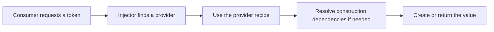
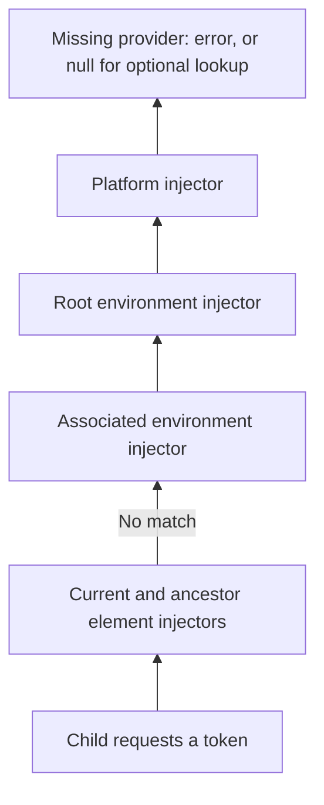

Two components ask for the same service. Sometimes they receive the same instance; sometimes they receive separate instances. A component overrides a configuration token, but a root-provided service still uses the original value.

Those behaviors become predictable once you separate three questions:

- **Token:** what dependency is being requested?
- **Provider:** how should its value be obtained?
- **Injector:** where does that provider live, and which instance does it own?

Dependency injection starts with an even simpler distinction: **using an object is not the same responsibility as creating it**.

We will start with plain TypeScript, then follow one dependency through Angular's providers and injector hierarchies. The Angular examples use standalone components and signal-based queries; their APIs and behavior were checked against Angular v22.2.1.

## Contents

1. [Usage versus construction](#usage-versus-construction)
2. [Manual injection versus a container](#manual-injection-versus-a-container)
3. [Tokens and provider recipes](#tokens-and-provider-recipes)
4. [Where inject can run](#where-inject-can-run)
5. [Hierarchies and instance ownership](#hierarchies-and-instance-ownership)
6. [Local overrides and visibility](#local-overrides-and-visibility)
7. [Queries and parent/child collaboration](#queries-and-parentchild-collaboration)
8. [A debugging checklist](#a-debugging-checklist)

## Usage versus construction

Consider a class that creates its own dependency:

```ts
class Logger {
  log(message: string): void {
    console.log(message);
  }
}

class UserApi {
  private readonly logger = new Logger();

  loadUser(id: string): void {
    this.logger.log(`Loading user ${id}`);
  }
}
```

`UserApi` uses logging, but it also decides which logger to construct and when to construct it. Replacing the logger now means changing the consumer.

Moving the logger to a global variable avoids repeated construction. Hiding it behind a lazy singleton delays construction. Neither removes the consumer's knowledge of **where to obtain it**.

Constructor injection moves that decision outside the class:

```ts
interface LogSink {
  log(message: string): void;
}

class UserApi {
  constructor(private readonly logger: LogSink) {}

  loadUser(id: string): void {
    this.logger.log(`Loading user ${id}`);
  }
}

const api = new UserApi(console);
api.loadUser("42");
```

The class receives a usable dependency when it is constructed. There is no later setter that callers must remember before `loadUser()` is safe to call.

A test can supply a different implementation without changing `UserApi`:

```ts
const messages: string[] = [];
const api = new UserApi({
  log(message) {
    messages.push(message);
  },
});

api.loadUser("42");
console.log(messages); // ["Loading user 42"]
```

**This is already dependency injection.** It does not require decorators, a framework, or a container. The benefit is separation of responsibilities, not the number of objects involved.

## Manual injection versus a container

Manual wiring is straightforward for a small graph:

```ts
const logger = new Logger();
const api = new UserApi(logger);
```

For a larger graph, some object must still decide how dependencies are created, configured, and shared. A **DI container** automates that wiring using registered rules.

Angular calls its containers **injectors**. An injector can look up a token, use its provider to produce a value, and reuse that value for later requests. If construction needs other dependencies, those are resolved in turn.


```mermaid
flowchart LR
    C[Consumer requests a token] --> I[Injector finds a provider]
    I --> P[Use the provider recipe]
    P --> D[Resolve construction dependencies if needed]
    D --> V[Create or return the value]
```

The injector does not remove the need to choose lifetimes or implementations. It gives those choices an explicit home instead of scattering them through consumers.

## Tokens and provider recipes

A **token** is a runtime lookup key. A **provider** describes how to obtain the value for that key.

A class can serve both as a token and as its implementation:

```ts
import { Injectable } from "@angular/core";

@Injectable({ providedIn: "root" })
export class Logger {
  log(message: string): void {
    console.log(message);
  }
}
```

`@Injectable()` supplies Angular with the metadata needed to construct the service. `providedIn: "root"` registers it in the application's root environment scope. Without `providedIn`, register it explicitly in an appropriate `providers` array.

This is registration, not immediate construction: a normal class provider creates its instance when first resolved. Root registration also supports tree-shaking of unused services.

### Values and interfaces need runtime tokens

TypeScript interfaces disappear at runtime. Angular cannot look up an interface name that no longer exists.

Use `InjectionToken<T>` for configuration, functions, or interface-shaped capabilities:

```ts
import { InjectionToken } from "@angular/core";

export const API_URL = new InjectionToken<string>("api.url");
```

The description helps debugging; it is not the identity. Two calls to `new InjectionToken<string>("api.url")` create **different tokens**, even with the same description. Export and reuse the same token object.

### Provider recipes

The following are provider-array fragments. Place them in application configuration, route configuration, or component metadata according to the desired scope; they are not standalone statements.

| Recipe                                                          | Meaning                                                    |
| --------------------------------------------------------------- | ---------------------------------------------------------- |
| `Logger`                                                        | Shorthand for `{ provide: Logger, useClass: Logger }`      |
| `{ provide: Logger, useClass: ConsoleLogger }`                  | Construct `ConsoleLogger` for requests for `Logger`        |
| `{ provide: API_URL, useValue: "/api" }`                        | Return exactly the supplied value                          |
| `{ provide: API_URL, useFactory: () => inject(Config).apiUrl }` | Call a factory to obtain the value                         |
| `{ provide: AuditLogger, useExisting: Logger }`                 | Resolve `Logger` and return that value under another token |

Here, `ConsoleLogger`, `Config`, and `AuditLogger` stand for application-defined classes. The factory can call `inject()` because Angular executes it in an injection context.

A normal factory provider is not a getter that reruns on every injection. Angular caches its result in the injector that owns the provider. Likewise, `useValue` does not clone an object for each consumer.

### Construction is not aliasing

These registrations create separate instances, even though both use the same class:

```ts
const providers = [ConsoleLogger, { provide: Logger, useClass: ConsoleLogger }];
```

Resolving `ConsoleLogger` constructs one instance. Resolving `Logger` constructs another instance for that registration.

To share the resolved instance, alias its token:

```ts
const providers = [ConsoleLogger, { provide: Logger, useExisting: ConsoleLogger }];
```

Now both tokens resolve to the same object. This distinction matters when the object holds state, subscriptions, or resource ownership.

## Where inject can run

`inject()` is not a global service locator you can call anywhere. It needs an active **injection context**: a synchronous execution context in which Angular knows the current injector.

Common valid locations include:

- field initializers and constructors of classes created by Angular DI;
- provider and injection-token factories;
- framework callbacks explicitly designed for DI, such as functional router guards;
- synchronous code called from one of those contexts.

```ts
import { Component, inject } from "@angular/core";
import { Logger } from "./logger";

@Component({
  selector: "user-page",
  template: `<button (click)="load()">Load user</button>`,
})
export class UserPage {
  private readonly logger = inject(Logger);

  load(): void {
    this.logger.log("Loading user");
  }
}
```

The field initializer resolves the dependency during construction. The later event handler uses the stored reference.

Moving `inject(Logger)` into `load()` would fail with **NG0203**. Lifecycle hooks such as `ngOnInit()` are not automatically injection contexts either. Resolve dependencies during initialization and use them later.

For code that genuinely needs an explicit context, Angular provides `runInInjectionContext(injector, callback)`. The callback's context is synchronous: it does not survive an `await` or transfer to a later timer callback. Resolve the dependencies before the asynchronous boundary.

An injection context also does not make `new UserPage()` equivalent to Angular creating a component. Framework construction and plain JavaScript construction are different operations.

## Hierarchies and instance ownership

Angular does not have one flat container. In a standalone application, the two main hierarchies are:

- **Environment injectors:** application and broader feature scopes, including child injectors created by route provider configuration.
- **Element injectors:** providers associated with components and directives in Angular's logical view tree.

For a normal component/directive request, Angular searches the current element injector and eligible ancestors first. If no provider matches, it falls back to the environment hierarchy associated with the request's starting location.


```mermaid
flowchart BT
    Child[Child requests a token] --> Local[Current and ancestor element injectors]
    Local -->|No match| Route[Associated environment injector]
    Route --> Root[Root environment injector]
    Root --> Platform[Platform injector]
    Platform --> Missing[Missing provider: error, or null for optional lookup]
```

**The nearest visible matching provider wins.** Visibility matters: this is Angular's logical view hierarchy, not an arbitrary walk through `element.parentElement`. NgModule-based applications also have module-injector configuration; the examples here use standalone setup.

### One shared instance per owning scope, not per class name

A root-provided service normally has one instance per application root injector. It is not a process-wide singleton, and a local provider can create another instance of the same class.

```ts
import { Component, Injectable, inject, signal } from "@angular/core";

@Injectable()
export class SectionState {
  readonly count = signal(0);
}

@Component({
  selector: "section-counter",
  providers: [SectionState],
  template: ` <button (click)="increment()">Count: {{ state.count() }}</button> `,
})
export class SectionCounter {
  readonly state = inject(SectionState);

  increment(): void {
    this.state.count.update((count) => count + 1);
  }
}
```

Render two `<section-counter />` instances and each gets its own `SectionState`. Clicking one does not change the other. Eligible descendants of each counter can share that counter's local instance.

Destroying a counter destroys its element-scoped service instance too. Angular invokes applicable destruction hooks; a service that owns resources still needs to release them, for example through `DestroyRef` or `ngOnDestroy()`.

Do not assume a route-provided service is recreated on every navigation. Its lifetime follows its owning injector and router reuse behavior, not simply a URL change.

## Local overrides and visibility

The most revealing override example involves a service's **own dependencies**.

Suppose these declarations live in `user-api.ts`:

```ts
import { Injectable, InjectionToken, inject } from "@angular/core";

export const API_URL = new InjectionToken<string>("api.url", {
  providedIn: "root",
  factory: () => "/api",
});

@Injectable({ providedIn: "root" })
export class UserApi {
  readonly apiUrl = inject(API_URL);
}
```

Now a component overrides the token:

```ts
import { Component, inject } from "@angular/core";
import { API_URL, UserApi } from "./user-api";

@Component({
  selector: "user-page",
  providers: [{ provide: API_URL, useValue: "/feature-api" }],
  template: `
    <p>Direct token: {{ directUrl }}</p>
    <p>Service configuration: {{ api.apiUrl }}</p>
  `,
})
export class UserPage {
  readonly directUrl = inject(API_URL);
  readonly api = inject(UserApi);
}
```

The output is:

```text
Direct token: /feature-api
Service configuration: /api
```

The direct request sees the component provider. But `UserApi` belongs to the root injector, so its construction resolves `API_URL` from that root context. This remains true even if this component is the first consumer to request `UserApi`.

**A consumer's local overrides do not reconfigure a dependency owned by an ancestor injector.**

To create a locally configured `UserApi`, use this array for the component's `providers`:

```ts
const providers = [UserApi, { provide: API_URL, useValue: "/feature-api" }];
```

Now the component owns both registrations, and both displayed URLs are `/feature-api`. The root `UserApi` registration still exists for other consumers.

### providers versus viewProviders

Component `providers` can be visible to both view descendants and projected content. `viewProviders` restricts those providers to the component's own view; content passed through `<ng-content>` cannot see them.

This is useful when a component needs private internal state without overriding dependencies used by its caller's projected content.

Projection changes where content is displayed, not simply where all its dependencies are resolved. That is why “nearest DOM ancestor wins” is an insufficient model.

### Resolution modifiers

These options modify an individual `inject()` request:

| Option               | Effect                                                                                                      |
| -------------------- | ----------------------------------------------------------------------------------------------------------- |
| `{ optional: true }` | Return `null` if lookup fails instead of throwing                                                           |
| `{ self: true }`     | Restrict lookup to the current injector                                                                     |
| `{ skipSelf: true }` | Skip the current injector and start with its parent                                                         |
| `{ host: true }`     | Limit element lookup to the host boundary of the containing view; do not fall back to environment providers |

For example, `inject(SectionState, { optional: true, skipSelf: true })` asks for an ancestor's state rather than a provider on the current element.

The host boundary is not merely “the nearest parent HTML element.” It depends on Angular's view structure, and `providers` versus `viewProviders` affects what is visible there. Use `host` when that boundary is part of the component's intended contract, not as a general scoping fix.

## Queries and parent/child collaboration

Components and directives themselves are available for injection. A child can inject an eligible ancestor component instance without the parent manually registering itself as a service.

The opposite relationship uses **queries**:

- `inject()` resolves a dependency from the current context and eligible ancestors.
- `viewChild` and `viewChildren` search a component's own template.
- `contentChild` and `contentChildren` search content supplied by its caller.

Queries return signals. A single-result query can return `undefined` when no match exists; a multiple-result query returns an array. Required single-result queries fail if the required match is absent.

| Query                       | Descendant traversal                                                              |
| --------------------------- | --------------------------------------------------------------------------------- |
| `viewChild`, `viewChildren` | Traverse the component's own view                                                 |
| `contentChild`              | Traverses descendants by default                                                  |
| `contentChildren`           | Direct children by default; use `{ descendants: true }` to include deeper matches |

None of these queries pierces another component's private template. Traversing descendants is not permission to cross that boundary.

### Locating a node and reading a value are separate choices

A query locator can be a component, directive, provider token, or template-reference name. It is not a CSS selector.

```ts
import { Component, ElementRef, viewChild } from "@angular/core";

@Component({
  selector: "search-toolbar",
  template: `
    <input #searchBox aria-label="Search" />
    <button (click)="focusSearch()">Focus search</button>
  `,
})
export class SearchToolbar {
  private readonly input = viewChild.required("searchBox", {
    read: ElementRef<HTMLInputElement>,
  });

  focusSearch(): void {
    this.input().nativeElement.focus();
  }
}
```

`#searchBox` locates the node; `read: ElementRef` specifies the value to retrieve. A token locator similarly finds a node providing that token and, by default, reads its value. Queries and DI share tokens and node-associated values, but queries are not unrestricted “injection in reverse.”

### Break a circular import with a capability token

A parent may query children while each child injects the parent:

```text
parent-panel.ts → imports ChildItem to query it
child-item.ts   → imports ParentPanel to inject it
```

That is a **module import cycle**. It is different from a **DI construction cycle**, where creating service A requires B and creating B requires A. Removing a module import cycle does not automatically repair a cyclic construction graph.

If the child only needs a parent capability, give that capability a token. The following three files form one example.

```ts
// parent-api.ts
import { InjectionToken } from "@angular/core";

export interface ParentApi {
  select(id: string): void;
}

export const PARENT_API = new InjectionToken<ParentApi>("parent.api");
```

```ts
// child-item.ts
import { Component, inject, input } from "@angular/core";
import { PARENT_API } from "./parent-api";

@Component({
  selector: "child-item",
  template: `<button (click)="select()">Select {{ id() }}</button>`,
})
export class ChildItem {
  readonly id = input.required<string>();
  private readonly parent = inject(PARENT_API);

  select(): void {
    this.parent.select(this.id());
  }
}
```

```ts
// parent-panel.ts
import { Component, contentChildren, forwardRef, signal } from "@angular/core";
import { ChildItem } from "./child-item";
import { PARENT_API, type ParentApi } from "./parent-api";

@Component({
  selector: "parent-panel",
  providers: [{ provide: PARENT_API, useExisting: forwardRef(() => ParentPanel) }],
  template: `
    <p>Items: {{ children().length }}</p>
    <p>Selected: {{ selectedId() }}</p>
    <ng-content />
  `,
})
export class ParentPanel implements ParentApi {
  readonly children = contentChildren(ChildItem);
  readonly selectedId = signal<string | null>(null);

  select(id: string): void {
    this.selectedId.set(id);
  }
}
```

`useExisting` returns the actual parent component instance, not a second constructed parent. `forwardRef` defers resolving that class reference in the decorator configuration.

The child imports the contract, not the parent. The parent can still query the concrete child class, so the import cycle is gone.

Here is the caller that supplies the content:

```ts
import { Component } from "@angular/core";
import { ChildItem } from "./child-item";
import { ParentPanel } from "./parent-panel";

@Component({
  selector: "selection-page",
  imports: [ParentPanel, ChildItem],
  template: `
    <parent-panel>
      <child-item id="first" />
      <child-item id="second" />
    </parent-panel>
  `,
})
export class SelectionPage {}
```

The panel reports two items. Selecting either item updates the parent's selected ID. The caller imports both components because both selectors appear in **its** template; querying a class does not require adding it to the parent's template imports.

### Alternatively, alias the child role

If the parent should know only a child capability, put a `CHILD_API` token and its interface in a shared contract file instead:

```ts
import { InjectionToken } from "@angular/core";

export interface ChildApi {
  focus(): void;
}

export const CHILD_API = new InjectionToken<ChildApi>("child.api");
```

This replaces a concrete child reference with a runtime contract. Use the following array for the child's component `providers`, importing `CHILD_API` from the contract file and `forwardRef` from `@angular/core`:

```ts
const providers = [{ provide: CHILD_API, useExisting: forwardRef(() => ChildItem) }];
```

The child must implement `ChildApi`; the parent can then query `contentChildren(CHILD_API)` without importing `ChildItem`. These are alternative-design fragments, not additions required by the preceding example.

Choose the direction that removes the unwanted dependency. Use tokens on both sides only when both sides genuinely need independent contracts, not merely to maximize abstraction.

## A debugging checklist

When injection behaves unexpectedly, inspect the request and its owner:

1. **Is it the same runtime token?** Interfaces are erased, and identically described `InjectionToken` objects are still distinct.
2. **Is there an injection context?** NG0203 points to where `inject()` ran, not necessarily to a missing provider.
3. **Where is the provider registered?** Check root, route, component, and directive configuration. `@Injectable()` without registration is not enough.
4. **Which injector owns the object being constructed?** A component override does not flow into a root-owned service's dependencies.
5. **Was a second instance requested?** Local re-provisioning and `useClass` registrations can create separate instances; `useExisting` aliases a resolved value.
6. **Is the provider visible?** Check projection, `viewProviders`, and resolution modifiers rather than just the rendered DOM.
7. **What kind of cycle exists?** Module imports and recursive DI construction need different fixes.
8. **Is the query allowed to find the target?** Check the template boundary, descendant options, and whether the target currently exists.

For a test, instantiate the consumer through the intended injector scope and assert the observable behavior or instance identity. A test that manually constructs every object can bypass the provider configuration you meant to verify.

## Takeaways

- Dependency injection separates dependency usage from construction; a container is optional.
- Tokens identify dependencies, providers obtain values, and injectors own registrations and cached instances.
- `inject()` requires a synchronous injection context.
- Root scope is application-wide sharing, not a guarantee that every request for a class returns one universal instance.
- A service resolves its own dependencies in its owning injector's context.
- Queries can read node-associated tokens without crossing component template boundaries.
- Capability tokens are useful when they remove a concrete coupling problem.

## Sources and further reading

- [Angular: dependency injection overview](https://angular.dev/guide/di)
- [Angular: defining dependency providers and aliases](https://angular.dev/guide/di/defining-dependency-providers)
- [Angular: injection context](https://angular.dev/guide/di/dependency-injection-context)
- [Angular: hierarchical injectors, visibility, and resolution modifiers](https://angular.dev/guide/di/hierarchical-dependency-injection)
- [Angular: component queries](https://angular.dev/guide/components/queries)
- [Angular: runInInjectionContext](https://angular.dev/api/core/runInInjectionContext)
- [Angular v22.2.1: injector resolution and instance caching](https://github.com/angular/angular/blob/fb7711f87d293ba1a282f21d0e9c1ef651c1b343/packages/core/src/di/r3_injector.ts)
