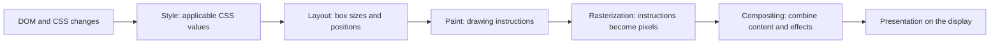

You expand a task's details, mark it complete, or open its editor. The JavaScript might change only one attribute. The browser still has to work out what that change means for the visible page.

This article follows a small task list from changed DOM values to pixels. You need to recognize an HTML element, a CSS declaration such as `color: red;`, and a JavaScript function. The [DOM and events article](/dump/blog/html-dom-and-events/) introduces those pieces; [CSS layout fundamentals](/dump/blog/css-layout-fundamentals/) explains how boxes occupy space. We will explain the rendering work here rather than assume you already know it.

## Contents

1. [Three small changes, three mysteries](#three-small-changes-three-mysteries)
2. [Updating the DOM is not displaying the screen](#updating-the-dom-is-not-displaying-the-screen)
3. [From changed values to pixels](#from-changed-values-to-pixels)
4. [Follow three changes to the same row](#follow-three-changes-to-the-same-row)
5. [When asking for a size makes the browser work](#when-asking-for-a-size-makes-the-browser-work)
6. [Frames are deadlines, not JavaScript allowances](#frames-are-deadlines-not-javascript-allowances)
7. [Layers are reusable content, not free acceleration](#layers-are-reusable-content-not-free-acceleration)
8. [Record one interaction before optimizing it](#record-one-interaction-before-optimizing-it)
9. [Connect the browser work back to Angular](#connect-the-browser-work-back-to-angular)

## Three small changes, three mysteries

Consider these actions in a task list:

- **Expand a row:** a hidden paragraph becomes visible. The row gets taller, so later rows move down.
- **Measure it:** the handler asks for the row's height immediately after revealing the paragraph. Work appears inside that height read, even though the line only looks like a query.
- **Move an editor:** the panel slides a short distance into its final position. Moving its already-drawn content can require less work than repeatedly changing its layout position.

These lead to three questions:

1. Why can a small DOM change cause a slow visual update?
2. Why can reading a size trigger work?
3. Why might `transform` movement cost less than movement through `top` or `left`?

The number of assignments is not enough to answer them. We need to follow what becomes out of date, what the browser must recompute, and what it can reuse.

## Updating the DOM is not displaying the screen

A task title is stored in application data. Activating a button calls an **event handler**: a function that can change that data. Angular reads the data used by its template, compares the relevant results with their previous values, and writes changed results to DOM properties, attributes, or text.

A **binding** connects a template's text or element property to a data value. A **signal** is a value container that can notify Angular when its value changes. Those help arrange application updates. The browser still needs to turn the DOM values and CSS into a visible result.

These are different milestones:

1. The event handler changes application state.
2. Angular performs the required binding and DOM work.
3. The browser updates its description of the page and prepares rendered content.
4. The result can be presented on a display.

Finishing the handler, returning from `signal.set()`, or finishing Angular's DOM update does **not** prove that the user has seen new pixels. A binding check can also finish without changing the DOM at all.

The same distinction applies without Angular. `element.hidden = false` changes the DOM synchronously, but does not promise immediate presentation. A browser can collect several changes before updating their visible result.

Static HTML, server-produced HTML, client-created HTML, and hydrated HTML all still need browser rendering. They differ in how the document and behavior arrive, not in whether CSS and boxes need to become pixels. See [HTML delivery methods](/dump/blog/html-rendering-methods/) and [Angular change detection](/dump/blog/angular-change-detection/) for those separate subjects.

## From changed values to pixels

Imagine revealing the details paragraph. Before it can appear, the browser needs answers to increasingly concrete questions: which CSS values apply, where the boxes fit, what to draw, and which pixels to combine.

Here is a **simplified dependency diagram**, not a promise that every update runs every box:



### Style: which values apply?

The browser matches CSS rules to elements and resolves which declarations win, including inherited values. For example, the task title might now have the completed color, while the details paragraph no longer has `display: none` from being hidden.

This work is usually called **style calculation** or **style recalculation**. Some values still depend on later geometry calculations: a percentage width cannot become a final box width without knowing its reference size.

### Layout: how big, and where?

The browser calculates box sizes and positions from the applicable styles, content, and available space. Text wrapping affects height. A taller row changes where later rows belong.

This is **layout**, also called **reflow** in some tools. It is about geometry, not about coloring pixels. An element, its children, and its neighbors can participate in the same calculation. One changed element is not necessarily one isolated box of work.

### Paint: what should be drawn?

The browser records drawing operations: draw this background, this border, and these letters, in the required order and with the required clipping. **Paint** produces instructions describing the appearance; it is not identical to putting the final pixels on a physical screen.

A **display list** is a recorded list of such drawing operations. Browser tools may expose paint events and their affected areas, although their internal data structures differ.

### Rasterization: turn drawing instructions into pixels

Drawing a glyph or a rounded border requires deciding the colors of actual pixels. **Rasterization** performs that conversion into pixel-backed content, often in smaller pieces called tiles. Images and text can require additional work along this path.

Previously rasterized content may be reusable. Newly exposed content or a changed raster scale can require more rasterization even when the underlying idea is “just move it.”

### Compositing: combine rendered content and effects

The browser combines rendered pieces with their positions, clipping, transparency, and other supported effects to form the result that can be presented. This is **compositing**. It can reuse existing pixel content rather than redraw that content for every movement.

Real engines have additional stages and synchronization between them. Chromium's [RenderingNG architecture](https://developer.chrome.com/docs/chromium/renderingng-architecture) explicitly separates work such as pre-paint, layerization, commit, activation, and drawing. Our five responsibilities are a learning model, not an engine implementation specification.

Crucially, browsers retain results and track what became invalid. They can skip unnecessary stages and update affected content rather than redraw the entire page for every change.

## Follow three changes to the same row

The property name is a clue, but the page and its current state determine the work.

| Change in this task list                       | What becomes different                 | Work to investigate                                                                             |
| ---------------------------------------------- | -------------------------------------- | ----------------------------------------------------------------------------------------------- |
| Reveal a details paragraph                     | Row height and later rows' positions   | Style, layout, and the resulting drawing work                                                   |
| Change only the title's color                  | Appearance, not its text or dimensions | Style and repainting the changed appearance; normally no new layout for that color change alone |
| Animate the editor's `transform` and `opacity` | Visual position and transparency       | Initial setup/drawing, then potentially reuse of rendered content during compositing            |

A font-size change is not equivalent to a color change: it can change text wrapping and neighboring geometry. Similarly, a class that sounds like a color utility might also contain a border-width declaration. Inspect what it actually changes.

### Resize the box, or transform its appearance?

Start with two block rows, A followed by B. **Normal flow** is the layout arrangement in which these rows take up space and B follows the space occupied by A. The browser first decides A's size and position, then where B belongs.

Changing A's `width` or `height` changes its layout dimensions. Giving A more height pushes B down. Giving text more width can change where lines wrap and, when height is automatic, how tall the box becomes.

A transform changes the appearance of that already-laid-out box:

- **`translateY(24px)` moves its drawn appearance 24 CSS pixels down.** A still reserves its original space in normal flow; B does not move down to accommodate the translation.
- **`scale(2)` doubles its drawn width and height.** The text and borders scale with it, but A still reserves its original layout space. It is not equivalent to assigning twice the `width` and `height`.
- **`scale(0.5)` halves its drawn width and height.** B does not move up to fill the space that now looks unused.

For a concrete comparison, let A start at **200 × 40 CSS px**, with B immediately below it and no margins or gaps. Keep height fixed except in the height-change row. Use `transform-origin: top left` so scaling grows or shrinks from A's top-left corner; with the usual centered origin, it would extend in different directions instead.

| Change to A                   | Space A reserves in normal flow | Drawn appearance of A            | Top of B, measured from A's original top |
| ----------------------------- | ------------------------------- | -------------------------------- | ---------------------------------------- |
| No change                     | 200 × 40 CSS px                 | 200 × 40 CSS px                  | 40 CSS px                                |
| `height: 80px`                | 200 × 80 CSS px                 | 200 × 80 CSS px                  | 80 CSS px                                |
| `width: 400px`                | 400 × 40 CSS px                 | 400 × 40 CSS px                  | 40 CSS px; height is fixed here          |
| `transform: translateY(24px)` | 200 × 40 CSS px                 | Same size, drawn 24 CSS px lower | 40 CSS px                                |
| `transform: scale(2)`         | 200 × 40 CSS px                 | 400 × 80 CSS px                  | 40 CSS px                                |
| `transform: scale(0.5)`       | 200 × 40 CSS px                 | 100 × 20 CSS px                  | 40 CSS px                                |

This simplified vertical-coordinate illustration shows why growing the height and scaling are different. The numbers are CSS pixels, and the drawing is not to scale:

```text
Change height to 80:
  A's layout space: 0 through 80
  A's drawn extent: 0 through 80
  B starts at:                80

Keep height 40 and scale(2):
  A's layout space: 0 through 40
  A's drawn extent: 0 through 80
  B starts at:        40
```

In the scaled case, A's appearance can overlap B's space rather than push B down. Transforms can also enlarge the area that overflows a container, so clipping or scrollbars may matter. “Does not rearrange normal flow” does not mean “has no other effects.”

Scaling is not text reflow. Increasing the layout width gives text more room to form lines; scaling enlarges the lines that were already laid out. Scaling text to fit a larger space is therefore not a substitute for choosing appropriate layout dimensions and font sizes.

### Positioning is another input to the browser

`top` and `left` apply to positioned elements, with behavior determined by their positioning mode. For example, `position: relative; top: 24px` offsets A while retaining its original space in normal flow, so B stays where it was. An absolutely positioned box is already outside normal flow. Do not use “the neighbors stayed still” as proof that no layout work happened.

Animating `top` or `left` generally asks the browser to update positioning geometry. A suitable transform animation may instead change the visual placement of reusable content without repeatedly calculating layout or painting that content. In a simple case they can look alike while requesting different browser work; inspect the actual trace rather than treating either cost as guaranteed.

Showing our editor still introduces a box into the page, which requires initial layout. Its short entrance animation is a separate question: can the browser reuse the editor's rendered content while changing its visual offset and opacity? Scaling may also require content to be rasterized at a different scale; a transform is not a promise to reuse the same pixels indefinitely.

**CSS animation is not automatically cheap, and JavaScript animation is not inherently expensive.** Repeatedly animating height through CSS still requests geometry changes. JavaScript can update a transform without requesting new layout geometry. What changes, how often it changes, and which work can be reused matter more than the language used to start the animation.

## When asking for a size makes the browser work

Suppose the browser already knows a collapsed row's height. Now your handler reveals its details and immediately reads `row.offsetHeight`:

1. The write makes the stored geometry potentially out of date.
2. The read asks for the **current** height, not the previously displayed height.
3. To return a correct value, the browser may need to calculate pending styles and layout immediately, before the JavaScript continues.

This is **forced synchronous layout**: the read makes the browser do required geometry work now. A size read is not inherently expensive. If the relevant layout is already current, the browser can use it. The problem is often the ordering and repetition of pending changes and reads.

`offsetHeight` returns an integer border-box height in CSS pixels, including padding and borders, excluding margins and ignoring transforms. `getBoundingClientRect()` returns a rectangle relative to the **viewport**, the page's viewing area, including the effects of transforms, and can include fractional sizes. These APIs answer different questions, but either can require current geometry.

A **CSS pixel** is a unit used for page layout. Display scaling and pixel density mean it need not correspond to one physical display pixel.

### A runnable comparison that needs the new geometry

Save the next three blocks as `index.html`, `rendering.css`, and `rendering.js` in one directory. Open `index.html` in Chromium; no framework or build is required.

The list has 24 rows so the repeated pattern is easy to find in a recording. Each row's expanded height depends on its own content and the list width, not on whether another row has expanded. Both buttons must reveal every paragraph **and measure each expanded row**. Moving the reads before expansion would measure the wrong state.

The interleaved version is **deliberately inefficient teaching code**, not the recommended implementation. The batched version groups compatible writes, then reads the resulting heights. It still allows a necessary layout.

The script also records named timestamps with `performance.mark()` and a named interval between them with `performance.measure()`. These **User Timing** entries let us find the expansion in browser tools. They describe when code ran, not when its pixels were displayed.

`index.html`:

```html
<!doctype html>
<html lang="en" data-theme="dark">
  <head>
    <meta charset="utf-8" />
    <meta name="viewport" content="width=device-width, initial-scale=1" />
    <title>Task rendering comparison</title>
    <link rel="stylesheet" href="./rendering.css" />
    <script src="./rendering.js" defer></script>
  </head>
  <body>
    <main class="page">
      <h1>Task rendering comparison</h1>
      <p>Expand details and measure the new row heights. Reload before comparing runs.</p>
      <label for="theme">Theme</label>
      <select id="theme">
        <option value="dark">Dark</option>
        <option value="light">Light</option>
      </select>
      <div class="controls">
        <button id="interleaved" type="button">Expand: interleaved (inefficient)</button>
        <button id="batched" type="button">Expand: batched</button>
        <button id="collapse" type="button">Collapse details</button>
      </div>
      <p id="measurement" role="status">No expanded heights measured yet.</p>
      <section id="editor" class="editor" aria-labelledby="editor-heading" hidden>
        <h2 id="editor-heading">Edit task title</h2>
        <form id="editor-form">
          <label for="editor-title">Title</label>
          <input id="editor-title" name="title" required />
          <div class="controls">
            <button type="submit">Save title</button>
            <button id="close-editor" type="button">Cancel</button>
          </div>
        </form>
      </section>
      <ul id="tasks" class="task-list" role="list"></ul>
      <template id="task-template">
        <li class="task-row">
          <div class="task-line">
            <span class="task-title"></span>
            <label class="completion">
              <input type="checkbox" />
              Done <span class="completion-name visually-hidden"></span>
            </label>
            <button class="edit" type="button">Edit</button>
          </div>
          <p class="task-details" hidden>
            Check the task's expected result, record what changed, and explain the next step.
          </p>
        </li>
      </template>
    </main>
  </body>
</html>
```

`rendering.css` uses the same dark/light colors as this site. The editor uses a small transform/opacity entrance, not a height animation. The reduced-motion rule removes that movement without removing the editor.

```css
:root {
  color-scheme: dark;
  --page: #111417;
  --surface: #181d21;
  --text: #f3efe8;
  --muted: #b8b0a5;
  --accent: #ff9b6d;
  --line: rgba(203, 221, 230, 0.18);
}

:root[data-theme="light"] {
  color-scheme: light;
  --page: #f4efe8;
  --surface: #fbf7f2;
  --text: #201916;
  --muted: #66564d;
  --accent: #a34d2d;
  --line: rgba(71, 52, 39, 0.2);
}

* {
  box-sizing: border-box;
}

[hidden] {
  display: none !important;
}

body {
  margin: 0;
  background: var(--page);
  color: var(--text);
  font:
    1.1875rem/1.5 system-ui,
    sans-serif;
}

.page {
  width: min(100% - 2rem, 48rem);
  margin: 2rem auto;
}

h1 {
  font-size: 1.75rem;
}

h2 {
  font-size: 1.25rem;
}

button,
input,
select {
  max-width: 100%;
  font: inherit;
  color: inherit;
  accent-color: var(--accent);
}

button,
input:not([type="checkbox"]),
select {
  border: 1px solid var(--muted);
  border-radius: 0.3rem;
  background: var(--surface);
  padding: 0.4rem 0.6rem;
}

button {
  cursor: pointer;
  white-space: normal;
}

:focus-visible {
  outline: 2px solid var(--accent);
  outline-offset: 3px;
}

.controls,
.task-line {
  display: flex;
  flex-wrap: wrap;
  align-items: center;
  gap: 0.75rem;
}

.controls {
  margin-block: 1rem;
}

.task-list {
  display: grid;
  gap: 0.75rem;
  padding: 0;
  list-style: none;
}

.task-row,
.editor {
  padding: 1rem;
  border: 1px solid var(--line);
  border-radius: 0.4rem;
  background: var(--surface);
}

.task-title {
  flex: 1 1 14rem;
  min-width: 0;
}

.task-title,
#measurement {
  overflow-wrap: anywhere;
}

.completion {
  display: inline-flex;
  align-items: center;
  gap: 0.4rem;
}

.is-done .task-title {
  color: var(--accent);
}

.task-details {
  margin: 1rem 0 0;
  color: var(--muted);
}

#editor-title {
  display: block;
  width: 100%;
}

.editor:not([hidden]) {
  animation: editor-enter 180ms ease-out;
}

@keyframes editor-enter {
  from {
    transform: translateY(0.5rem);
    opacity: 0;
  }
  to {
    transform: translateY(0);
    opacity: 1;
  }
}

@media (prefers-reduced-motion: reduce) {
  .editor:not([hidden]) {
    animation: none;
  }
}

.visually-hidden {
  position: absolute;
  width: 1px;
  height: 1px;
  padding: 0;
  margin: -1px;
  overflow: hidden;
  clip-path: inset(50%);
  white-space: nowrap;
}
```

`rendering.js`:

```js
const list = document.querySelector("#tasks");
const template = document.querySelector("#task-template");
const measurement = document.querySelector("#measurement");
const editor = document.querySelector("#editor");
const editorTitle = document.querySelector("#editor-title");
const rows = [];
let editingRow = null;

for (let index = 0; index < 24; index += 1) {
  const element = template.content.firstElementChild.cloneNode(true);
  const title = element.querySelector(".task-title");
  const completionName = element.querySelector(".completion-name");
  const editButton = element.querySelector(".edit");
  const checkbox = element.querySelector('input[type="checkbox"]');
  const details = element.querySelector(".task-details");
  const text = `Task ${index + 1}: inspect the expanded row`;

  title.textContent = text;
  completionName.textContent = text;
  editButton.setAttribute("aria-label", `Edit ${text}`);

  const row = { element, title, completionName, editButton, details };
  rows.push(row);
  list.append(element);

  checkbox.addEventListener("change", () => {
    element.classList.toggle("is-done", checkbox.checked);
  });

  editButton.addEventListener("click", () => {
    editingRow = row;
    editorTitle.value = title.textContent;
    editor.hidden = false;
    editorTitle.focus();
  });
}

// Deliberately inefficient: each read follows another invalidating write.
function expandInterleaved() {
  const heights = [];

  for (const row of rows) {
    row.details.hidden = false;
    heights.push(row.element.offsetHeight);
  }

  return heights;
}

// Recommended for THIS geometry contract: all expanded row heights.
function expandBatched() {
  for (const row of rows) {
    row.details.hidden = false;
  }

  const heights = [];

  for (const row of rows) {
    heights.push(row.element.offsetHeight);
  }

  return heights;
}

function expandAndReport(expand, name) {
  performance.mark(`${name}:start`);
  const heights = expand();
  performance.mark(`${name}:end`);
  performance.measure(name, `${name}:start`, `${name}:end`);

  let total = 0;

  for (const height of heights) {
    total += height;
  }

  measurement.textContent = `${heights.length} expanded rows. Heights (CSS px): ${heights.join(", ")}. Sum of row heights: ${total} CSS px (excluding list gaps).`;
}

document.querySelector("#interleaved").addEventListener("click", () => {
  expandAndReport(expandInterleaved, "expand-interleaved");
});

document.querySelector("#batched").addEventListener("click", () => {
  expandAndReport(expandBatched, "expand-batched");
});

document.querySelector("#collapse").addEventListener("click", () => {
  for (const row of rows) {
    row.details.hidden = true;
  }

  measurement.textContent = "Details collapsed. No expanded heights measured yet.";
});

function closeEditor() {
  editor.hidden = true;
  editingRow.editButton.focus();
  editingRow = null;
}

document.querySelector("#editor-form").addEventListener("submit", (event) => {
  event.preventDefault();
  const text = editorTitle.value;
  editingRow.title.textContent = text;
  editingRow.completionName.textContent = text;
  editingRow.editButton.setAttribute("aria-label", `Edit ${text}`);
  closeEditor();
});

document.querySelector("#close-editor").addEventListener("click", closeEditor);

document.querySelector("#theme").addEventListener("change", (event) => {
  document.documentElement.dataset.theme = event.target.value;
});
```

The sum reports row heights, not the total list height: the gaps between rows are intentionally excluded. The user timing marks surround the expansion and reads, not the later status-text write or presentation. They help locate the code in a trace; they are not an “everything is on screen” measurement.

### Why this batching preserves the result

In both versions, each height is read after that row's details become visible. In this layout, revealing another row can move the measured row but does not change its height. So the batched version can reveal all details first without changing the requested height values.

This would need reconsideration if we measured intermediate positions, if rows shared equal-height sizing, or if one row's change altered the width available to another. “Batch writes and reads” is not permission to change which state you measure.

If you need **old** geometry, read it before the compatible writes. If you need **new** geometry, perform the writes first and accept the required layout, while avoiding unnecessary repeated flushes. A read/write/read/write loop that repeatedly forces layout is called **layout thrashing**.

## Frames are deadlines, not JavaScript allowances

A display refreshing at 60 Hz—60 refreshes per second—has roughly 16.7 ms between refreshes. At 120 Hz, the interval is roughly 8.3 ms. Those intervals are **not guaranteed JavaScript budgets**.

A **thread** is an execution lane. On the page's **main thread**, JavaScript shares that lane with event handling and much of the work needed to update styles, layout, and drawing instructions. A running JavaScript handler does not let that same thread perform unrelated work halfway through the handler.

The browser can use other threads for parts of rendering. Nevertheless, a fresh result that needs main-thread work must wait while that thread is occupied. The available time also depends on when the handler starts: starting partway through a refresh interval does not create a new 16.7 ms allowance. Required browser work still needs time after the application's work.

### One busy handler can delay several visual updates

Imagine a 60 Hz display and a handler that starts at time zero and occupies the main thread for 55 ms of continuous execution, not time spent waiting for a request. Suppose an animation needs a new JavaScript-produced position at each opportunity. This is an **illustrative timeline**, not a measurement from the runnable example or a physical display:

```text
0 ms       Handler starts.
16.7 ms    Still busy: no fresh position from JavaScript.
33.3 ms    Still busy: no fresh position from JavaScript.
50.0 ms    Still busy: no fresh position from JavaScript.
55 ms      Handler ends; required follow-up work can proceed.
66.7 ms    Next nominal opportunity, not a completion promise.
```

The display can keep presenting previously prepared content, but those fresh JavaScript-dependent positions were not produced in time. The old position can remain visible longer; when a time-based animation next updates, it may jump farther along its path because more time has elapsed. Repeated late or uneven updates make motion stutter. That visible unevenness is **jank**.

Ending the handler removes one obstacle; it does not immediately finish framework updates, pending JavaScript, style, layout, or drawing work. Nor does it guarantee the next presentation opportunity will be met. The browser and operating system still need to schedule and complete the required work.

A handler can also be shorter than 16.7 ms and still contribute to a missed opportunity: it might start late, or leave too little time for the remaining work. A quick handler is not proof of a quick visual response, and average frames per second can hide uneven progress.

### A transform does not free the main thread

An animation that uses JavaScript to calculate and write each new transform value still needs its callback to run on the main thread. While a long handler occupies that thread, the animation callback cannot run there. Making the later rendering work cheaper does not make that callback available sooner.

Starting an animation with JavaScript is a different question. Our editor's click handler reveals the panel and starts its CSS entrance animation; it does not calculate a new transform for every animation update. The important distinction is who produces the successive values, not which language started the animation.

By contrast, a suitable animation that the browser has already handed to its **compositor thread** can advance independently of the main thread, using prepared content. An already-running CSS transform or opacity animation is a candidate for this path and may continue while a JavaScript handler is busy. Not every animation qualifies, and the compositor and other rendering work have their own costs; this is not a promise that every animation or the whole page stays smooth.

`requestAnimationFrame()` asks the browser to run a callback before a repaint at an appropriate rendering opportunity. The callback still runs on the page's main thread. It is useful for coordinating animation updates with rendering, and its timestamp supports time-based motion rather than “move five pixels per callback.” It is one-shot and commonly paused in background tabs.

It is **not** an after-paint callback, screen-completion evidence, or a way to make expensive work cheap. Moving 55 ms of work into that callback still occupies the main thread for 55 ms. A write followed by a geometry read inside it can still force layout. Even two callbacks do not establish when a physical display showed particular pixels.

For tasks, microtasks, and rendering opportunities, see [JavaScript engines and runtimes](/dump/blog/javascript-engines-and-runtimes/). Here, keep the narrower question: **what work must finish for this visual update, and which part is making it late?**

## Layers are reusable content, not free acceleration

Imagine keeping the editor's drawn content separately so the browser can move or fade it without drawing every letter again. That is the useful idea behind a **composited layer**: content the compositor can handle as a separately managed rendered piece.

Do not equate three different structures:

- A **DOM element** is a node in the document, such as a button or paragraph.
- A **stacking context** is a CSS grouping that controls how overlapping content is ordered relative to other groups.
- A **composited layer** is part of the engine's rendering organization for managing and combining content.

There is no one-layer-per-element rule, and creating a stacking context does not promise a dedicated composited layer. Engines choose how content is grouped, and those choices can change with the page and animation.

A suitable transform or opacity animation is a good candidate for compositor reuse. Initial rendering, changed content, clipping/effects, newly exposed areas, and raster scale can still introduce work. Confirm the actual path in browser tools instead of labeling the animation “GPU-only.”

Extra layers also have costs: stored pixel content consumes memory; creating or updating that content needs raster work; the browser must manage and combine it. Large layers and higher pixel density can increase those costs. **GPU involvement does not mean “fast” by definition.**

`will-change` is a hint that something is likely to change. It can encourage preparatory optimizations, but can also retain resources and affect stacking behavior. Do not add `will-change: transform` to every task. Start without it, find a specific problem, and only test a targeted hint if the evidence supports it. Our example does not need a blanket hint.

## Record one interaction before optimizing it

Use the runnable page to investigate the expansion first, separately from completion coloring or the editor animation.

1. Reload to start with 24 collapsed rows, the editor closed, and no completed tasks. Keep the same browser version, viewport, zoom, theme, fonts, CPU settings, and content for both runs.
2. Open Chromium's **Performance** panel and start a recording after the initial page has settled.
3. Click **Expand: interleaved (inefficient)** once. Stop after the resulting update has been recorded, rather than recording unrelated scrolling and editing too.
4. Locate `expand-interleaved` in the **Timings** track. In the renderer's **Main** track, inspect the click handler and the nested style/layout work. Names can vary by browser version; common entries include Recalculate Style and Layout.
5. Select a Layout event and inspect its initiator or call stack. The important evidence is layout inside the handler around `offsetHeight`, not just a large overall duration. DevTools' **Forced reflow** insight can also identify relevant code.
6. Repeat from a fresh reload with **Expand: batched**, using an equivalent recording window. Compare the actual expanded content and measured heights as well as the trace.

A repeated Layout pattern inside the loop supports the diagnosis: each reveal makes geometry stale again before another synchronous height request. In the batched version, the first read can update the geometry for all the writes; subsequent reads can reuse it.

### What was actually observed

The draft's verification used Chromium 152.0.7977.82 through a private Playwright/CDP fixture, with a 960 × 800 CSS-pixel viewport, device scale factor 1, and the exact HTML/CSS/JavaScript above. Both recordings began from fresh, collapsed pages and used the real expansion buttons. The parser selected the renderer main thread containing the expansion marks and counted events wholly inside those marks, also checking that the marked work belonged to the click handler.

| Observed inside the expansion marks                       | Interleaved             | Batched            |
| --------------------------------------------------------- | ----------------------- | ------------------ |
| Style-update events (`UpdateLayoutTree` in the raw trace) | 24                      | 1                  |
| Layout events                                             | 24                      | 1                  |
| Measured expanded row heights                             | 24 values of 122 CSS px | The same 24 values |
| Sum of row heights, excluding gaps                        | 2928 CSS px             | 2928 CSS px        |

The Layout stacks pointed to the `offsetHeight` read in `expandInterleaved` or `expandBatched`, respectively. Each complete recording also contained one later Layout event outside the expansion marks, following the status-text update. Those later events were not counted as geometry reads inside the expansion. The separate browser checks compared every row's final size and position, not just the sum.

These counts describe those recordings, not a required event count in every engine. The recordings and parser support a repeated forced-layout pattern and fewer synchronous flushes after batching. They do **not** establish a universal speedup, compositor-only animation, or the instant pixels reached a physical screen.

The fixture ran headless with software rendering. No physical display refresh rate or hardware-GPU behavior was measured. Trace durations depend on the machine, instrumentation, and scheduling; the architectural expectation and the observed events are separate evidence. The bounded expansion marks also exclude later status painting, so their duration is not full interaction latency.

### Investigate drawing only when it is the suspected cause

For the completion checkbox, enable **Paint flashing** in DevTools' Rendering panel and toggle one task. This highlights repaint regions; it does not measure their cost or prove final screen presentation. There should be no need to assume that a color-only update redraws every row.

For the editor, record opening it separately. Inspect initial style/layout/paint work, then its animation. Use the **Layers** panel, compositing reasons, and paint information if those help explain the behavior. A screenshot, an absence of obvious layout events, or the word `transform` alone is not proof of a compositor-only path.

Optimize the demonstrated cause, then repeat equivalent work. Removing the details text, changing the measured state, or replacing the editor with a visually different box can produce a faster test without improving the same product behavior.

## Connect the browser work back to Angular

Two different costs can appear in an Angular trace:

- **Application work:** scheduling, evaluating bindings, checking views, and changing DOM values.
- **Browser work:** responding to those DOM/CSS values with style, geometry, and drawing work.

Avoid putting repeated geometry queries in a template expression. A method called by a binding can run again during checks, and a geometry read can force pending work. Track stable row identities with `@for (...; track task.id)` so Angular can relate data to existing DOM nodes instead of needlessly replacing them. But fewer checks or fewer replacements do not make a genuinely larger box cheap to lay out or a complex appearance cheap to draw.

### Measure after Angular has applied the bindings

Here is a smaller Angular version of the expansion consumer. A **signal** stores state and tells Angular when a template that reads it needs updating. A **view query** gives the code references to the row elements created by that template.

The handler changes `expanded`, then registers a one-time read after Angular's next render. Here, “render” means Angular has applied its DOM work; it does not mean the browser has finished painting. The `read` phase groups the geometry reads rather than scattering them through template evaluation. It can still require layout to obtain the new sizes.

The example was compiled and run against **Angular 22.2.1 and TypeScript 6.0.3**. Save this as `task-rows.ts` in an Angular application and load the earlier `rendering.css` as a global stylesheet. The small inline template stays beside its behavior.

```ts
import {
  afterNextRender,
  Component,
  ElementRef,
  inject,
  Injector,
  signal,
  viewChildren,
} from "@angular/core";

@Component({
  selector: "task-rows",
  template: `
    <main class="page">
      <h1>Measure expanded task rows</h1>
      <button type="button" (click)="expandAndMeasure()">Expand and measure</button>
      <p role="status">{{ measurement() }}</p>
      <ul class="task-list" role="list">
        @for (task of tasks; track task.id) {
          <li #row class="task-row">
            <span class="task-title">{{ task.title }}</span>
            <p class="task-details" [hidden]="!expanded()">
              Check the expected result and record the next step.
            </p>
          </li>
        }
      </ul>
    </main>
  `,
})
export class TaskRows {
  readonly tasks = [
    { id: 1, title: "Inspect the row's expanded height" },
    { id: 2, title: "Compare the same geometry after batching" },
  ];
  readonly expanded = signal(false);
  readonly measurement = signal("No expanded heights measured yet.");
  readonly rows = viewChildren<ElementRef<HTMLLIElement>>("row");
  private readonly injector = inject(Injector);

  expandAndMeasure(): void {
    this.expanded.set(true);

    afterNextRender(
      {
        read: () => {
          const heights: number[] = [];

          for (const row of this.rows()) {
            heights.push(row.nativeElement.offsetHeight);
          }

          this.measurement.set(`Expanded heights (CSS px): ${heights.join(", ")}`);
        },
      },
      { injector: this.injector },
    );
  }
}
```

`main.ts`:

```ts
import { bootstrapApplication } from "@angular/platform-browser";
import { TaskRows } from "./task-rows";

bootstrapApplication(TaskRows).catch((error: unknown) => {
  console.error(error);
});
```

The host in the application's HTML is `<task-rows></task-rows>`. Native HTML custom-element hosts need their closing tags. An empty Angular usage inside an Angular template may instead be written as `<task-rows />`.

`afterNextRender` needs an injection context or an explicit injector. An event method is not automatically such a context, so the code captures `Injector` during component construction and passes it when registering the callback. Angular manages the callback's lifetime through that injector. Render callbacks do not run during server-side rendering or build-time prerendering; this measurement is browser-only.

The measurement updates a signal for display rather than directly inserting status HTML. The row size in this example is independent of that status text. If a real feature needs ongoing size observations rather than a measurement following an explicit action, investigate `ResizeObserver`; do not turn every Angular check into a size poll.

### Tailwind still produces ordinary CSS

A Tailwind utility changes the browser's CSS inputs just like another class. A color utility and a height utility still request different kinds of work; using Tailwind does not bypass layout or paint.

For example, this optional title span belongs in a template that defines `done` as a boolean signal. The complete class names are literal so Tailwind can discover them:

```html
<span [class.text-orange-300]="done()" [class.text-stone-100]="!done()"> Task title </span>
```

Those particular colors are a **dark-background-only illustration**, not a replacement for the theme-aware colors in the runnable page. The binding was also compiled as an Angular template and the utilities generated with Tailwind **4.3.3**. Avoid constructing strings such as `"text-" + color + "-300"`: Tailwind scans source text, not the possible runtime results of concatenation.

## Check your understanding

1. **A handler finishes quickly. Does that prove the new UI was displayed quickly?** No. Angular/DOM work and the remaining browser presentation work are different milestones.
2. **Which stage calculates the expanded row's height?** Layout. Paint describes drawing, rasterization turns drawing instructions into pixels, and compositing combines rendered content and effects.
3. **Why can a height read do work?** Pending changes may have invalidated geometry. The browser must return a current answer, potentially calculating style and layout synchronously.
4. **Should the batched example read heights before expanding?** No. Its consumer needs expanded heights. Reading earlier changes the result rather than optimizing the same operation.
5. **Does a translated row push the following rows down?** Not merely because of the translation. Its layout space stays where it was; changing its occupied height has different semantics.
6. **Does `transform` guarantee no paint or GPU-only execution?** No. It is a candidate for reusing rendered content, subject to actual content, effects, engine decisions, and initial rendering work.
7. **Are 16.7 ms at 60 Hz reserved for JavaScript?** No. That is a nominal refresh interval, not a guaranteed share for one part of the application/browser work.
8. **Does Angular's read-phase callback prove pixels reached the display?** No. It runs after Angular's DOM rendering and can still require browser layout.
9. **Does `scale(2)` reserve twice as much height in normal flow?** No. It doubles the drawn dimensions, not the space reserved in normal flow. Changing the layout height has different consequences.
10. **Why can a JavaScript-driven transform animation stutter during a long handler?** Its callback needs the occupied main thread to produce the next value. A suitable already-running compositor-driven animation may continue independently; the cheaper property alone does not move arbitrary JavaScript off the main thread.

## References and verification baseline

Official documentation was fetched and checked for this draft on **2026-10-07**, rather than inferred from earlier articles. The private verification artifacts include the final-fence extraction, strict Angular AOT compilation/linking, browser assertions, and raw Chromium traces with their parser. The results above describe that fixture, not all browsers or devices.

- [Chromium RenderingNG architecture](https://developer.chrome.com/docs/chromium/renderingng-architecture): concrete pipeline responsibilities, retained artifacts, and skipped stages.
- [web.dev: Avoid large, complex layouts and layout thrashing](https://web.dev/articles/avoid-large-complex-layouts-and-layout-thrashing): forced synchronous layout and repeated read/write patterns. Its read-before-write advice applies when old geometry meets the consumer's need; our comparison explicitly needs new geometry.
- [CSSOM View specification](https://drafts.csswg.org/cssom-view/#dom-htmlelement-offsetheight), [MDN: `offsetHeight`](https://developer.mozilla.org/en-US/docs/Web/API/HTMLElement/offsetHeight), and [MDN: `getBoundingClientRect()`](https://developer.mozilla.org/en-US/docs/Web/API/Element/getBoundingClientRect): integer untransformed heights versus viewport-relative, transformed rectangles.
- [CSS Transforms specification](https://drafts.csswg.org/css-transforms-1/#transform-rendering) and [MDN: stacking contexts](https://developer.mozilla.org/en-US/docs/Web/CSS/CSS_positioned_layout/Stacking_context): transformed appearance versus layout flow, and CSS overlap ordering.
- [WHATWG HTML: update the rendering](https://html.spec.whatwg.org/multipage/webappapis.html#update-the-rendering) and [MDN: `requestAnimationFrame()`](https://developer.mozilla.org/en-US/docs/Web/API/Window/requestAnimationFrame): rendering opportunities and callback timing, not physical-screen completion.
- [web.dev: high-performance animations](https://web.dev/articles/animations-guide), [MDN: `will-change`](https://developer.mozilla.org/en-US/docs/Web/CSS/will-change), and [MDN: reduced motion](https://developer.mozilla.org/en-US/docs/Web/CSS/@media/prefers-reduced-motion): animation candidates, resource tradeoffs, and honoring reduced motion.
- [Chrome DevTools Performance reference](https://developer.chrome.com/docs/devtools/performance/reference), [Rendering tools](https://developer.chrome.com/docs/devtools/rendering/performance), and [Layers panel](https://developer.chrome.com/docs/devtools/layers): recording, paint flashing, and layer inspection.
- [Angular DOM APIs](https://angular.dev/guide/components/dom-apis), [`afterNextRender`](https://angular.dev/api/core/afterNextRender), [signals](https://angular.dev/guide/signals), and [template control flow](https://angular.dev/guide/templates/control-flow): render callbacks, their phases, reactive state, and tracked row identity. The explicit `injector` option was also checked in the installed `@angular/core` 22.2.1 declarations and implementation.
- [Tailwind: detecting classes in source files](https://tailwindcss.com/docs/detecting-classes-in-source-files): why complete utility class names must be findable in source.
