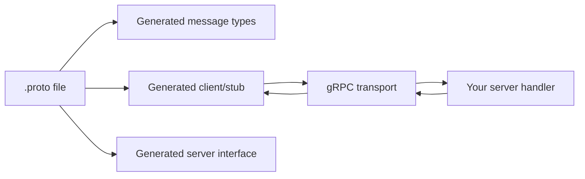
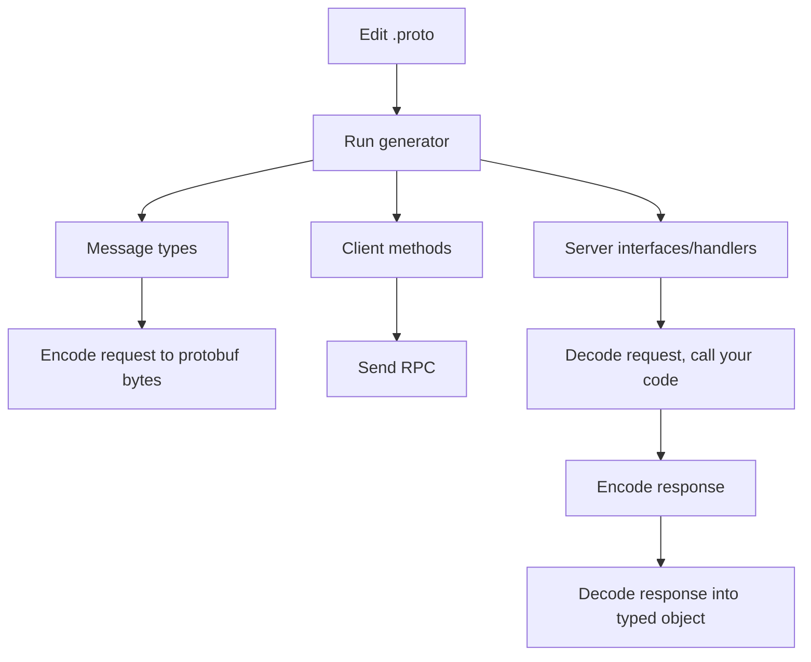

## Contents

1. [Problem: shared API contracts](#daily-problem)
2. [OpenAPI: HTTP API description](#openapi-model)
3. [Protobuf: message schema and encoding](#protobuf-model)
4. [gRPC: service methods over the network](#grpc-model)
5. [Generated code](#generated-code)
6. [Example](#example)
7. [Wire formats: JSON vs protobuf](#wire-format-overview)
8. [Tiny protobuf byte example](#wire-format)
9. [Compatibility rules](#compatibility)
10. [Presence and defaults](#presence)
11. [Errors and status codes](#errors)
12. [Browser clients](#browser)
13. [Streaming](#streaming)
14. [OpenAPI vs gRPC tradeoffs](#tradeoffs)
15. [Checklist](#checklist)

<a id="daily-problem"></a>

## Problem: frontend and backend need the same contract

Start with a normal web API. Backend returns JSON. Frontend calls it with `fetch` or a generated client. The team agrees that a user response looks like this:

```json
{
  "id": "u_123",
  "displayName": "Ada Lovelace",
  "avatarUrl": "https://example.test/ada.png"
}
```

This works well until the contract drifts. Someone renames `displayName` to `name`. Someone makes `avatarUrl` nullable. Someone adds pagination, streaming progress, or a backend-to-backend call where JSON parsing cost and payload size start to matter. The request still goes over the network, but now developers are asking: “What exactly is the contract?”

### Basic distinction

- **OpenAPI** describes an HTTP API.
- **Protobuf** describes typed messages.
- **gRPC** describes service methods that exchange those messages.

<a id="openapi-model"></a>

## OpenAPI: describe HTTP

OpenAPI Specification is a language-agnostic description for HTTP APIs. It tells humans and tools what paths exist, which HTTP methods they support, what parameters they accept, what request body shape they expect, and what responses and HTTP status codes they return.

```json
{
  "openapi": "3.1.0",
  "info": {
    "title": "User API",
    "version": "1.0.0"
  },
  "paths": {
    "/users/{userId}": {
      "get": {
        "operationId": "getUser",
        "parameters": [
          {
            "name": "userId",
            "in": "path",
            "required": true,
            "schema": {
              "type": "string"
            }
          }
        ],
        "responses": {
          "200": {
            "description": "User found",
            "content": {
              "application/json": {
                "schema": {
                  "$ref": "#/components/schemas/User"
                }
              }
            }
          },
          "404": {
            "description": "User not found"
          }
        }
      }
    }
  },
  "components": {
    "schemas": {
      "User": {
        "type": "object",
        "required": ["id", "displayName"],
        "properties": {
          "id": {
            "type": "string"
          },
          "displayName": {
            "type": "string"
          },
          "avatarUrl": {
            "type": ["string", "null"]
          }
        }
      }
    }
  }
}
```

From this document, tools can generate clients, server stubs, documentation, tests, gateway config, mocks, and more. Your team may already generate TypeScript from OpenAPI. That generation usually turns an HTTP operation like `GET /users/{userId}` into a function like `getUser(userId)`.

### What OpenAPI emphasizes

- The API surface is HTTP-shaped: paths, HTTP methods, query/path/header parameters, request/response bodies.
- The payload is often JSON, but OpenAPI can describe many media types.
- Status is HTTP status: `200`, `400`, `404`, `500`, etc.
- The generated function is usually a convenience wrapper around an HTTP request.
- It is well suited to public web APIs, browser-native JSON APIs, documentation, portals, gateways, and broad tooling.

### Important nuance

OpenAPI does not force “REST”. It can describe REST-ish resource APIs, RPC-ish HTTP APIs, file uploads, webhooks, and more. The key point is that OpenAPI describes the HTTP interface directly.

<a id="protobuf-model"></a>

## Protobuf: describe messages

Protocol Buffers, usually called protobuf, are a language-neutral and platform-neutral way to define structured data. A `.proto` file describes message types. A compiler then generates code in your language so programs can build, read, serialize, and parse those messages.

```proto
syntax = "proto3";

package users.v1;

message User {
  string id = 1;
  string display_name = 2;
  optional string avatar_url = 3;
}
```

This is not JSON. It is a schema for a message. The field names are used by humans and generated code. The field numbers are used by the binary format. That distinction is one of the most important protobuf ideas.

| Part           | Meaning                                                                     |
| -------------- | --------------------------------------------------------------------------- |
| `message User` | A structured data type named `User`.                                        |
| `string id`    | A field named `id` with type `string`.                                      |
| `= 1`          | The stable numeric field identifier used on the wire.                       |
| `optional`     | Generated code can distinguish “missing” from “present with default value”. |

### What protobuf is for

- **Shared contract:** one schema generates types for many languages.
- **Compact encoding:** field numbers and binary values are sent, not repeated JSON property names.
- **Fast parse/serialize:** protobuf is designed for efficient machine-to-machine data exchange.
- **Evolution:** old and new versions can often interoperate if field numbers and types are handled carefully.
- **Generated APIs:** developers use language-native classes/types/functions instead of hand-parsing data.

### Protobuf is not only for gRPC

Protobuf can be used for files, queues, caches, or custom protocols. gRPC commonly uses protobuf as its IDL and message format, but protobuf and gRPC are separate concepts.

<a id="grpc-model"></a>

## gRPC: call remote service methods

gRPC is an RPC framework. RPC means Remote Procedure Call: client code calls a method that lives on another machine. The call looks local in your code, but it crosses the network.

```proto
syntax = "proto3";

package users.v1;

service UserService {
  rpc GetUser(GetUserRequest) returns (GetUserResponse);
}

message GetUserRequest {
  string user_id = 1;
}

message GetUserResponse {
  User user = 1;
}

message User {
  string id = 1;
  string display_name = 2;
  optional string avatar_url = 3;
}
```

The `message` definitions describe data. The `service` definition describes callable methods. gRPC generates client-side code for calling these methods and server-side code/interfaces for implementing them.



### What gRPC emphasizes

- The API surface is service/method-shaped: `UserService.GetUser`.
- Each method has a typed request message and typed response message.
- Status is gRPC status: `OK`, `NOT_FOUND`, `INVALID_ARGUMENT`, `UNAVAILABLE`, etc.
- The generated client method is not only a wrapper around a URL; it knows how to encode/decode protobuf messages and speak the RPC protocol.
- It fits internal service-to-service APIs, multi-language systems, generated contracts, and streaming use cases.

<a id="generated-code"></a>

## What generated code is doing

Generated code is adapter glue. You should usually not edit it. You edit the contract, regenerate, then use or implement the generated API.



### On the client side

Generated client code usually does these jobs:

- Expose a typed method, for example `getUser(request)`.
- Validate/shape data according to generated types, depending on generator.
- Serialize the request object into protobuf bytes or protobuf JSON, depending on protocol/client.
- Send the RPC through gRPC, gRPC-Web, Connect, or a gateway.
- Decode the response into a typed object.
- Convert transport errors into library-specific error objects with gRPC status codes.

### On the server side

Generated server code usually does these jobs:

- Expose an interface or registration function for `UserService`.
- Decode incoming protobuf bytes into `GetUserRequest`.
- Call your handler function.
- Encode your `GetUserResponse`.
- Return gRPC status and metadata/trailers.

### Working rule

If generated code looks wrong, first inspect the `.proto` and generator config. Usually the fix is in the contract or build step, not in generated files.

<a id="example"></a>

## Example: `UserService.GetUser`

### 1. Contract in `.proto`

```proto
syntax = "proto3";

package users.v1;

service UserService {
  rpc GetUser(GetUserRequest) returns (GetUserResponse);
}

message GetUserRequest {
  string user_id = 1;
}

message GetUserResponse {
  User user = 1;
}

message User {
  string id = 1;
  string display_name = 2;
  optional string avatar_url = 3;
  UserStatus status = 4;
}

enum UserStatus {
  USER_STATUS_UNSPECIFIED = 0;
  USER_STATUS_ACTIVE = 1;
  USER_STATUS_DISABLED = 2;
}
```

### 2. Illustrative TypeScript client usage

Exact names vary by generator. The idea is the same.

```ts
const response = await userClient.getUser({
  userId: route.params.userId,
});

const user = response.user;

if (!user) {
  throw new Error("server returned no user");
}

renderUserCard({
  id: user.id,
  displayName: user.displayName,
  avatarUrl: user.avatarUrl,
  status: user.status,
});
```

Notice that code calls `getUser`, not `fetch("/users/...")`. The generated client knows how this maps to the RPC protocol. The method name, request type, and response type came from the `.proto` file.

### 3. Illustrative server handler

```ts
async function getUser(request: GetUserRequest, context: RpcContext): Promise<GetUserResponse> {
  const user = await userRepository.findById(request.userId);

  if (!user) {
    throw new RpcError("user not found", Code.NotFound);
  }

  return {
    user: {
      id: user.id,
      displayName: user.displayName,
      avatarUrl: user.avatarUrl,
      status: UserStatus.USER_STATUS_ACTIVE,
    },
  };
}
```

The handler receives a typed request and returns a typed response. It should not return arbitrary JSON. It must return data that matches the response message shape.

### 4. OpenAPI equivalent shape

```json
{
  "paths": {
    "/users/{userId}": {
      "get": {
        "operationId": "getUser",
        "parameters": [
          {
            "name": "userId",
            "in": "path",
            "required": true,
            "schema": {
              "type": "string"
            }
          }
        ],
        "responses": {
          "200": {
            "description": "User found"
          },
          "404": {
            "description": "User not found"
          }
        }
      }
    }
  }
}
```

Both can generate a `getUser`-like function. Difference: OpenAPI starts with an HTTP path and method. gRPC starts with a service method and typed messages.

<a id="wire-format-overview"></a>

## Wire formats: JSON vs protobuf

A wire format is the actual serialized data sent in a request or response body. In a typical OpenAPI/JSON API, the body is UTF-8 text containing JSON syntax. In a protobuf API, the body is binary protobuf data.

OpenAPI and protobuf can both describe API data, but OpenAPI usually describes JSON-over-HTTP while protobuf defines a schema that is also used to produce protobuf binary bytes.

### JSON on the wire

With JSON, field names and punctuation are sent as text:

```json
{
  "id": "u_123",
  "displayName": "Ada Lovelace",
  "avatarUrl": "https://example.test/ada.png"
}
```

- You can read it in devtools, logs, or curl output.
- The payload contains field names such as `displayName`.
- The payload has JSON-level types: string, number, boolean, object, array, and null.
- The OpenAPI document explains what those fields mean and which fields are expected.

### Protobuf on the wire

With protobuf, field numbers and encoded values are sent. The receiver needs the matching schema:

```proto
message User {
  string id = 1;
  string display_name = 2;
  optional string avatar_url = 3;
}
```

- The binary payload does not contain the text `display_name` or `displayName`.
- Generated code maps source-code names to stable field numbers.
- Field number `2` means `display_name` because the `.proto` file says so.
- Old code can skip unknown field numbers, which helps rolling deploys and schema evolution.

### Same data, different representation

| Question                   | JSON API                                         | Protobuf/gRPC API                                              |
| -------------------------- | ------------------------------------------------ | -------------------------------------------------------------- |
| What is sent?              | Text JSON body.                                  | Binary protobuf body.                                          |
| How are fields identified? | By field name in the payload.                    | By field number in the payload.                                |
| Where is meaning defined?  | OpenAPI schema plus application code.            | `.proto` schema plus generated code.                           |
| Main practical risk        | Changing field names or shapes breaks consumers. | Changing or reusing field numbers breaks binary compatibility. |

<a id="wire-format"></a>

## Tiny protobuf byte example: field numbers matter

Protobuf binary messages do not send JSON property names like `display_name`. They send records containing a field number, a wire type, and a value. The receiver uses the same `.proto` definition to understand what field number `2` means.

```proto
message Tiny {
  int32 count = 1;
}
```

Now create one actual `Tiny` message value:

```text
Tiny { count: 150 }
```

One valid binary protobuf serialization is `08 96 01`: `08` is the tag, and `96 01` is the value.

### How the tag byte becomes `08`

Each protobuf record starts with a tag. The tag answers two questions: which field is this, and how should the next bytes be parsed? Protobuf stores both answers in one number.

The lowest 3 bits are reserved for the wire type. The field number uses the remaining higher bits. That is why the encoder shifts the field number left by 3, then fills the lowest 3 bits with the wire type:

```text
tag = (field_number << 3) | wire_type
```

| Step         | Value                                      | Why                                                                              |
| ------------ | ------------------------------------------ | -------------------------------------------------------------------------------- |
| field number | `1` → binary `00000001`                    | `count = 1` in the `.proto`.                                                     |
| shift left 3 | `1 << 3` → binary `00001000`               | Make room for the 3 wire-type bits at the end.                                   |
| wire type    | `VARINT` = `0` → binary `000`              | `int32` values use varint encoding.                                              |
| bitwise OR   | `00001000 \| 00000000 = 00001000`          | Put the wire type into the lowest 3 bits without changing the field number bits. |
| tag byte     | binary `00001000` = decimal `8` = hex `08` | The tag is then varint-encoded. This small tag fits in one byte.                 |

When the receiver reads tag `08`, it reverses this idea: the lowest 3 bits give wire type `0`, and the remaining bits give field number `1`. Then the receiver looks at the `.proto` file and knows field `1` is `count`.

| Source                             | Serialized part               | Meaning                                                               |
| ---------------------------------- | ----------------------------- | --------------------------------------------------------------------- |
| `count = 1` in the `.proto`        | field number `1`              | The field name `count` is not sent as text. The field number is sent. |
| `int32` in the `.proto`            | wire type `0` / `VARINT`      | The wire type tells the parser how to read the following value.       |
| field number + wire type           | `(1 << 3) \| 0 = 8`, hex `08` | The tag says: “this is field `1`, and its value is a varint.”         |
| runtime payload value `count: 150` | `96 01`                       | These bytes are the varint encoding of the value `150`.               |

So the complete message is one protobuf record: `08` identifies which field this is and how to parse it; `96 01` is the actual value. The receiver uses the same `.proto` file to map field number `1` back to `count`.

This is why field numbers are compatibility-critical. If future code reuses or changes `= 1`, old bytes can be decoded as the wrong field.

### Renaming vs renumbering

Renaming a field is not harmless: it can break generated code and protobuf JSON/text formats. But changing a field number is worse for binary compatibility because old bytes will be interpreted differently. Treat both as serious changes; never casually renumber.

<a id="compatibility"></a>

## Compatibility: how to evolve protobuf safely

Protobuf is designed for backward and forward compatibility, but only if you follow the rules. Old clients may talk to new servers. New clients may talk to old servers. Rolling deploys make this normal.

### Usually safe change: add a new field

```proto
message User {
  string id = 1;
  string display_name = 2;
  optional string avatar_url = 3;
  UserStatus status = 4;

  // New field. Old clients ignore it. New clients see default/missing when old servers do not send it.
  optional string timezone = 5;
}
```

### Unsafe change: reuse a field number

```proto
message User {
  string id = 1;

  // BAD if field 2 used to mean display_name.
  // Old data may decode as the wrong concept.
  string legal_name = 2;
}
```

### Correct deletion: reserve number and maybe name

```proto
message User {
  string id = 1;
  string display_name = 2;

  reserved 3;
  reserved "avatar_url";
}
```

| Rule                                               | Why it matters                                                          |
| -------------------------------------------------- | ----------------------------------------------------------------------- |
| Never reuse field numbers.                         | Old binary data can become ambiguous, corrupt, or privacy-sensitive.    |
| Do not change a field’s meaning.                   | Same number now means different business concept. That is a silent bug. |
| Reserve deleted field numbers.                     | Prevents future accidental reuse.                                       |
| Reserve deleted names when JSON/TextProto matters. | Names appear in those formats even though binary protobuf uses numbers. |
| Add optional fields for new data.                  | Old clients can ignore them; new clients can detect presence if needed. |
| Use enum zero as `UNSPECIFIED` or `UNKNOWN`.       | Proto3 enum default is the first value, which must be zero.             |

<a id="presence"></a>

## Presence and defaults: missing is not always different from empty

In proto3, scalar fields without `optional` often have implicit presence. That means generated code may not distinguish “field was not sent” from “field was sent with the default value”.

```proto
message UpdateUserRequest {
  // Problem for patch semantics:
  // missing display_name and display_name = "" can collapse in many APIs.
  string display_name = 1;

  // Better when you need to know whether caller intentionally sent it.
  optional string bio = 2;
}
```

| Type                   | Default value    | Trap                                                                                    |
| ---------------------- | ---------------- | --------------------------------------------------------------------------------------- |
| `string`               | `""`             | May not know whether empty string was sent or field was absent unless `optional`.       |
| `int32`, `int64`, etc. | `0`              | May not know whether zero was sent or absent unless `optional`.                         |
| `bool`                 | `false`          | Do not make “false means do something special” unless absence and false are equivalent. |
| `enum`                 | zero enum value  | Zero must be safe as unknown/unspecified, not a meaningful active state.                |
| `message`              | not set          | Message fields track presence.                                                          |
| `repeated`, `map`      | empty collection | No distinction between absent and empty collection.                                     |

### Practical rule

If business logic needs to distinguish “not provided” from “provided as empty/zero/false”, use `optional`, a wrapper/message type, a `oneof`, or a patch pattern such as field masks depending on your project conventions.

<a id="errors"></a>

## Error handling: think gRPC status, not only HTTP status

gRPC calls return a status. Successful calls use `OK`. Failed calls use well-known status codes. Your TypeScript client library may expose these as exceptions, error objects, or rejected promises.

| Use this gRPC code    | When                                                          | Rough HTTP analogy |
| --------------------- | ------------------------------------------------------------- | ------------------ |
| `INVALID_ARGUMENT`    | Request is malformed or invalid regardless of system state.   | `400`              |
| `NOT_FOUND`           | Requested entity does not exist or should not be visible.     | `404`              |
| `PERMISSION_DENIED`   | Caller is known but not allowed.                              | `403`              |
| `UNAUTHENTICATED`     | Caller lacks valid credentials.                               | `401`              |
| `FAILED_PRECONDITION` | System state must change before operation can succeed.        | `400` or `409`     |
| `UNAVAILABLE`         | Service is temporarily unavailable; retry may be appropriate. | `503`              |
| `DEADLINE_EXCEEDED`   | Call took longer than client was willing to wait.             | `504`              |
| `INTERNAL`            | Unexpected server invariant broken.                           | `500`              |

gRPC also has metadata and trailers. You usually do not need to understand trailers deeply at first. Just know that gRPC can attach call metadata, error details, and final status information outside the main response message.

### Deadlines matter

Distributed calls should have deadlines/timeouts. Without them, a slow dependency can make callers wait too long and amplify outages.

<a id="browser"></a>

## Browser clients: native gRPC is not the same as `fetch` JSON

Native gRPC usually runs over HTTP/2 and uses features such as multiplexed streams, metadata, trailers, and streaming. Browsers do not expose every low-level HTTP/2 feature that native gRPC expects. That is why frontend projects commonly use one of these:

| Option            | What it means                                                                                                                          |
| ----------------- | -------------------------------------------------------------------------------------------------------------------------------------- |
| gRPC-Web          | Browser-compatible protocol for calling gRPC services, often through a proxy such as Envoy.                                            |
| Connect           | Protocol/library family that supports browser-friendly clients and can interoperate with gRPC and gRPC-Web depending on configuration. |
| JSON/REST gateway | Backend exposes HTTP/JSON externally while internal services still use gRPC/protobuf.                                                  |

For your day-to-day work, inspect which generated TypeScript client your project uses. The concept is the same: your code calls typed methods; the generated client handles protocol details.

<a id="streaming"></a>

## Streaming: know the four shapes, mostly use unary

Most project calls may be unary: one request, one response. gRPC also supports streaming shapes. Even if you do not use them today, know what the `stream` keyword means when you see it in a `.proto` file.

| RPC type                | Proto shape                                          | Use case                                             |
| ----------------------- | ---------------------------------------------------- | ---------------------------------------------------- |
| Unary                   | `rpc GetUser(Request) returns (Response);`           | Normal request/response. Most CRUD-ish calls.        |
| Server streaming        | `rpc WatchUser(Request) returns (stream Event);`     | Client sends one request; server sends many updates. |
| Client streaming        | `rpc Upload(stream Chunk) returns (Result);`         | Client sends many messages; server replies once.     |
| Bidirectional streaming | `rpc Chat(stream Message) returns (stream Message);` | Both sides send many messages independently.         |

### Mostly unary is normal

If your project mostly uses unary calls, learn unary deeply first: request, response, errors, deadlines, generated client, server handler. Streaming is the toolbox for later, not the first thing to master.

<a id="tradeoffs"></a>

## OpenAPI vs protobuf/gRPC: different tradeoffs

| Question            | OpenAPI                                                                | gRPC + protobuf                                                                         |
| ------------------- | ---------------------------------------------------------------------- | --------------------------------------------------------------------------------------- |
| Primary model       | HTTP API: paths, methods, parameters, bodies, responses.               | RPC API: services, methods, request messages, response messages.                        |
| Common payload      | JSON, but many media types possible.                                   | Protobuf binary by default; protobuf JSON possible in some setups.                      |
| Generated client    | Usually typed wrapper around HTTP operations.                          | Typed RPC stub/client that encodes/decodes messages and handles RPC status.             |
| Error model         | HTTP status codes and response bodies.                                 | gRPC status codes, status message, optional error details/metadata.                     |
| Compatibility focus | HTTP path/method, field names, required/optional schema, status codes. | Field numbers, wire types, presence/defaults, service/method signatures.                |
| Browser fit         | Excellent with native `fetch` and JSON.                                | Usually needs gRPC-Web, Connect, or gateway/proxy.                                      |
| Public API fit      | Excellent: documentation, portals, cURL, broad tooling.                | Good when consumers accept generated clients/protobuf; less friction for internal APIs. |
| Streaming           | Possible with HTTP streaming/SSE/WebSockets, but tooling varies.       | Built into service model: unary and three streaming forms.                              |
| Performance         | JSON is human-readable and ubiquitous; can be enough for many apps.    | Protobuf can reduce payload/parse cost; only claim endpoint speed where measured.       |

### When gRPC is a good fit

- Internal service-to-service APIs.
- Many languages need the same contract.
- You want generated clients and server interfaces from one source of truth.
- You need strong typing and safer API evolution.
- You need streaming, deadlines, metadata, and standard RPC status semantics.
- You have measured payload/CPU/latency benefits from protobuf or gRPC in your actual path.

### When OpenAPI/JSON may be a better fit

- Public APIs consumed by unknown clients.
- Browser-first APIs where `fetch`, JSON, and devtools readability matter most.
- Simple CRUD APIs where RPC tooling adds more complexity than value.
- Teams need easy manual calls with cURL/Postman and no generated client.
- Payloads are large files or streams better modeled as HTTP media types rather than protobuf messages.

<a id="checklist"></a>

## Checklist for writing and reading `.proto` files

### When reading a service

- Find the `service` block first. That tells you callable methods.
- For each `rpc`, inspect request and response message types.
- Check whether the method is unary or uses `stream`.
- Look for package/version naming, for example `users.v1`.
- Look for comments. Good proto comments become generated docs in many toolchains.

### When editing a message

- Add fields with new numbers. Never reuse numbers.
- Use `optional` when presence matters.
- Make enum zero value `UNSPECIFIED` or `UNKNOWN`.
- Reserve deleted field numbers and names.
- Do not change field meaning under the same number.
- Be careful changing type, cardinality, or moving fields into `oneof`.
- Regenerate code and update callers/handlers together.

### When debugging a failed call

- Check generated client call shape: request object field names may be camelCase in TypeScript.
- Check gRPC status code first: `NOT_FOUND`, `INVALID_ARGUMENT`, `UNAVAILABLE`, etc.
- Check deadline/timeout behavior.
- Check browser adapter/proxy if running from web app: gRPC-Web, Connect, gateway, CORS.
- Check schema evolution if old and new services are deployed at same time.

### Summary

OpenAPI says “here is how to call this HTTP endpoint”; protobuf says “here is the shape of this data”; gRPC says “here is a typed service method that exchanges those messages over an RPC transport.”

## Glossary

<dl>
  <dt>IDL</dt>
  <dd>Interface Definition Language. A schema language used to define contracts independent of implementation code.</dd>
  <dt>Protobuf</dt>
  <dd>Protocol Buffers: schema language, compiler, generated code, runtimes, and binary serialization format.</dd>
  <dt>.proto</dt>
  <dd>Text file that defines protobuf messages and optionally gRPC services.</dd>
  <dt>RPC</dt>
  <dd>Remote Procedure Call. Calling a method on another process/machine as if it were a local method.</dd>
  <dt>Stub/client</dt>
  <dd>Generated client-side object with methods matching the service definition.</dd>
  <dt>Unary call</dt>
  <dd>One request message and one response message.</dd>
  <dt>Metadata</dt>
  <dd>Key/value information attached to a gRPC call, often used for auth or request context.</dd>
  <dt>Deadline</dt>
  <dd>Maximum time the client is willing to wait for an RPC before it is terminated.</dd>
</dl>

## Sources and further reading

- [Protocol Buffers overview](https://protobuf.dev/overview/)
- [Proto3 language guide](https://protobuf.dev/programming-guides/proto3/)
- [Protocol Buffers encoding guide](https://protobuf.dev/programming-guides/encoding/)
- [Protocol Buffers field presence note](https://protobuf.dev/programming-guides/field_presence/)
- [gRPC introduction](https://grpc.io/docs/what-is-grpc/introduction/)
- [gRPC core concepts](https://grpc.io/docs/what-is-grpc/core-concepts/)
- [gRPC status codes](https://grpc.io/docs/guides/status-codes/)
- [gRPC-Web basics](https://grpc.io/docs/platforms/web/basics/)
- [What is OpenAPI?](https://www.openapis.org/what-is-openapi)
- [OpenAPI Specification latest](https://spec.openapis.org/oas/latest.html)
- [Connect introduction](https://connectrpc.com/docs/introduction)
