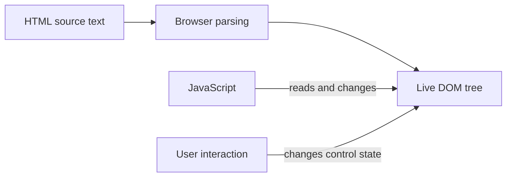

A form submits even though your click handler ran. A listener on the form logs a click that happened on a button. DevTools shows `value="Read the DOM"`, but the input displays something else.

These are not three unrelated browser quirks. They come from three separate parts of the platform:

- **HTML** describes elements, their meaning, and their initial configuration.
- **The DOM** is the live object tree that JavaScript and the browser can change.
- **Events** let application code respond to interactions. **Default actions** are what the browser normally does in response, such as following a link or submitting a form.

When we say **native browser behavior**, we mean behavior built into the browser, not behavior supplied by Angular or our own JavaScript.

We will use a small task form to connect those parts, first without a framework and then in Angular. No backend is involved; the tasks exist only while the page is open.

The [article on rendering strategies](/dump/blog/html-rendering-methods/) explains where HTML comes from. This article starts once that HTML reaches the browser.

## Contents

1. [HTML describes meaning, not just appearance](#html-describes-meaning-not-just-appearance)
2. [The browser builds a live object tree](#the-browser-builds-a-live-object-tree)
3. [Events report something happening](#events-report-something-happening)
4. [Events can travel through the tree](#events-can-travel-through-the-tree)
5. [Propagation and default behavior are separate](#propagation-and-default-behavior-are-separate)
6. [Angular uses the same browser foundation](#angular-uses-the-same-browser-foundation)
7. [Predict the interaction](#predict-the-interaction)

## HTML describes meaning, not just appearance

Save this as `index.html` and open it in a browser:

```html
<!doctype html>
<html lang="en">
  <head>
    <meta charset="utf-8" />
    <meta name="viewport" content="width=device-width, initial-scale=1" />
    <title>Task notes</title>
  </head>
  <body>
    <main>
      <h1>Task notes</h1>
      <form id="task-form" method="get">
        <label for="task-title">Task title</label>
        <input id="task-title" name="title" type="text" value="Read the DOM" required />
        <button id="add-task" type="submit">
          <span id="add-label">Add task</span>
        </button>
      </form>
      <ul id="task-list"></ul>
    </main>
  </body>
</html>
```

An **element** is a part of the document such as the form or input. Its **attributes** configure it: `type="text"`, `name="title"`, and `required` each have a different job. Elements can contain text and other elements. Here, the button contains a `span`, which contains the text “Add task.”

The choices are behavioral, not merely visual:

- A link with an `href` navigates to a destination.
- A button performs an action and already supports keyboard activation.
- A form groups controls and provides a submission mechanism.
- A label names a control; matching `for` to the input's `id` associates them. Clicking this label focuses the input.

The input's `id` identifies it in the document. Its `name` is the key used when its value is included in form submission. Those are separate responsibilities.

Try submitting the form. Because there is no `action`, its destination is the current page. With `method="get"`, the browser puts the named control's value in the query string and navigates. Under ordinary HTTP serving, that means requesting this page again with something like `?title=Read+the+DOM`.

The browser does **not** know that we intend to add a list item. We have not written that behavior yet.

If you clear the input first, `required` prevents ordinary submission and the browser provides validation feedback. Detailed validation is another topic; the important point here is that HTML already supplies behavior before JavaScript runs.

A styled `<div>` would not inherit the button's semantics, focusability, or keyboard activation. Choosing the correct element gives us a useful starting contract instead of a collection of behaviors to recreate.

## The browser builds a live object tree

HTML arrives as text. The browser reads the tags, attributes, and nesting, then builds a tree of JavaScript-accessible objects. That process is called **parsing**. The resulting objects follow the **Document Object Model**, or DOM.

A **node** is one object in that tree. The document itself, individual elements, and pieces of text are all nodes.



A simplified part of our tree looks like this:

```text
document
└─ html
   └─ body
      └─ main
         ├─ h1
         │  └─ #text "Task notes"
         ├─ form
         │  ├─ label
         │  ├─ input
         │  └─ button
         │     └─ span
         │        └─ #text "Add task"
         └─ ul
```

The actual tree also contains the head, doctype, and whitespace text nodes omitted here.

The form is the button's **parent**, the element directly containing it. The input and button are **siblings** because they share that parent. The span is a **child** of the button. The button, form, main, body, and html elements are the span's **ancestors**: follow its parents upward to find them.

Open your browser's developer tools, usually called **DevTools**, and find the Console tab. It lets you run JavaScript against the page. Change the heading:

```js
document.querySelector("h1").textContent = "Tasks for today";
```

`querySelector("h1")` finds the first `h1` element. A selector such as `"#task-title"` instead finds the element with that `id`. Setting `textContent` changes the element's text in the live tree. DevTools' Elements panel shows the result; the original file still contains “Task notes.”

**Changing the DOM does not rewrite the downloaded HTML.** View Source or the document response shows the original markup; the Elements panel shows the current tree. The tree can also differ because the HTML parser repairs invalid nesting. We do not need parser internals to recognize that source text and live objects are different things.

### Attributes and properties are not interchangeable

An HTML attribute appears in the markup, such as `value="Read the DOM"`. A JavaScript **property** is a value exposed by an object, read or written with syntax such as `input.value`. Similar names do not guarantee that an attribute and a property hold the same state.

Try this in the console:

```js
const titleInput = document.querySelector("#task-title");

titleInput.value = "Inspect event propagation";

console.log(titleInput.getAttribute("value")); // "Read the DOM"
console.log(titleInput.value); // "Inspect event propagation"
```

For this text input:

- The `value` **attribute** supplies its default value.
- The `.value` **property** exposes its current value.

Typing changes the current value, not the `value` attribute. Reading the attribute to find out what the user typed therefore gives the wrong answer.

Attributes are not permanently frozen: `setAttribute` can change them. Some properties read and write their corresponding attributes directly, so their values stay in sync. A text input's current value is a useful example precisely because it has separate state. Updating its default can affect the current value before it has been edited; that does not make the attribute a reliable source for the user's current input.

Also, assigning `.value` in JavaScript does not automatically fire an `input` event. A state change and an event notification are distinct operations.

## Events report something happening

When something happens, such as a click or an edit to an input, the browser creates an **event object** containing information about it.

An **event listener** is a function you ask the browser to call when an event of a particular type reaches the place where you registered it. `addEventListener` makes that registration:

```js
document.querySelector("#task-title").addEventListener("input", (event) => {
  console.log(event.type, event.currentTarget.value);
});
```

Now type in the field. The listener receives the `input` event and reads the control's current value.

Three event types matter to our task form:

- **`click`** reports activation by clicking and can also result from keyboard activation of a button. It is not limited to a physical mouse click.
- **`input`** reports user-driven changes to the input's value, including typing and pasting. It is not the same as a key press.
- **`submit`** occurs on the form after the browser has checked rules such as `required` and allowed submission to proceed, but before it completes the submission. Those built-in checks are called **native constraint validation**.

The event object exposes details such as `type`, `target`, `currentTarget`, and whether its default action can be canceled. We will inspect those as we go.

### Listen to the operation you intend to handle

“Add this task” is the form's submission operation, not merely a click on its button.

Users can activate the button with a pointer or keyboard. In this form, pressing Enter in the text field can also submit. Code can request submission with `form.requestSubmit()`.

A button-click listener alone ties application behavior to one control's activation. A form-submit listener expresses the operation and runs after native validation has allowed submission.

There is one API distinction worth knowing: `form.submit()` bypasses the `submit` event and native constraint validation. Use `requestSubmit()` when you want the ordinary submission path.

Registering a listener does not itself replace a default action. This code logs submission **and still allows navigation**:

```js
document.querySelector("#task-form").addEventListener("submit", (event) => {
  console.log("Submitting", event.type);
});
```

Reload between console experiments to remove their listeners. If you want to preserve submission logs across navigation, enable “Preserve log” in DevTools.

## Events can travel through the tree

You click the text inside the button. The browser identifies the nested `span` as the **target**: the element on which this click happened.

The span has parents around it: the button, form, main, body, and html elements, then the document. Those objects form a path between the document and the span. The browser already knows the target; it is not searching the whole tree for it.

To deliver the click to listeners, the browser follows that path **down to the span, then back up**:

1. **Down the tree — capturing phase.** Starting at the document, the browser visits `html`, `body`, `main`, `form`, and `button`, in that order. At each point it runs listeners registered for this downward pass.
2. **At the span — target phase.** The browser reaches the clicked element and runs its own listeners.
3. **Back up the tree — bubbling phase.** A `click` event bubbles, so the browser visits `button`, `form`, `main`, `body`, `html`, and finally the document. At each point it runs listeners registered for this upward pass.

```text
Down:  document → html → body → main → form → button
                                                   ↓
Target:                                          span
                                                   ↑
Up:    document ← html ← body ← main ← form ← button
```

This delivery along the path is called **event propagation**. Only the objects on this path participate; the sibling input and task list are not visited. An object can be on the path even when we have not attached a listener to it.

**The same click event makes both passes. Its target remains the span.** The form and button are not generating additional clicks. “Capture” does not mean catching, canceling, or redirecting the click; it names the downward pass. “Bubble” names the upward pass.

For this explanation we started at the document. The full browser path also includes `window`, the object representing the browser window, outside the document: its capture listeners run before the document's, and its bubbling listeners run afterward.

### Choose which pass a listener joins

When registering a listener on an ancestor, you choose when it runs:

- `{ capture: true }` means **run on the way down**, before the target's listeners.
- Omitting that option means **run on the way up**, after the target's listeners, for an event that bubbles.

The browser does not run every listener twice. A listener registered for capture runs on the downward pass; an ordinary ancestor listener runs on the upward pass. You can register separate listeners for each pass on the same object.

### Watch one click go down and back up

To run the script examples as files, serve this folder over local HTTP, create `app.js`, and add this just before `</body>`:

```html
<script type="module" src="./app.js"></script>
```

For example, `python -m http.server 8000` serves the folder at `http://localhost:8000`. Modules should be served over HTTP rather than loaded from a `file:` URL.

Use this as the contents of `app.js`. Later examples that replace this file should be run after a reload, not piled on top of its listeners.

```js
const span = document.querySelector("#add-label");
const form = document.querySelector("#task-form");

document.addEventListener(
  "click",
  () => {
    console.log("document: capture — on the way down");
  },
  { capture: true },
);

span.addEventListener("click", () => {
  console.log("span: target — reached the clicked element");
});

document.addEventListener("click", () => {
  console.log("document: bubble — back at the document");
});

// Keep the page open; cancellation is explained in the next section.
form.addEventListener("submit", (event) => {
  event.preventDefault();
});
```

Click the button's text, which is inside the span. You should see:

```text
document: capture — on the way down
span: target — reached the clicked element
document: bubble — back at the document
```

The document's first listener runs before the span's listener because it was registered for capture. Its second listener runs after the span's listener because it was registered for bubbling. Both observe the same click, at different points in its delivery.

### Add listeners along the path

Now replace `app.js` with the expanded example below. It adds listeners to the form and button so we can see more of the route.

There is one detail to know at the target: its capture listeners run first, then its ordinary, non-capture listeners. Both groups run during the **target phase**, not the ancestor capturing or bubbling phases. Within each group, listeners run in registration order.

```js
const form = document.querySelector("#task-form");
const button = document.querySelector("#add-task");
const label = document.querySelector("#add-label");

function logEvent(location, event) {
  console.log(location, {
    phase: event.eventPhase,
    target: event.target.id,
    currentTarget: event.currentTarget.id,
  });
}

form.addEventListener(
  "click",
  (event) => {
    logEvent("form capture", event);
  },
  { capture: true },
);

button.addEventListener(
  "click",
  (event) => {
    logEvent("button capture", event);
  },
  { capture: true },
);

label.addEventListener(
  "click",
  (event) => {
    logEvent("span capture", event);
  },
  { capture: true },
);

label.addEventListener("click", (event) => {
  logEvent("span non-capture", event);
});

button.addEventListener("click", (event) => {
  logEvent("button bubble", event);
});

form.addEventListener("click", (event) => {
  logEvent("form bubble", event);
});

// Keep the page open while inspecting clicks.
form.addEventListener("submit", (event) => {
  event.preventDefault();
});
```

Click the button's **text**, not its padding. The expected logs are:

```text
location          phase  target      currentTarget
form capture      1      add-label   task-form
button capture    1      add-label   add-task
span capture      2      add-label   add-label
span non-capture  2      add-label   add-label
button bubble     3      add-label   add-task
form bubble       3      add-label   task-form
```

`eventPhase` is `1` for capture, `2` at the target, and `3` for bubbling. Clicking the button's padding instead targets the button, so the span listeners do not run.

### `target` and `currentTarget` answer different questions

- **`target`:** Which element did this click happen on? For our example, it stays the span throughout these listeners.
- **`currentTarget`:** Which object has the listener that is running right now? Inside the form's listener it is the form; inside the button's listener it is the button.

Use `currentTarget` when you need the element whose listener you attached. Use `target` when an ancestor listener needs to identify the descendant involved in the interaction.

Read `currentTarget` during the callback. It becomes `null` after dispatch; retaining the event object does not preserve that listener's location for later asynchronous work.

This explanation assumes ordinary DOM nesting. Shadow DOM introduces retargeting rules that we are deliberately leaving out.

### Capture and delegation solve different placement problems

A parent can observe descendant interactions without registering a listener on every child. That is **event delegation**.

For a small demonstration, replace the empty list with this markup:

```html
<ul id="task-list">
  <li>
    Read the DOM
    <button type="button" data-action="remove"><span>Remove</span></button>
  </li>
</ul>
```

Add this listener to `app.js`:

```js
const list = document.querySelector("#task-list");

list.addEventListener("click", (event) => {
  const target = event.target;
  if (!(target instanceof Element)) {
    return;
  }

  const removeButton = target.closest('button[data-action="remove"]');
  if (!removeButton) {
    return;
  }

  removeButton.closest("li").remove();
});
```

`closest` starts at the clicked element and checks it, then its parents, until it finds an element matching the selector. This handles the click landing on the nested span rather than the button itself. The list listener runs when the event travels back up to the list and removes that button's row. It also works for matching rows added later: their events reach the same list listener.

Capture, by contrast, lets an ancestor observe the event **before** descendant handlers run. It can help when you need early observation, but it is not a way to replace a button's semantics.

Not every event bubbles. For example, `focus` does not bubble, but ancestor capture listeners can still observe it. “Does not bubble” does not mean “only the target can hear it.”

## Propagation and default behavior are separate

Two questions are easy to confuse:

1. Which listeners receive this event?
2. Does the browser perform the default action associated with it?

Propagation is the event's delivery down and up the path. Cancellation is asking the browser not to perform its default action. These are separate controls: stopping delivery to other listeners does not, by itself, cancel the action.

### `preventDefault()` cancels a cancelable default action

For a form's `submit` event, calling `preventDefault()` cancels native submission. It does not prevent ancestor listeners from receiving that submit event.

`event.cancelable` tells you whether the browser allows this event's default action to be canceled. `event.defaultPrevented` tells you whether a listener has successfully canceled it.

A listener registered with `{ passive: true }` promises not to cancel the default action. For scrolling interactions, that promise can let the browser start scrolling without waiting for the listener to decide whether to cancel it. Calling `preventDefault()` from a passive listener does not cancel the action, even if the event is otherwise cancelable.

Cancellation is also event-specific. Canceling a submit button's `click` can prevent that click from initiating submission. Canceling the form's `submit` handles the submission operation itself, regardless of which ordinary submission route initiated it.

### Replace submission with our client-side operation

Return to the original empty list and replace `app.js` with this complete task-adding script:

```js
const form = document.querySelector("#task-form");
const input = document.querySelector("#task-title");
const list = document.querySelector("#task-list");

form.addEventListener("submit", (event) => {
  event.preventDefault();

  const title = input.value.trim();
  if (title === "") {
    return;
  }

  const item = document.createElement("li");
  item.textContent = title;
  list.append(item);

  input.value = "";
});
```

Now submission reads the current input value, creates a DOM element, puts the user's title into its text, appends it to the list, and clears the field. The trim check rejects whitespace-only titles, which `required` alone does not reject.

Use `textContent` here, not `innerHTML`: a task title is text, not HTML supplied by the user. A title such as `<strong>Read</strong>` should appear literally, not create an element.

The native submission was canceled because this script replaces it. We did not stop the submit event from propagating, and we did not need to suppress the button's click.

Reloading still loses the tasks. We changed the live DOM, not a stored file or database.

### Stopping propagation is not canceling submission

`stopPropagation()` stops the event from continuing along its path. It does **not** stop the remaining listeners being run on **the same element, in the same group—capture or non-capture**. Running one such group is what we mean by a **listener pass**.

`stopImmediatePropagation()` also stops the remaining listeners in that group.

To see the difference, replace `app.js` with this experiment:

```js
const button = document.querySelector("#add-task");
const form = document.querySelector("#task-form");

button.addEventListener("click", (event) => {
  console.log("A");
  event.stopPropagation();
});

button.addEventListener("click", () => {
  console.log("B");
});

form.addEventListener("click", () => {
  console.log("C");
});

form.addEventListener("submit", (event) => {
  console.log("submit still happened");
  event.preventDefault();
});
```

With a valid input, click Add task:

```text
A
B
submit still happened
```

A stopped the click from reaching the form's bubbling listener C. B still ran because A and B are both non-capture listeners registered on the same button: they belong to the same listener pass.

Now replace `stopPropagation()` with `stopImmediatePropagation()`:

```text
A
submit still happened
```

Neither method canceled the button's activation behavior. Submission still started and produced a **different event**, `submit`, dispatched at the form. Its listener keeps the page open by canceling that event.

If you remove that submit listener, the browser submits and navigates in both versions. Stopping the click's propagation does not cancel navigation or form submission.

**Same element does not always mean same listener pass.** At the target—the clicked span in our example—the browser runs two separate groups:

1. The span's capture listeners.
2. Then the span's non-capture listeners.

If a capture listener on the span calls `stopPropagation()`, the remaining capture listeners on that span can still run. But its later non-capture group does not run, and neither do the ancestors' bubbling listeners. With `stopImmediatePropagation()`, even the remaining capture listeners stop.

That is why the rule is **same element and same group**, not simply “all listeners on the same element.”

Prefer correct elements and deliberate listener placement over adding suppression calls until the symptoms disappear. Reach for a propagation-stopping method when there is an actual propagation boundary to enforce.

## Angular uses the same browser foundation

Angular changes how we describe the relationship between application state and the DOM. It does not replace the browser's event system or remove native HTML behavior.

Here is the same task interaction as a component in a current Angular application:

```ts
import { Component, signal } from "@angular/core";

type Task = {
  id: number;
  title: string;
};

@Component({
  selector: "task-notes",
  template: `
    <h1>Task notes</h1>
    <form (submit)="addTask($event)">
      <label for="task-title">Task title</label>
      <input
        #titleInput
        id="task-title"
        name="title"
        type="text"
        required
        [value]="draft()"
        (input)="draft.set(titleInput.value)"
      />
      <button type="submit"><span>Add task</span></button>
    </form>
    <ul>
      @for (task of tasks(); track task.id) {
        <li>{{ task.title }}</li>
      }
    </ul>
  `,
})
export class TaskNotes {
  readonly draft = signal("Read the DOM");
  readonly tasks = signal<Task[]>([]);

  private nextId = 1;

  addTask(event: Event): void {
    event.preventDefault();

    const title = this.draft().trim();
    if (title === "") {
      return;
    }

    const task: Task = { id: this.nextId, title };
    this.nextId += 1;

    this.tasks.update((tasks) => [...tasks, task]);
    this.draft.set("");
  }
}
```

Import this component into an existing standalone parent and render `<task-notes />`, or bootstrap it as the application's root. It deliberately does not import Angular forms directives; this example is about native events, not a form library.

Here, the two **signals** hold application state: `draft` contains the current title, and `tasks` contains the task array. Calling `draft()` or `tasks()` reads the current value. `set` replaces a value; `update` calculates a replacement from the previous value.

The template reads that state and describes the resulting elements. We update the state rather than manually creating and appending list items.

The pieces correspond directly to the browser example:

- **`(submit)`** registers handling for the form's native submit event.
- **`$event`** supplies that event object to `addTask`.
- **`[value]`** binds the input's current value property to application state.
- **`(input)`** updates the draft when the user edits the control.
- **`#titleInput`** gives the template a reference to the input so we can read its `.value` without guessing the type of `$event.target`.
- **`@for`** describes list items from task state; Angular manages the corresponding DOM updates.

We still call `preventDefault()` explicitly. A template event binding does not, merely by existing, cancel native submission.

Angular also cancels the default action if an event-handler expression evaluates to `false`. Explicit cancellation is clearer; the method above returns `void` instead of relying on that convention.

Clicking the span still produces a native click that can bubble through the button, form, and component host. Framework-created elements are still DOM elements. The native `required` check still applies before ordinary submission because we have not replaced it with Angular forms behavior.

Signals and template updates explain how Angular reflects application state. The scheduling and change-detection mechanisms behind those updates belong in the [change detection article](/dump/blog/angular-change-detection/), not in this event lesson.

### Native events and component outputs are different

A binding such as `(click)` on a native button handles a browser event. A **component output** is a notification the component defines and sends to its caller, such as “a task was added.” In a binding such as `(taskAdded)`, `$event` is whatever value the component sends with that notification, not necessarily an `Event` object.

Angular component outputs do **not** bubble through the DOM. Similar binding syntax does not imply the same propagation behavior. State ownership and output design belong in the component composition article.

## Predict the interaction

Before running these variations, predict what will happen:

1. You click the nested span. In which direction does the browser follow the path during capture? What happens at the span, and in which direction does bubbling proceed?
2. In the expanded listener-order experiment, what are `target` and `currentTarget` inside the form's listener?
3. You click the button's padding instead. Which listeners disappear?
4. Listener A calls `stopPropagation()`. Do B and C run? Does the form still begin submission?
5. A calls `stopImmediatePropagation()` instead. What changes?
6. The submit listener calls `preventDefault()`. Can an ancestor still observe that submit event?
7. You type a new title. Does `getAttribute("value")` now return it?

The answers follow from the same model:

- Capture goes down the ancestor path toward the span. The span's own listeners run at the target. Bubbling goes back up the path toward the document and window.
- The span is the target; the form is the form listener's current target.
- Clicking padding targets the button, so the span listeners disappear.
- With `stopPropagation()`, B runs, C does not, and submission can still begin.
- With `stopImmediatePropagation()`, B also stops; submission can still begin.
- Canceling submission does not stop the submit event from propagating.
- The current input value is `.value`, not its default-value attribute.

The useful habit is to separate **meaning**, **live state**, **event delivery**, and **default behavior** before reaching for a framework API. Angular builds on those responsibilities; it does not make them disappear.

## Sources and further reading

- [WHATWG HTML: form submission and implicit submission](https://html.spec.whatwg.org/multipage/form-control-infrastructure.html#form-submission)
- [WHATWG HTML: the input element and its value](https://html.spec.whatwg.org/multipage/input.html#the-input-element)
- [WHATWG DOM: dispatching events and invoking listeners](https://dom.spec.whatwg.org/#dispatching-events)
- [WHATWG DOM: `preventDefault`, `stopPropagation`, and `stopImmediatePropagation`](https://dom.spec.whatwg.org/#interface-event)
- [Angular: template event listeners](https://angular.dev/guide/templates/event-listeners)
- [Angular: component outputs](https://angular.dev/guide/components/outputs)
