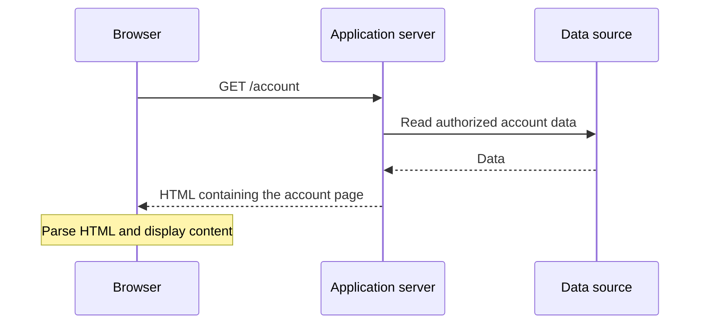
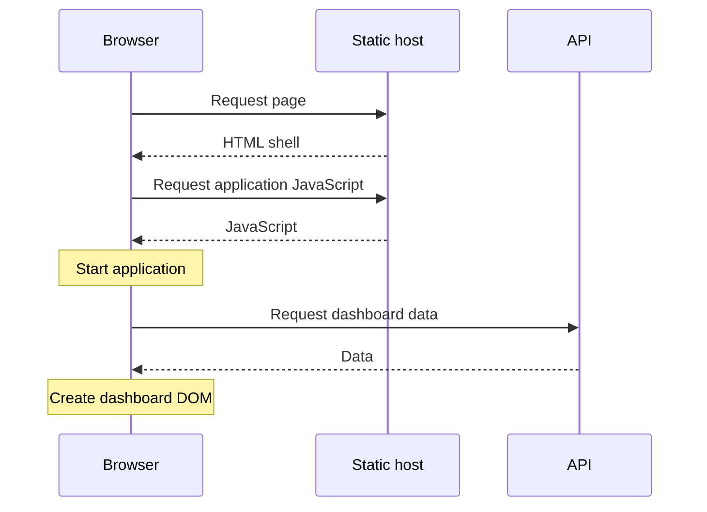
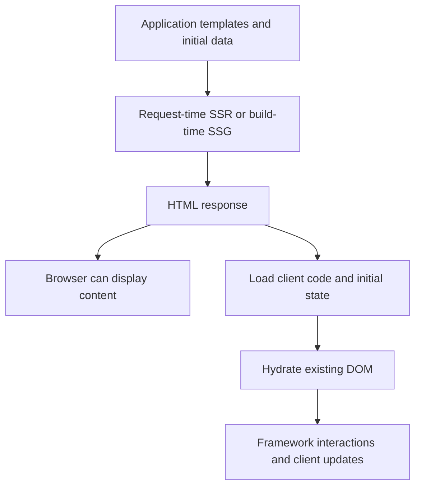
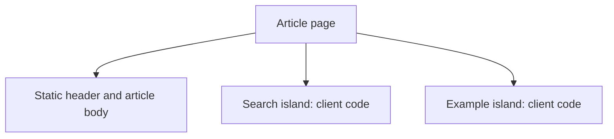

Rendering discussions often start with framework names: Angular, Next.js, Nuxt, Astro, Analog.js. That makes it easy to confuse a product with the architecture it happens to support.

A more useful question is:

> Where and when is the initial HTML produced, and what still needs to happen in the browser?

That question separates static pages, traditional server rendering, client-rendered applications, and hydrated applications without making any of them sound like the inevitable winner.

We will move from static HTML to hybrid applications, then choose an approach for a concrete site.

## Contents

1. [Three separate decisions](#three-separate-decisions)
2. [Static HTML and static site generation](#static-html-and-static-site-generation)
3. [Traditional server-side rendering](#traditional-server-side-rendering)
4. [Client-side rendering and SPAs](#client-side-rendering-and-spas)
5. [SSR and SSG with hydration](#ssr-and-ssg-with-hydration)
6. [Hydration is work, not magic](#hydration-is-work-not-magic)
7. [Islands and selective hydration](#islands-and-selective-hydration)
8. [Choosing per route](#choosing-per-route)
9. [Inspect the result, not the label](#inspect-the-result-not-the-label)

## Three separate decisions

People often bundle three independent choices into the word “rendering.”

| Decision        | Question                                            | Examples                                                                      |
| --------------- | --------------------------------------------------- | ----------------------------------------------------------------------------- |
| Initial content | Where is the page's first meaningful HTML produced? | Build process, request-time server, browser                                   |
| Navigation      | What happens when the user follows a link?          | New document request, client-side route transition                            |
| Interactivity   | How does the page respond to actions?               | Native HTML behavior, small scripts, hydrated components, client-rendered app |

A statically generated page can have interactive JavaScript. A server-rendered site can use client-side navigation. A single-page application can receive server-rendered HTML on its initial load.

**SSR is a rendering strategy. SPA is primarily an application and navigation model.** They are not mutually exclusive.

Also distinguish two uses of “rendering”:

- **Application rendering** produces HTML or updates the DOM from data and templates.
- **Browser rendering** turns the DOM and styles into layout, painted content, and displayed pixels.

The browser still performs its rendering work whether the HTML came from a server, a build, or JavaScript.

## Static HTML and static site generation

The simplest case is an HTML file that already exists before the visitor requests it.

```html
<!doctype html>
<html lang="en">
  <head>
    <meta charset="utf-8" />
    <title>Article notes</title>
  </head>
  <body>
    <main>
      <h1>Article notes</h1>
      <p>The article is already in the response.</p>
    </main>
  </body>
</html>
```

The hosting service reads the file and sends it. The browser does not have to run application JavaScript to discover that paragraph.

**Static site generation (SSG)** automates the creation of those files. A build can turn Markdown, templates, components, or CMS data into ready-to-serve HTML.


The relevant distinction is not whether a human wrote the HTML. It is whether the meaningful HTML was produced **before the request**.

### What static delivery buys you

- No application render is required for each page request.
- The same public output can be served from a CDN.
- Hosting and deployment are relatively simple.
- The article remains available if enhancement scripts fail.

This is a strong fit for blogs, documentation, and public pages that can tolerate content updates arriving through a build and deployment.

This blog is a concrete example: its Markdown articles become HTML during the Astro build and are delivered through static hosting. Scripts can enhance the page with theme switching and diagrams without making the article text depend on a client-rendered application.

### What static does not mean

It does not mean “no JavaScript,” “no backend anywhere,” or “the page can never change.” A static page can call an API after loading or submit a form to a service. The distinction is that its **initial generated HTML** is not tailored to the requesting user's session.

Fresh API data added in the browser is client-rendered data. It does not retroactively make the original file request-time SSR.

The costs are freshness and scale at build time. If you generate many thousands of pages, builds and deployments can grow expensive. If content must change immediately, rebuilding the entire output may not be a suitable update mechanism.

## Traditional server-side rendering

With traditional SSR, the server produces HTML while handling the request, often from a template plus database or session data.



PHP, Rails, Django, JSP, and server-rendered ASP.NET applications are familiar examples of this model. The language is not the defining feature; request-time HTML generation is.

### Native HTML is already interactive

A server-rendered document does not need a client framework to make links and forms work:

```html
<form action="/preferences" method="post">
  <label>
    Display name
    <input name="displayName" value="Ada" />
  </label>
  <button type="submit">Save</button>
</form>
```

The server must still authenticate the request, validate input, and apply any required CSRF protection. The point is that the browser already knows how to submit a form and follow a response.

JavaScript can progressively enhance this interaction—for example, submitting without replacing the document—but the baseline does not require hydration.

### The tradeoff is request-time work

SSR can put useful content in the initial response and tailor it to an authenticated user. It also introduces operational responsibilities:

- Run an application server or server-rendering platform.
- Manage request-time data latency and failures.
- Decide which output is safe to cache and for whom.
- Keep personalized responses out of shared public caches.

Sending populated HTML removes a client-side content-discovery step, but it does not guarantee a fast page. If the server waits on slow queries before producing any response, time to first byte can dominate.

Caching can reduce repeated rendering for public content. It is not accurate to say every SSR request must repeat all computation—but the freshness and cache-isolation rules still need an owner.

## Client-side rendering and SPAs

In a client-rendered application, the initial document often contains a mounting point and references to application JavaScript:

```html
<!doctype html>
<html lang="en">
  <head>
    <meta charset="utf-8" />
    <title>Dashboard</title>
  </head>
  <body>
    <div id="app">Loading dashboard…</div>
    <script type="module" src="/assets/app.js"></script>
  </body>
</html>
```

The browser loads the bundle, starts the application, fetches necessary data, and creates the meaningful DOM.



This is a conceptual dependency chain, not a mandatory four-step waterfall. Preloading, caching, early fetches, and bundled initial data can overlap or eliminate parts of it. But the core dependency remains: if JavaScript is responsible for creating the content, that JavaScript must run before the content exists.

### Why this model is useful

SPAs work well for interaction-heavy applications where users stay for many operations: editors, dashboards, internal tools, and applications behind login.

The client owns navigation and much UI state. After startup, subsequent interactions may reuse already-loaded code rather than request a new HTML document every time.

That can produce a good experience. It does not follow that client-side routing is automatically faster than document navigation for every workload.

### The costs move to the browser

The browser must download, parse, and execute code before creating client-rendered content. That cost is more visible on slower devices and networks than on the developer's machine.

There are also failure and discoverability considerations:

- A failed bundle can leave only the shell.
- A failed API request can prevent meaningful content from appearing.
- Search crawlers and link-preview tools differ in how much JavaScript they execute.
- Deep links need hosting rules that deliver the application entry point without turning asset errors into HTML responses.

“SPAs cannot be indexed” is too absolute. Some crawlers execute JavaScript. The better statement is that putting public content directly in the response reduces dependence on crawler execution and timing.

## SSR and SSG with hydration

Modern client frameworks can produce initial HTML outside the browser, then start client-side behavior using that HTML.

The initial HTML can come from:

- **SSR:** render during the page request;
- **SSG/prerendering:** render during the build.

**Hydration** is the framework's process of connecting client-side application behavior to previously rendered DOM. Depending on the framework, this includes matching existing nodes, restoring or establishing state, and connecting event handling.



After startup, the application may use client-side navigation like a SPA. It may also continue using document navigation. Hydration alone does not decide that.

### Visibility and application readiness are different

A page can display server-rendered text before its framework-specific controls are ready.

Native links and forms may already work. A button whose only behavior is a JavaScript handler may still be waiting for hydration. Some frameworks capture early events and replay them when the relevant application code is ready; Angular supports event replay as part of its hydration tooling.

Do not collapse these milestones into “the page loaded”:

1. The response starts arriving.
2. Useful content becomes visible.
3. Required client code becomes available.
4. Application-specific interactions become ready.

SSR can improve the second milestone without eliminating the work required for the fourth.

## Hydration is work, not magic

Hydration can avoid throwing away the server-produced DOM, but it still requires client code and initialization. In many applications, a substantial amount of application logic runs both outside the browser and in the browser.

That means you have two environments to support.

| Concern            | What to watch                                                                           |
| ------------------ | --------------------------------------------------------------------------------------- |
| Browser-only APIs  | `window`, storage, and layout measurements may not be available during server rendering |
| Initial data       | Server and client need a consistent starting point; avoid accidental duplicate requests |
| Secrets            | Server rendering does not make serialized HTML, inline data, or client bundles private  |
| Shared state       | Request-specific data must not leak through process-wide mutable state                  |
| Output consistency | The initial DOM must match what the client expects to hydrate                           |

### A timestamp can create a mismatch

Imagine a template displaying a freshly generated timestamp.

The server renders at `10:00:00`. The client initializes at `10:00:01`. If both independently compute their initial value, they can disagree about the content to claim during hydration.

Other mismatch sources include random values, locale-dependent output, invalid HTML repaired by the browser, and scripts that rearrange the DOM before hydration.

The fix is usually not to hide the hydration error. It is to make the initial output deterministic: transfer the initial value, use consistent formatting, and delay genuinely browser-only updates until the appropriate lifecycle point.

In Angular, direct DOM manipulation is a documented source of hydration problems. Reusing the server DOM requires agreement about the structure, including framework-generated nodes.

## Islands and selective hydration

Not every page needs a whole application to start in the browser.

Consider an article page with a search box and an interactive example. The article body is static content. The search and example are separate interactive areas.

An **islands architecture** lets those areas initialize independently while the surrounding page remains HTML.



Astro documents client islands as UI components hydrated separately from the rest of the page. Client directives control which components receive client-side code and when they initialize.

This reduces the amount of framework JavaScript required for mostly-content pages. It also introduces boundaries: islands still need intentional state ownership and communication if they share behavior.

Selective, partial, and incremental hydration are related techniques, but their precise meaning differs by framework. The practical question remains:

> Which parts of this page actually need client application code, and when?

Do not add islands merely to divide an already small script into more pieces. Use the boundary when the interaction has a meaningful independent owner.

## Choosing per route

Take a site with four features:

| Route           | Requirement                             | Reasonable starting point                                                     |
| --------------- | --------------------------------------- | ----------------------------------------------------------------------------- |
| `/articles/...` | Public content updated when published   | Static generation                                                             |
| `/pricing`      | Public content changed infrequently     | Static generation or cached server rendering                                  |
| `/account`      | Authenticated, user-specific content    | Server rendering with private caching rules, or client rendering behind login |
| `/editor`       | Long-lived, interaction-heavy workspace | Client-rendered application; SSR only if it solves a concrete startup need    |

This is not a mandate for four frameworks. It is a reminder that one site's routes can have different requirements.

Angular's `@angular/ssr` supports route-level rendering choices. In an application already configured for server/hybrid rendering, a server-route file can express the policy:

```ts
import { RenderMode, type ServerRoute } from "@angular/ssr";

export const serverRoutes: ServerRoute[] = [
  {
    path: "articles",
    renderMode: RenderMode.Prerender,
  },
  {
    path: "account",
    renderMode: RenderMode.Server,
  },
  {
    path: "editor",
    renderMode: RenderMode.Client,
  },
];
```

This fragment demonstrates rendering policy, not a complete application configuration. Parameterized prerendered routes also need a way to enumerate their build-time parameters. Angular's official server-rendering guide covers the providers, route registration, and deployment modes.

Frameworks such as Analog.js, Next.js, and Nuxt also support combinations of server and client rendering. Choose from verified framework capabilities after deciding the product requirements, not the other way around.

### A compact comparison

| Approach            | Initial meaningful HTML                          | Main responsibility                          | Main tradeoff                                            |
| ------------------- | ------------------------------------------------ | -------------------------------------------- | -------------------------------------------------------- |
| Static/SSG          | Produced before the request                      | Build and deployment                         | Freshness and build scale                                |
| Traditional SSR     | Produced during the request                      | Server and request-time data                 | Server latency, operations, caching isolation            |
| Client rendering    | Produced in the browser                          | Client code and API                          | Startup cost and JavaScript dependency                   |
| SSR/SSG + hydration | Produced outside the browser, enhanced inside it | Consistent server/build and client execution | Client startup plus environment and hydration complexity |

## Inspect the result, not the label

A framework's marketing page cannot tell you whether your particular route is performing well.

For a real page:

1. **Inspect the document response.** Is the useful text present, or only a mounting point and loading UI?
2. **Reload with JavaScript disabled.** What content and native behavior remain? Existing client-side state can otherwise hide the answer.
3. **Test a direct deep link.** Do you receive the intended page and status code without first visiting the home page?
4. **Use a slower device and network profile.** Measure the interval between visible content and usable interactions.
5. **Inspect data loading.** Are server-fetched results reused, or immediately fetched again in the browser?
6. **Check cache boundaries.** Public output can be shared; personalized output needs deliberate isolation.

SEO is more than putting text in HTML: URLs, status codes, metadata, links, and content quality still matter. First paint is also not the whole performance story; useful content and responsive interactions matter more than an early loading placeholder.

## Takeaways

- Static generation and request-time SSR differ mainly in **when** HTML is produced.
- Client rendering moves initial content creation onto the user's device.
- SPA navigation and server rendering can coexist.
- Hydration reuses initial DOM but still requires client-side work and consistency.
- Interactivity does not inherently require a client framework: native HTML and small enhancement scripts are valid options.
- Choose the smallest rendering model that meets the route's content, freshness, and interaction requirements.

## Sources and further reading

- [Angular: server-side and hybrid rendering](https://angular.dev/guide/ssr)
- [Angular: hydration, constraints, and event replay](https://angular.dev/guide/hydration)
- [Astro: islands architecture](https://docs.astro.build/en/concepts/islands/)
