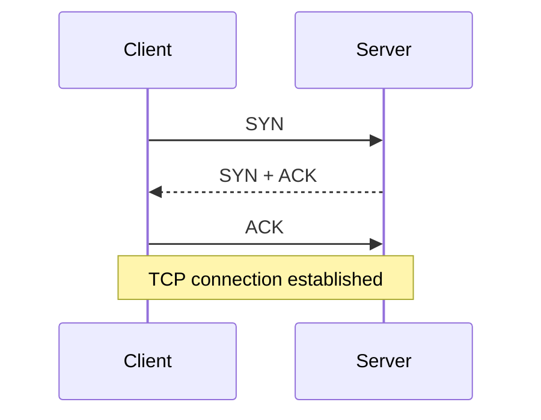
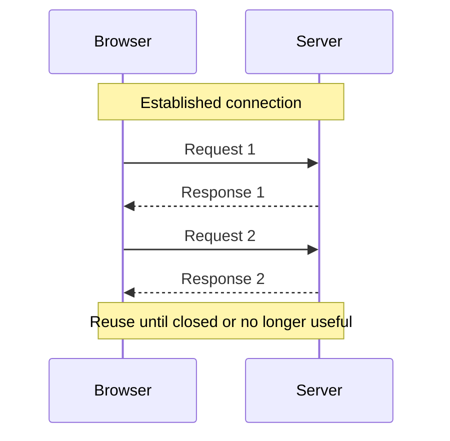
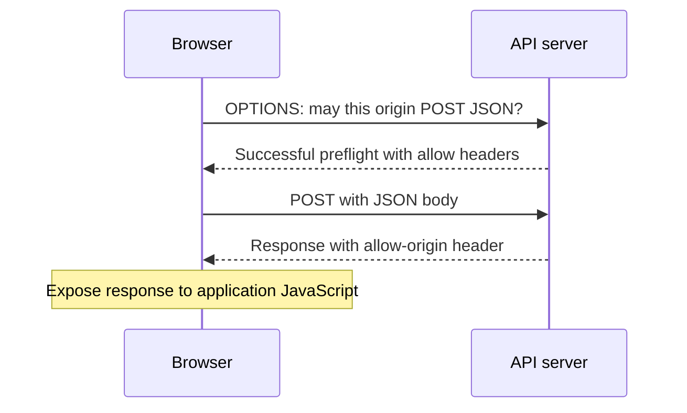

A frontend request can fail at several different layers.

The connection might not open. The server might return `500`. The response might be successful HTTP but inaccessible to JavaScript because of CORS. The body might arrive and then fail JSON parsing.

Calling all of those “the request failed” makes debugging harder than it needs to be.

A useful bottom-up model is:

> Transport moves bytes. HTTP gives those bytes meaning. Browser APIs expose a policy-filtered view of the result.

HTTP/1.1 makes the message format easy to inspect. HTTP/2 and HTTP/3 change transport and framing without replacing the familiar methods, status codes, and header semantics.

## Contents

1. [TCP: a reliable byte stream](#tcp-a-reliable-byte-stream)
2. [HTTP gives the stream message boundaries](#http-gives-the-stream-message-boundaries)
3. [Methods and status codes are semantics](#methods-and-status-codes-are-semantics)
4. [Headers describe different concerns](#headers-describe-different-concerns)
5. [Connections and keep-alive](#connections-and-keep-alive)
6. [From fetch to HTTP](#from-fetch-to-http)
7. [Origins and browser policy](#origins-and-browser-policy)
8. [CORS without preflight](#cors-without-preflight)
9. [CORS with preflight](#cors-with-preflight)
10. [Credentials and exposed headers](#credentials-and-exposed-headers)
11. [Loading a page means loading resources](#loading-a-page-means-loading-resources)
12. [What HTTP/2 and HTTP/3 change](#what-http2-and-http3-change)
13. [A debugging checklist](#a-debugging-checklist)

## TCP: a reliable byte stream

Networks can lose, duplicate, and reorder packets. TCP provides applications with an ordered byte stream, recovering from packet loss where possible and reporting connection failure when it cannot continue.

A TCP connection has two endpoints. Each has an IP address and a port:

```text
client:  192.0.2.10:54321
server:  198.51.100.20:443
```

The server listens on a service port. The client's operating system typically assigns an ephemeral port. These example addresses are documentation addresses, not services to call.

TCP is bidirectional: each endpoint can send bytes. It does **not** know where an HTTP request starts or ends.

If the sender writes two pieces of data, the receiver is not guaranteed two matching reads. TCP may split or combine the bytes while preserving their order. The application protocol must define its own message boundaries.

### Establishing a connection

The familiar three-way handshake establishes the TCP connection:



For a new HTTPS connection using HTTP/1.1 or HTTP/2, TLS adds encryption and server authentication over TCP before ordinary HTTP application data is exchanged. DNS lookup may also be necessary before connecting. Caches, existing connections, and session resumption can change the observed setup cost.

This is a model for HTTP over TCP, not a statement that every HTTP version uses TCP. HTTP/3 uses QUIC instead.

## HTTP gives the stream message boundaries

HTTP/1.1 structures bytes into messages with a start line, header fields, a blank line, and an optional body.

### A request

```http
GET /api/users HTTP/1.1
Host: api.example.com
Accept: application/json

```

The request line has:

- a method: `GET`;
- a request target: `/api/users`;
- a protocol version: `HTTP/1.1`.

`Host` identifies the target authority and is required in HTTP/1.1 requests. One server address can serve multiple hostnames, so the IP address alone is not enough to identify the intended site.

These blocks display line breaks for readability. HTTP/1.1 uses CRLF line endings; the empty line terminates the header section even when no body follows.

### A response

```http
HTTP/1.1 200 OK
Content-Type: application/json
Content-Length: 25

{"users":["alice","bob"]}
```

The response starts with the version, status code, and a reason phrase. Applications should use the status code, not depend on the phrase.

`Content-Length: 25` describes the 25 bytes of the displayed JSON body, with no trailing newline. Length is in **bytes**, not JavaScript string characters. Non-ASCII text makes that distinction important.

### A request with a body

```http
POST /api/users HTTP/1.1
Host: api.example.com
Content-Type: application/json
Content-Length: 32

{"name":"alice","role":"editor"}
```

The headers describe how to interpret and delimit the body. They do not establish that its application data is valid. The server still needs to validate the input and authorize the operation.

### Framing: how the receiver knows when to stop

On a reusable connection, the receiver must distinguish the end of one message from the beginning of the next.

Common HTTP/1.1 body-length mechanisms include:

- **Content-Length:** read the specified number of bytes.
- **Chunked transfer coding:** read a sequence of size-prefixed chunks and a terminating zero-size chunk.
- **Connection closure:** for certain responses, closing the connection marks the end of the body, preventing reuse of that connection.

For example, this chunked response carries the text `hello`:

```http
HTTP/1.1 200 OK
Content-Type: text/plain
Transfer-Encoding: chunked

5
hello
0

```

Chunk sizes are hexadecimal. Real chunk framing also uses CRLF, and the terminating chunk can be followed by trailers before the final empty line.

Some responses have no message body by definition, including responses to `HEAD` and statuses such as `204` and `304`. Do not treat the body-length rules as a single unconditional “read Content-Length” instruction. Senders also must not combine `Content-Length` with `Transfer-Encoding`; ambiguous framing is a security-sensitive protocol error, not something application code should improvise around.

## Methods and status codes are semantics

HTTP methods express the intended operation, not merely whether a JSON body is present.

| Method  | Core meaning                                                                   |
| ------- | ------------------------------------------------------------------------------ |
| GET     | Retrieve a representation                                                      |
| HEAD    | Retrieve response metadata without a response body                             |
| POST    | Ask the target resource to process the supplied content                        |
| PUT     | Create or replace the target resource's state with the supplied representation |
| PATCH   | Apply a modification described by the request                                  |
| DELETE  | Remove the association with the target resource                                |
| OPTIONS | Describe communication options; also used for CORS preflight                   |

Two terms matter for retries:

- **Safe:** the requested semantics are read-only. GET and HEAD are safe, even though incidental logging can still happen.
- **Idempotent:** repeating the same request has the same intended effect as making it once. PUT and DELETE are idempotent; POST is not inherently idempotent.

Idempotent does not mean “the response is identical.” Deleting something twice may yield different statuses while still having the same intended final effect.

The Fetch API does not permit a body on GET or HEAD. More generally, GET request content has no broadly defined semantics; do not design a browser API around a GET body.

### Status families

| Family | Meaning                                        | Examples                                  |
| ------ | ---------------------------------------------- | ----------------------------------------- |
| 1xx    | Informational, before a final response         | `100 Continue`                            |
| 2xx    | Successful processing                          | `200 OK`, `201 Created`, `204 No Content` |
| 3xx    | Redirection or related representation handling | `301`, `302`, `304 Not Modified`          |
| 4xx    | A problem attributed to the request            | `400`, `401`, `403`, `404`                |
| 5xx    | Server-side failure                            | `500`, `502`, `503`                       |

Not every 3xx status means “navigate to another URL.” `304`, for example, is used in cache validation. A `401` generally concerns authentication; a `403` means the server refuses to fulfill the request.

## Headers describe different concerns

Headers become easier to reason about when grouped by responsibility.

| Concern                | Examples                                 | Question answered                                             |
| ---------------------- | ---------------------------------------- | ------------------------------------------------------------- |
| Representation         | `Content-Type`, `Content-Encoding`       | What is this body and how is it encoded?                      |
| Negotiation            | `Accept`, `Accept-Encoding`              | Which response formats or encodings can the client handle?    |
| Framing                | `Content-Length`, `Transfer-Encoding`    | How is this HTTP/1.1 body delimited?                          |
| Caching                | `Cache-Control`, `ETag`, `If-None-Match` | Can a stored response be reused or validated?                 |
| Identity               | `Authorization`, `Cookie`, `Set-Cookie`  | What authentication or session data accompanies the exchange? |
| Browser sharing policy | `Origin`, `Access-Control-*`             | May browser JavaScript access the cross-origin response?      |

`Accept: application/json` asks for a JSON response. `Content-Type: application/json` describes the body of the message carrying that header. They are not interchangeable.

Likewise, `Content-Encoding: gzip` concerns representation compression. `Transfer-Encoding: chunked` concerns HTTP/1.1 transfer framing. A compressed response can also be chunked.

## Connections and keep-alive

Opening a new connection for every resource repeats setup work. HTTP/1.1 defaults to persistent connections, allowing multiple exchanges over a connection.



An explicit `Connection: keep-alive` header is not required to obtain HTTP/1.1's default persistence. `Connection: close` indicates that the connection will not remain reusable after the current response.

Persistence is an opportunity, not a guarantee. Servers, proxies, and clients can close connections because of timeouts, resource limits, or failures.

### Reuse is not multiplexing

For ordinary browser HTTP/1.1 traffic, think of a small pool of connections, with exchanges proceeding sequentially on each connection. Parallel requests can use different connections.

HTTP/1.1 also defines **pipelining**, which allows sending multiple requests before their responses arrive. Responses still have to be sent in request order, so a slow earlier response can hold up later ones. Pipelining is not HTTP/2-style multiplexing and is not the model to rely on for normal browser request scheduling.

You will often hear “six connections per origin.” Treat that as a common implementation behavior, not a protocol guarantee. Exact pooling rules and limits vary.

## From fetch to HTTP

`fetch` asks the browser to perform a resource request. The browser handles transport negotiation, connection management, caching, and policy checks.

```js
async function createUser(name) {
  const response = await fetch("https://api.example.com/users", {
    method: "POST",
    headers: {
      "Content-Type": "application/json",
      Accept: "application/json",
    },
    body: JSON.stringify({ name }),
  });

  if (!response.ok) {
    throw new Error(`Create user failed: ${response.status}`);
  }

  return response.json();
}
```

This example assumes a successful response has a JSON body. An API returning `204 No Content` needs a different success path; parsing an empty body as JSON is an error.

The mapping is straightforward:

- The URL supplies the target authority, path, and query.
- `method` supplies the HTTP method.
- Allowed headers describe the request.
- `body` supplies content.
- The browser determines protocol-specific framing and adds controlled headers.

Application JavaScript cannot freely set headers such as `Host`, `Content-Length`, or `Cookie`. With HTTP/2 or HTTP/3, the wire representation differs from the textual HTTP/1.1 examples even though your `fetch` call is the same.

### Receiving a response is not reading the whole body

The fetch promise can resolve once a response is available, before its complete body has arrived. Body-reading methods such as `response.json()` are asynchronous too, and can fail during reading or parsing.

`response.ok` is true for statuses `200` through `299`. Fetch normally **resolves** for HTTP errors such as `404` and `500`; inspect the status yourself. Network failures, aborts, and CORS failures can reject the promise instead.

Bodies are streams and are generally consumed once. Calling `json()` and then `text()` on the same consumed response does not reread it. If you genuinely need separate consumers, cloning before consumption is an option, but it can incur buffering costs.

`XMLHttpRequest` exposes the same underlying HTTP and browser-policy concerns through an event-based API. It is not a way to bypass CORS.

## Origins and browser policy

For ordinary HTTP(S) URLs, an origin is the combination of scheme, host, and effective port.

```text
https://app.example.com
https://app.example.com:443    → same origin as above
http://app.example.com        → different scheme
https://api.example.com       → different host
https://app.example.com:8443  → different port
```

Changing only the path does not change the origin.

The **same-origin policy** limits how one origin can access another origin's resources. **CORS** is the browser's protocol for allowing selected cross-origin access.

The important distinction is between **sending an operation** and **letting JavaScript inspect its response**.

CORS is not API authentication. A command-line client or another server does not need a browser's CORS permission to call your API. It still needs whatever authentication and authorization the API requires.

CORS is also not a complete CSRF defense: some cross-origin operations can be sent without preflight, even when JavaScript cannot read the response.

## CORS without preflight

Some cross-origin requests qualify to be sent without a preliminary permission check. These are often called “simple requests”; the standard describes safelisted methods and headers.

At a high level, this includes GET, HEAD, or POST with permitted header values. Safelisted content types include `text/plain`, `application/x-www-form-urlencoded`, and `multipart/form-data`. There are additional restrictions on header values and request construction; method and media type alone are not the whole algorithm.

Consider a non-credentialed request from `https://app.example.com`:

```js
const response = await fetch("https://api.example.com/public-users");
```

The browser can send the GET directly with an `Origin` header. To expose the response, the server might return:

```http
Access-Control-Allow-Origin: https://app.example.com
Vary: Origin
```

A public response intended for any origin, without credentials mode `include`, can instead use:

```http
Access-Control-Allow-Origin: *
```

If the server does not grant access, the GET may still have reached the server and produced a successful HTTP response. JavaScript's fetch promise fails the CORS check rather than receiving that readable response.

`Vary: Origin` matters when the response policy changes based on the request's origin and the response may be cached. Only emit an allowed origin after checking it against the intended policy; blindly reflecting any origin is not an allowlist.

## CORS with preflight

A cross-origin JSON POST typically needs preflight because `application/json` is not a CORS-safelisted content type. PUT, PATCH, and non-safelisted headers such as `Authorization` can also require preflight.

Before sending the operation, the browser asks permission using OPTIONS:

```http
OPTIONS /users HTTP/1.1
Host: api.example.com
Origin: https://app.example.com
Access-Control-Request-Method: POST
Access-Control-Request-Headers: content-type

```

The server can permit it with:

```http
HTTP/1.1 204 No Content
Access-Control-Allow-Origin: https://app.example.com
Access-Control-Allow-Methods: POST
Access-Control-Allow-Headers: Content-Type
Access-Control-Max-Age: 600
Vary: Origin

```

Then the browser sends the POST. Its response must **also** include the appropriate `Access-Control-Allow-Origin`; permission on OPTIONS alone does not make the actual response readable.



Two failure modes are different:

- **Preflight fails:** the browser does not send the actual POST.
- **Actual response fails CORS:** the POST may have completed, but JavaScript cannot read its response.

That second case is especially important before retrying a mutation. A rejected fetch is not proof that the server did nothing.

Preflight results can be cached, subject to browser limits, so you should not expect an OPTIONS request before every repeat call. Cross-origin preflight itself does not include cookies or HTTP authentication credentials; a server requiring a logged-in session just to answer OPTIONS can prevent the actual request from ever being sent.

## Credentials and exposed headers

Fetch defaults to `credentials: "same-origin"`. To allow browser-managed credentials such as eligible cookies on a cross-origin request, use:

```js
const response = await fetch("https://api.example.com/account", {
  credentials: "include",
});
```

This does not manufacture credentials or override cookie policy. Cookie attributes, `SameSite`, and third-party-cookie restrictions still apply. Cross-origin and cross-site are different concepts; two subdomains can be cross-origin while remaining same-site.

For credentials mode `include`, the server must grant response access using an explicit origin and credentials permission:

```http
Access-Control-Allow-Origin: https://app.example.com
Access-Control-Allow-Credentials: true
Vary: Origin
```

`Access-Control-Allow-Origin: *` is not valid for this mode, even if there happened to be no cookie available to send. Credentialed preflighted operations also need credentials permission on the preflight response.

A bearer token you explicitly supply in an `Authorization` header is a separate application choice. `credentials: "include"` does not create or automatically attach your application's token. The header needs preflight permission and must be explicitly allowed; an `Access-Control-Allow-Headers: *` wildcard does not cover `Authorization`.

### Which response headers can JavaScript read?

Successful CORS does not automatically expose every response header. A limited safelist is readable by default, including `Content-Type` and `Content-Length`.

If your API returns a custom pagination header, expose it:

```http
Access-Control-Expose-Headers: X-Next-Cursor
X-Next-Cursor: page-2
```

Then JavaScript can read it:

```js
const nextCursor = response.headers.get("X-Next-Cursor");
```

`Set-Cookie` is not exposed to browser JavaScript through response headers, even if you list it in `Access-Control-Expose-Headers`. The browser manages cookie processing separately.

### Why no-cors is not a fix

`mode: "no-cors"` does not disable browser security. It restricts the request and can return an **opaque** response whose body and headers are unavailable to your code and whose exposed status is `0`.

For a normal API call that needs JSON, this is not a useful workaround. Configure the API's sharing policy or use an intentional same-origin backend/proxy that owns the remote call and its authorization.

## Loading a page means loading resources

A document request is usually only the beginning.

As the browser parses HTML, it discovers stylesheets, scripts, images, fonts, and other resources. Those requests have different priorities, caching behavior, and execution dependencies.

HTTP response arrival order does not by itself define JavaScript execution order. Classic parser-blocking scripts, `defer`, `async`, and modules have different loading and execution rules.

Cross-origin embedding is also not the same as fetching a readable API response:

- Images can often display without CORS, but drawing them to canvas can make the canvas unreadable to JavaScript.
- Classic scripts can often load cross-origin without CORS; module scripts use CORS.
- Stylesheets can often apply cross-origin while access to their rules remains restricted.

Other policies, including Content Security Policy and resource-specific checks, can still block these loads. “It displays in an image tag” is not evidence that the same URL is readable through fetch.

In DevTools, distinguish connection waiting, server response time, body download, and application processing. A long waterfall is not automatically “slow JavaScript,” and a fast response is not proof that the UI handled it quickly.

## What HTTP/2 and HTTP/3 change

HTTP/2 keeps HTTP semantics but uses binary framing and multiple streams over a connection. Frames from different exchanges can be interleaved instead of making each response wait for the previous response to finish.

This removes HTTP/1.1's ordered-response bottleneck between exchanges on that connection. It does not remove shared bandwidth, server limits, flow control, or TCP's transport-level head-of-line blocking: missing TCP bytes can delay delivery for multiple streams.

HTTP/3 carries HTTP over QUIC, which uses UDP and provides reliable streams with encryption. Packet loss affecting one stream need not hold up delivery on unrelated streams in the same way as TCP. The connection still has shared congestion and resource limits.

| Version  | Transport and message model                                | Relevant distinction                                          |
| -------- | ---------------------------------------------------------- | ------------------------------------------------------------- |
| HTTP/1.1 | Usually TCP; textual message headers and ordered responses | Connection reuse is not multiplexing                          |
| HTTP/2   | TCP; binary frames and multiplexed streams                 | Independent HTTP exchanges still share TCP delivery           |
| HTTP/3   | QUIC over UDP; multiplexed reliable streams                | Stream delivery avoids TCP's cross-stream ordering constraint |

Your application normally uses the same fetch API for all three. The browser and server choose an available protocol; JavaScript does not opt into HTTP/2 by adding a request header.

Enable the Protocol column in the browser's Network panel when investigating actual traffic. Do not assume a readable HTTP/1.1 example is a literal capture of an HTTP/2 exchange.

## A debugging checklist

Work from the outside inward:

1. **Did a network request happen?** Check the URL, DNS, connection, TLS, cancellation, and browser policy messages. A cache or service worker can also satisfy a request without a new network exchange.
2. **Was there a preflight?** If OPTIONS failed, inspect its status and allow headers before debugging a POST that never happened.
3. **Did the actual operation reach the server?** Use server logs where necessary. A CORS error is not proof of non-execution.
4. **What was the HTTP status?** Fetch does not reject merely because the server returned a 4xx or 5xx response.
5. **Could JavaScript access the response?** Compare the origin, credentials mode, and CORS response headers, including on error responses.
6. **Was the body valid for the reader?** Check for empty bodies, HTML error pages, malformed JSON, or an already-consumed stream.
7. **Where was the time spent?** Separate queuing and connection setup from server latency, download, parsing, and UI work.

If curl succeeds while the browser fails, that narrows the investigation but does not prove the API is correctly configured for browser access. curl does not enforce the browser's CORS checks or cookie policies.

## Takeaways

- TCP carries ordered bytes; HTTP defines message structure and semantics.
- HTTP/1.1 needs explicit framing to reuse connections safely.
- Fetch exposes a response in stages, and HTTP errors differ from promise rejection.
- CORS controls browser sharing; it is neither authentication nor a guarantee that an operation was not sent.
- Preflight permission and actual-response permission are separate checks.
- HTTP/2 and HTTP/3 change the delivery model, not the meaning of your API's methods and statuses.

## Sources and further reading

- [RFC 9110: HTTP semantics](https://www.rfc-editor.org/rfc/rfc9110.html)
- [RFC 9112: HTTP/1.1 message syntax, framing, and connections](https://www.rfc-editor.org/rfc/rfc9112.html)
- [Fetch standard: CORS protocol](https://fetch.spec.whatwg.org/#http-cors-protocol)
- [Fetch standard: credentials](https://fetch.spec.whatwg.org/#credentials)
- [RFC 9113: HTTP/2](https://www.rfc-editor.org/rfc/rfc9113.html)
- [RFC 9114: HTTP/3](https://www.rfc-editor.org/rfc/rfc9114.html)
