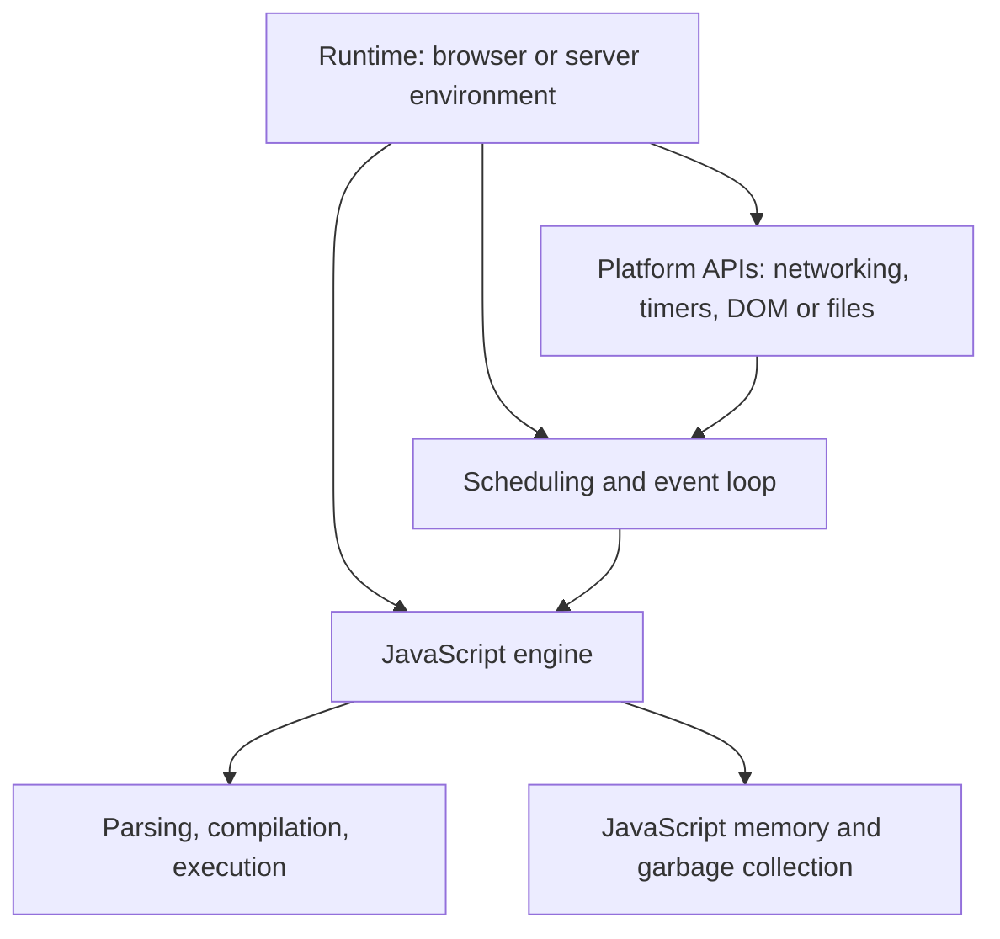
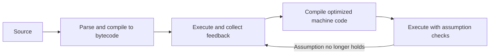

JavaScript is often described with two statements: it is single-threaded, and it is asynchronous.

Neither statement, on its own, explains why a promise callback runs before a timer, why an `async` function can freeze a page, or why an object you stopped using is still taking up memory.

The useful starting point is to separate three responsibilities:

- The **engine** executes JavaScript and manages its memory.
- The **runtime** provides the surrounding platform: timers, networking, files, the DOM, and scheduling.
- Your **application** decides what work to start and what references to keep.

Browser scheduling is the main example; Node.js has a different event-loop model, even though many language mechanisms are shared.

## Contents

1. [Engine versus runtime](#engine-versus-runtime)
2. [The call stack](#the-call-stack)
3. [JIT compilation and deoptimization](#jit-compilation-and-deoptimization)
4. [Object shapes and inline caches](#object-shapes-and-inline-caches)
5. [Memory and garbage collection](#memory-and-garbage-collection)
6. [Tasks, microtasks, and rendering](#tasks-microtasks-and-rendering)
7. [What async and await actually do](#what-async-and-await-actually-do)
8. [Concurrency is not parallel JavaScript](#concurrency-is-not-parallel-javascript)
9. [The Angular connection](#the-angular-connection)
10. [A practical performance checklist](#a-practical-performance-checklist)

## Engine versus runtime

A JavaScript engine parses source, compiles or interprets it, executes it, and manages JavaScript memory. Common engines include:

| Engine         | Examples of environments that embed it |
| -------------- | -------------------------------------- |
| V8             | Chrome, Edge, Node.js, Deno            |
| SpiderMonkey   | Firefox                                |
| JavaScriptCore | Safari, Bun                            |

The engine is not the whole environment.

`Promise`, arrays, and ordinary objects are language features. `setTimeout`, `fetch`, `document`, and filesystem APIs come from the host environment. Different runtimes can embed the same engine and still expose different APIs and scheduling behavior.



That distinction explains a familiar failure:

```js
// Works in a browser document, not in an ordinary Node.js process.
const button = document.querySelector("button");
```

The problem is not that Node.js cannot understand JavaScript. It is that Node.js does not provide a browser document.

## The call stack

Within one JavaScript agent, such as a page's main-thread execution environment, ordinary synchronous code runs one step at a time. Function calls create nested execution contexts; returning from a function resumes its caller.

```js
function multiply(a, b) {
  return a * b;
}

function square(value) {
  return multiply(value, value);
}

function printSquare(value) {
  const result = square(value);
  console.log(result);
}

printSquare(4);
```

While `multiply` is executing, the conceptual stack is:

```text
multiply(4, 4)     ← currently executing
square(4)
printSquare(4)
calling script
```

`multiply` returns `16`, then `square` returns that value, then `printSquare` logs it and returns.

This model also explains stack overflow. Recursion without a stopping condition keeps adding calls until the engine's stack limit is reached. There is no portable number of allowed recursive calls: limits depend on the engine, platform, and function's stack usage.

### Single-threaded does not mean the whole runtime has one thread

Browsers perform networking, compilation, garbage collection, and other work using additional threads or processes. Workers can execute JavaScript separately from the page's main thread.

The narrower claim is the useful one:

> A promise callback does not run simultaneously with the synchronous JavaScript currently executing in the same agent.

If your click handler spends a long time computing, the runtime cannot simply insert another ordinary JavaScript callback halfway through it. Input handlers and main-thread rendering work have to wait for that execution to yield.

## JIT compilation and deoptimization

JavaScript is not simply “interpreted line by line.” Modern engines use multiple execution tiers to balance startup cost against execution speed.

A conceptual pipeline looks like this:



V8 documents tiers such as the Ignition interpreter, the Sparkplug baseline compiler, and optimizing compilers including Maglev and TurboFan. The exact compiler pipeline evolves; these names are implementation details, not JavaScript language rules.

The durable idea is **runtime feedback**. An engine observes the types, object shapes, and behavior at particular operations, then uses that information to produce specialized code.

```js
function add(a, b) {
  return a + b;
}

console.log(add(1, 2)); // 3
console.log(add("hello", " world")); // "hello world"
```

Both calls are valid JavaScript. But a frequently executed addition site that has only seen numbers may be optimized around numeric addition. A later string input may invalidate an assumption and require **deoptimization**: reconstructing a less-specialized execution state so the program can continue correctly.

The engine is not punishing the application. It is preserving the language's behavior after an optimization stops being applicable.

### What this does not tell you

It does not mean that:

- a fixed number of calls guarantees optimization;
- every change of input type causes deoptimization;
- polymorphic functions are inherently bad;
- one deoptimization explains a slow application.

Inlining, redundant-check elimination, and allocation elimination can all help, but engines decide when those transformations are safe and worthwhile. A tiny example cannot establish the performance of your production workload.

Write clear code with coherent data contracts. Investigate engine-level behavior when a profile identifies a hot path—not before.

## Object shapes and inline caches

Dynamic objects still need fast property access.

```js
function createPoint(x, y) {
  return { x, y };
}

const first = createPoint(1, 2);
const second = createPoint(3, 4);
```

In V8, compatible objects can share internal layout metadata called a **hidden class**, or **Map**. This is not the JavaScript `Map` collection.

A simplified shape says:

```text
shape: { x, y }
x → known field location
y → known field location
```

Adding named properties can produce transitions between shapes. Consistent construction gives the engine more opportunities to reuse layouts, although property names alone are not the entire story: prototypes, attributes, and representations matter too.

An **inline cache** records information at an operation site, such as `point.x`:

```js
function readX(point) {
  return point.x;
}
```

If that site repeatedly sees a compatible shape, the engine can check the shape and load the field from a known location instead of performing a fully general lookup every time.

The usual vocabulary describes how much variety a site encounters:

| Term        | Useful mental model                                    |
| ----------- | ------------------------------------------------------ |
| Monomorphic | One observed shape                                     |
| Polymorphic | A small set of observed shapes                         |
| Megamorphic | Enough variety to require a more general handling path |

Exact thresholds and lookup strategies are engine- and version-dependent. “Two shapes are bad” is not a useful application-design rule.

### Preserve semantics before chasing shapes

A consistent record can be straightforward:

```js
function createUser(name, age) {
  return { name, age };
}
```

But an absent property is not the same as a property whose value is `undefined`:

```js
const user = { name: "Ada", age: 36 };

user.age = undefined;
console.log(Object.hasOwn(user, "age")); // true

delete user.age;
console.log(Object.hasOwn(user, "age")); // false
```

Blindly replacing `delete` with assignment changes observable behavior. Likewise, adding every imaginable optional field creates a different data contract and may waste memory.

Use the representation the application actually needs. Stable record shapes can help in measured hot paths; dynamic dictionaries are legitimate data structures too.

## Memory and garbage collection

The call stack helps explain active execution. The heap helps explain the lifetime of dynamically allocated data.

Do not turn that into a language rule that “all primitives are on the stack and all objects are on the heap.” Engines choose representations, retain captured bindings, and sometimes eliminate allocations entirely. JavaScript does not expose a storage-location contract for your local variables.

The reliable memory model is **reachability**:

> Data must remain available while it is reachable from live roots. Unreachable data can become eligible for garbage collection.

Roots include active execution state and references maintained by the environment. The collector follows references from those roots to find live objects.

An unreachable cycle can be collected. A reachable object that you no longer want cannot be collected just because you consider it “unused.”

### A timer can keep data alive

```js
function startReporting(data) {
  const timer = setInterval(() => {
    console.log(data.length);
  }, 1000);

  return function stopReporting() {
    clearInterval(timer);
  };
}

const stopReporting = startReporting(new Array(1_000_000).fill("x"));

// Call this when the feature that owns the timer is finished.
stopReporting();
```

While active, the timer retains a callback that can access `data`. Cleanup removes that source of retention. Collection still depends on whether other references remain, including any retained cleanup closures; it is not immediate or guaranteed at a particular time.

Other common retention paths include:

- an application array holding DOM nodes after they are removed;
- listeners on a long-lived target capturing obsolete state;
- an unbounded cache;
- subscriptions whose lifetime outlasts their owner.

Removing a DOM node is not enough if another live object still references it. Conversely, not every listener requires manual removal for garbage collection: an unreachable node and its listener can be collected together.

### Why generations help

V8 uses generational garbage-collection techniques because many allocations are short-lived. Young data can be collected differently from long-lived data. Collection also uses parallel, incremental, and concurrent techniques to reduce pauses.

The implementation changes over time. Avoid depending on a fixed promotion count or a promised collection duration. The practical questions are simpler:

1. How much are we allocating?
2. What remains reachable after the feature closes?
3. Which retaining path explains that lifetime?

Heap snapshots and allocation profiles answer those questions better than guessing from source code alone.

## Tasks, microtasks, and rendering

In a browser, the event loop coordinates JavaScript with input, networking, and rendering.

A useful working model is:

1. The current synchronous execution runs to completion.
2. At a **microtask checkpoint**, queued microtasks run until the queue is empty, including microtasks added by other microtasks.
3. The browser schedules further tasks and rendering work according to its event-loop rules and rendering opportunities.

Timer callbacks and much event-dispatch work run as **tasks**. Promise reactions and `queueMicrotask` callbacks run as **microtasks**. “Macrotask” is common teaching vocabulary; the HTML standard calls these tasks.

There is not one universal FIFO queue containing every kind of browser work. The browser has task sources and scheduling choices. Nor does every completed task produce a frame.

### Predict the output

```js
console.log("1: sync");

setTimeout(() => {
  console.log("2: timeout");
}, 0);

Promise.resolve()
  .then(() => {
    console.log("3: promise");
  })
  .then(() => {
    console.log("4: promise 2");
  });

queueMicrotask(() => {
  console.log("5: microtask");
});

console.log("6: sync end");
```

For this isolated example in a browser, the output is:

```text
1: sync
6: sync end
3: promise
5: microtask
4: promise 2
2: timeout
```

The first promise reaction is queued before the explicit microtask. The second `.then` is queued only after the first reaction completes, so it goes behind the microtask already waiting.

A zero-delay timer means “eligible later,” not “interrupt this code now.” Timer clamping, other work, and background-tab policies can delay it further.

### Microtasks can starve the page

A microtask that keeps adding another microtask can prevent the checkpoint from finishing. That delays further tasks and rendering work.

This is why repeatedly awaiting an already-resolved promise is not a reliable way to let the browser paint. You are yielding JavaScript execution, but only back into microtask processing.

For visual updates, `requestAnimationFrame` schedules a callback during a rendering update before the upcoming repaint. It is one-shot, so an animation schedules another callback for its next frame. Expensive work inside that callback still delays the frame.

At 60 Hz, frames are about 16.7 ms apart. That interval is shared with browser work; it is not a guaranteed JavaScript budget. Higher refresh rates shorten it further.

## What async and await actually do

An `async` function returns a promise. Its body begins executing synchronously when called, until it reaches a suspension point.

```js
async function showOrder() {
  console.log("A");
  await Promise.resolve();
  console.log("B");
}

console.log("C");
showOrder();
console.log("D");
```

Output:

```text
C
A
D
B
```

`await` suspends this invocation, not the whole runtime. When the awaited result is available, the continuation resumes through promise-job scheduling, which browsers integrate with microtasks.

Promise chains are a useful conceptual explanation, but `async`/`await` is not literally a source-to-source replacement with identical details in every case.

### Async does not move computation off the main thread

```js
async function sumUpTo(limit) {
  let total = 0;

  for (let value = 0; value < limit; value += 1) {
    total += value;
  }

  return total;
}
```

Calling this function performs the loop synchronously before returning its promise. The `async` keyword does not create a worker or make the loop interruptible.

For substantial CPU work, consider a worker. For work that must stay on the main thread, splitting it into bounded chunks and yielding through task scheduling can give other work a chance to run. A timer-based yield is a simple option, but it does not promise that a paint happens before your continuation.

## Concurrency is not parallel JavaScript

Sequential `await` is correct when later work depends on earlier work. It is unnecessary serialization when operations are independent.

```js
async function loadJson(url) {
  const response = await fetch(url);

  if (!response.ok) {
    throw new Error(`Request failed: ${response.status}`);
  }

  return response.json();
}

async function loadDashboard() {
  const [profile, notifications] = await Promise.all([
    loadJson("/api/profile"),
    loadJson("/api/notifications"),
  ]);

  return { profile, notifications };
}
```

The two operations start before the function waits for both. Network progress can overlap; their JavaScript continuations still run through the runtime's scheduling model.

`Promise.all` does not create threads, guarantee simultaneous network transmission, or bypass connection limits. If one promise rejects, the aggregate rejects, but it does not automatically cancel the other operation.

For two independent requests this is usually the right primitive. For thousands of requests, respect the API's capacity and use bounded concurrency rather than launching everything at once.

## The Angular connection

Frameworks need a way to connect application-state changes to DOM updates.

In a Zone.js-based Angular application, patched asynchronous APIs provide indications that application state may have changed. Angular then schedules or runs synchronization according to its configuration. This is not a precise dependency graph, and it is not accurate to say that every promise necessarily causes a separate full-tree render.

Signals provide explicit dependencies instead:

```ts
import { computed, signal } from "@angular/core";

const count = signal(0);
const doubled = computed(() => count() * 2);

count.set(1);
console.log(doubled()); // 2
```

Updating a signal read by a template is one of the notifications Angular can use to schedule change detection. `AsyncPipe`, bound listeners, and explicit marking are other notification surfaces. Signals are not a replacement for the JavaScript event loop, and updating one does not mean the browser immediately paints.

**Version note:** Angular's current documentation states that zoneless change detection is the default in v21 and later. For Angular v20, it documents `provideZonelessChangeDetection()`.

The framework-level model and the runtime-level model complement each other:

- Angular decides which views need synchronization.
- The browser decides when JavaScript and rendering work can execute.

## A practical performance checklist

Start with the work users can observe:

1. **Profile the actual interaction.** Is the bottleneck network latency, JavaScript, layout, or allocation?
2. **Avoid long uninterrupted execution.** `async` alone does not help; use task-sized chunks or workers where appropriate.
3. **Overlap independent I/O.** Keep dependent operations sequential and honor concurrency limits.
4. **Give retained resources an owner.** Timers, subscriptions, listeners, and caches need intentional lifetimes.
5. **Use coherent data representations.** Optimize shapes and types only when a measured hot path justifies it.
6. **Choose cloning by semantics.** `structuredClone` supports cycles and many built-in types, but not functions or DOM nodes, and it does not preserve arbitrary class behavior. JSON serialization is a different operation, not a universal clone.

Do not turn engine internals into blanket rules such as “never use `delete`,” “`arguments` prevents optimization,” or “always prefill every optional property.” Those rules often change behavior or add complexity without improving the workload that matters.

## Takeaways

- The engine executes the language; the runtime supplies platform APIs and scheduling.
- Synchronous JavaScript in one agent does not become parallel because you use promises.
- JIT compilation exploits observed behavior while preserving JavaScript semantics.
- Garbage collection follows reachability, not your application's idea of usefulness.
- Microtasks run at checkpoints; they are not a shortcut to rendering.
- `await` suspends one invocation, while `Promise.all` coordinates work that you have already started.

## Sources and further reading

- [V8: Maglev and execution tiers](https://v8.dev/blog/maglev)
- [V8: fast properties and hidden classes](https://v8.dev/blog/fast-properties)
- [V8: garbage collection and reachability](https://v8.dev/blog/trash-talk)
- [HTML standard: event loops](https://html.spec.whatwg.org/multipage/webappapis.html#event-loops)
- [Angular: zoneless change detection](https://angular.dev/guide/zoneless)
